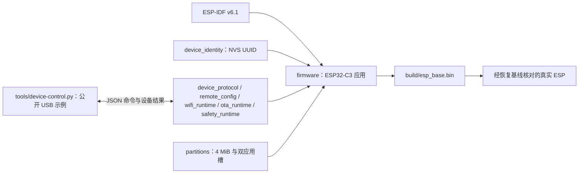

# ESP Base

基于官方 ESP-IDF v6.1 的设备业务基座。当前具备持久 UUID、硬件事实、心跳、分区、配置事务、Wi-Fi station 和 USB status/restart/config.set 协议；五能力实现及完整验收仍在进行。

## 架构拓扑



## 开发

```bash
source "$IDF_PATH/export.sh"
idf.py -C firmware build
```

`IDF_PATH` 指向独立安装的 ESP-IDF v6.1。应用依赖来自本仓、SDK 和 Component Manager 锁定的官方 cJSON 组件，不读取工作区相邻仓库。构建制品和实板结论以[开发检查点](docs/operations/development_checkpoint.md)为准；编译不写设备。

NVS 初始化失败时保留原分区并停止初始化，不自动擦除。身份沿用 `nvs/base_identity/device_uuid`；分区地址和大小保持迁移基线。首版目标仅为 ESP32-C3、4 MiB，无 GPIO 动作。

- [固件入口](firmware/README.md)
- [设备协议](docs/design/device_protocol.md)
- [公开 USB 主机示例](tools/README.md)
- [乐鑫官方仓库全景与 ESP Base 选型](docs/design/espressif-official-solutions.md)
- [乐鑫 342 个公开仓库逐项清单](docs/design/espressif-repository-catalog.md)
- [来源记录](docs/design/source_provenance.md)
- [嵌入式工程标准](https://github.com/darren-you/darren-space/blob/master/harness/docs/workspace/standards/embedded_firmware/embedded_firmware_golden_path.md)

## 许可

新代码及维护者拥有的选定迁移代码使用 Apache-2.0。未导入 GPL FRP POC、私有历史、设备恢复字节或生产配置。
