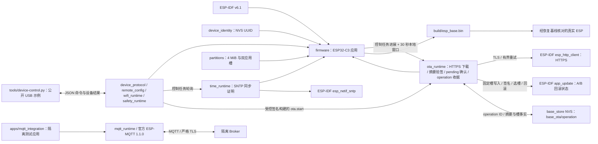

# ESP Base

基于官方 ESP-IDF v6.1 的设备业务基座。当前具备持久 UUID、硬件事实、心跳、分区、配置事务、Wi-Fi station、本次启动 SNTP 时间同步门、USB status/restart/config.set 协议，以及 OTA pending 新槽本地确认。受控签名构建还具备 USB `ota.start` 下载和按 operation ID 查询 `ota.result` 持久收据的软件链；当前实板仍是未签名基座，五能力完整验收尚未完成。

## 架构拓扑



## 开发

```bash
source "$IDF_PATH/export.sh"
idf.py -C firmware build
```

`IDF_PATH` 指向独立安装的 ESP-IDF v6.1。依赖来自本仓、SDK 和 Component Manager 锁定的官方 cJSON / ESP-MQTT，不读取工作区相邻仓库。MQTT 当前只装配到隔离测试应用，普通基座仍报告 MQTT unsupported。构建制品和实板结论以[开发检查点](docs/operations/development-checkpoint.md)为准；编译不写设备。

NVS 初始化失败时保留原分区并停止初始化，不自动擦除。身份沿用 `nvs/base_identity/device_uuid`；分区地址和大小保持迁移基线。首版目标仅为 ESP32-C3、4 MiB，无 GPIO 动作。

pending OTA 槽只在身份、配置、USB 控制任务初始化成功，控制循环实际开始、在本地 30 秒窗口内持续报告进展，且跨过窗口终点再完成一轮后确认。Wi-Fi 初始化失败时状态为 `failed`，USB 控制仍启动，不因此回滚；窗口内 `config.set` 返回 `ota_verification_pending`，确认成功后恢复；不等待 Wi-Fi、Broker 或 FRPS 在线。确认 SDK 报错但 otadata 已为 VALID 时按持久状态清门。启动或活性检查失败时由 IDF 尝试回滚；无可回退镜像时当前执行暂留，但下次复位不保证可启动，需人工恢复。

普通应用使用编译期 `CONFIG_ESP_BASE_TIME_SERVER`（默认 `pool.ntp.org`）启动官方 SNTP。本次启动收到同步事件且时间合理后才报告 `time_ready=true`；初始化或同步失败时保持 false，USB 与 pending OTA 本地确认继续运行。签名构建的 HTTPS OTA 必须先有 Wi-Fi IP 和 `time_ready`。普通未签名构建拒绝 OTA；签名镜像的首次迁移、真实 TLS/回滚和 SNTP 网络行为仍待实板验收。

签名构建的 `ota.start` 在下载前将最近一次 operation ID、设备 ID、完整镜像摘要/长度和双槽写入 `base_store/base_ota/operation` 并读回。只读 `ota.result` 可在新 boot 按原 operation ID 查询：worker 活跃和新槽 pending 为 running，新槽 VALID 且镜像摘要相同才 succeeded，有可核对失败证据才 failed，其余为 unknown。旧回滚镜像若不含此查询代码，工具仍须报告 unknown；本轮没有升级实板上的旧镜像。

- [固件入口](firmware/README.md)
- [设备协议](docs/design/device-protocol.md)
- [公开 USB 主机示例](tools/README.md)
- [配置候选断电验收](docs/operations/config-power-loss-acceptance.md)
- [官方 MQTT 集成测试应用](firmware/apps/mqtt_integration/README.md)
- [MQTT 实板验收记录](docs/operations/mqtt-hardware-acceptance.md)
- [乐鑫官方仓库全景与 ESP Base 选型](docs/design/espressif-official-solutions.md)
- [乐鑫 342 个公开仓库逐项清单](docs/design/espressif-repository-catalog.md)
- [来源记录](docs/design/source-provenance.md)
- [嵌入式工程标准](https://github.com/darren-you/darren-space/blob/master/harness/docs/workspace/standards/embedded_firmware/embedded_firmware_golden_path.md)

## 许可

新代码及维护者拥有的选定迁移代码使用 Apache-2.0。未导入 GPL FRP POC、私有历史、设备恢复字节或生产配置。
