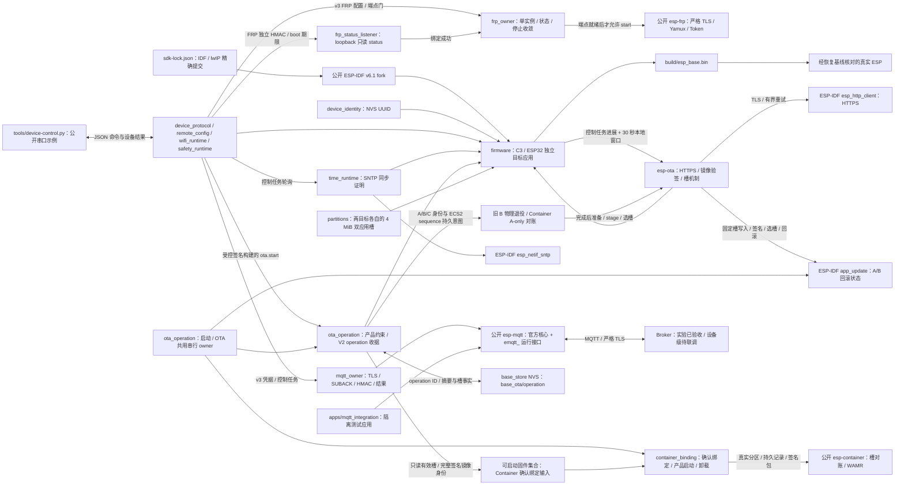

# ESP Base

基于公开 ESP-IDF v6.1 维护 fork 的设备业务基座。当前具备持久 UUID、硬件事实、心跳、分区、配置事务、Wi-Fi station、本次启动 SNTP 时间同步门、USB status/restart/config.set 协议、配置后启动的严格 TLS MQTT 命令通道，以及 OTA pending 新槽本地确认。受控签名构建还具备 `ota.start` 下载、按 operation ID 查询 `ota.result` 的 V2 持久收据、只读签名固件集合观察，以及与 Container 产品绑定的无包固件 OTA 和启动恢复软件链。FRP 已接入公开组件和单 owner；受控 loopback 管理端点已有只读 `status` 软件候选，能在绑定成功后开放 FRP 启动门，但尚无同板资源及真实 FRPS 闭环；实体 C3 仍保留旧 Base、ESP32 仍保留旧 ESP-AT，五能力完整验收尚未完成。

2026-09-27 当前主固件在 MQTT `c0677e5` 的精确消费提交上，将唯一 OTA 清单和 C3／ESP32 锁更新到 `esp-ota@d98361f`。上游在旧备用固件退役前拒绝空主机及非法端口的 HTTPS 请求；同锁双目标普通编译与 Base host ASan/UBSan 分别通过。随后以同锁仓外候选布局完成双目标签名产品镜像的官方验签与尺寸门，C3／ESP32 分别为 `0x111000`／`0x10fff4`；正式分区、设备 HTTPS／Flash 和完整五能力并发尚未验收。精确输入见[离线签名容量检查点](docs/operations/p6-03-five-repo-signed-capacity-checkpoint.md)。

同一当前精确锁的 C3 原样测试键签名镜像重新绑定真实 ABI 2 包后，仓外 QEMU 到达产品 `RUNNING` 和 Base `READY`，内部堆最低 free **45,600 B**，低于 48 KiB 门 3,552 B；此次没有 FRPS、Broker、HTTPS 或实体板。输入、断点和 Flash 逐区读回见[当前锁 C3 签名 guest 容量检查点](docs/operations/p6-03-current-lock-c3-signed-guest-qemu-checkpoint.md)。

同一五仓精确锁的 ESP32 仓外签名 guest 在 OpenETH DHCP 后建立 FRP client，原样静态 TLS 配置于 `mbedtls_ssl_setup` 的 4,429 B 出站缓冲申请失败；16,717 B 入站缓冲先前已分配。Base 正式 SNTP 门仍为 false，首次正式时间回调在建 client 前拒绝；该容量探针仅以仓外时钟回调继续，启动内部堆最低 43,032 B，低于 48 KiB 门。后续仓外固定时钟的同输入对照中，SDK 原生动态缓冲完成严格 TLS 验签，却在建立 FRP session 时的 1,024 B 分配失败、最低空闲堆仅 320 B；两种配置都未登录或注册。输入、失败阶段和原始收据见[当前锁 ESP32 FRP 会话容量检查点](docs/operations/esp32-frps-current-lock-qemu-capacity-checkpoint.md)。

当前 Base 将同步验包工作区移至产品 pthread 栈，产品配置的栈下界提高到 16 KiB。固定 SDK 双目标 host 回归及普通构建通过；后续源码核对发现旧双目标签名 QEMU 的仓外 Container 组件含 `P603_SAMPLE` 诊断插桩。ESP32 的 5,012 B 栈余量／49,100 B 堆低水和 C3 的 5,140 B／51,180 B 只属于诊断镜像，不能证明未插桩精确锁的容量；后续纯净锁双目标签名 guest 启动已单独重测，见下段。完整 FRPS/TLS、MQTT、OTA 并发和实板尚未验收。详见[工作区移栈检查点](docs/operations/product-workspace-stack-checkpoint.md)。

同锁的命令去重历史槽只保留重放判定及异步回执实际消费的字段，固定 SDK 双目标链接图各释放 2,304 B 常驻 `.bss`；host 回归通过。纯净锁双目标签名 guest 在无网络启动时均到 `RUNNING/READY`，C3／ESP32 的内部堆最低分别为 53,208／51,456 B，产品线程栈最低未用 5,140／5,012 B；仅该启动切片超过 48 KiB 初始观察门，P6-03 仍未通过。详见[命令去重表容量检查点](docs/operations/p6-03-request-guard-capacity-checkpoint.md)与[纯净签名 QEMU 检查点](docs/operations/p6-03-request-guard-clean-signed-qemu-checkpoint.md)。

移栈后的 Base `6ef7a02` 另用三份独立签名 ESP32 QEMU 探针接 OpenETH 与官方 FRPS：原样静态 TLS 在 `CONNECTING` 阶段因 2,212 B 分配失败；仓外 SDK 动态缓冲完成严格验签和 session 建立，进入 `AUTHENTICATING` 后认证超时，尚未证明 Login 收发、注册或 Pong。额外 4 KiB 探针任务与测试时钟不属于正式 FRP owner，Base SNTP 门保持 false；这批镜像也早于上述命令去重表收缩，堆读数不得混用。详见[移栈后 FRPS 容量检查点](docs/operations/esp32-frps-stack-workspace-qemu-capacity-checkpoint.md)。该批三份镜像的受管组件已严格重算并匹配精确锁，未受前述另一仓外目录的插桩影响；[认证超时只读诊断](docs/operations/esp32-frps-stack-auth-timeout-diagnosis.md)仍无法判定 Hello／Login 的实际收发。

此前 Classic 期限组合消费 `esp-container@6ef74fa`、WAMR `c10736f` 和 `esp-ota@f4fb0b4`；当时 Base 与 NVS 探针的 C3／ESP32 四份锁均已重新生成。Container 在 WAMR Classic 安全分派点协作检查三个 guest 入口的墙钟期限。该组合的 Base 双目标普通构建和测试键签名产品构建通过；当时正式 ESP32 CSV 的隔离 ECDSA v1 签名应用为 `0x10fff4`，C3 候选 RSA v2 为 `0x111000`。Base 宿主 ASan/UBSan 的 C3 20 项、ESP32 19 项和真实签名包 100 次停止／卸载／重装循环通过。同步原生导入与 OS 调度仍不能被硬抢占，实板期限及五能力并发尚未验收；精确证据见[开发检查点](docs/operations/development-checkpoint.md)。

2026-09-27 当前集成候选补齐 Container 产品线程的确认停止、回收与同次启动重新接入，以及成功 OTA 收据与后续产品独立提交的对账。C3 新增 Container 相关局部 LTO 后，仓外测试键签名应用为 `0x111000`，双 `0x120000` 槽各余 `0xf000`；ESP32 签名应用为 `0x10fff4`。两目标官方签名和容量门通过，C3 合成 Flash 的 QEMU 到达 Base `READY`，ESP32 合成 Flash 两次冷启动均到达 `READY container=empty`。这仍不代表实板 guest、网络并发或正式分区迁移验收；输入与原始日志见[开发检查点](docs/operations/development-checkpoint.md)。

本轮 Base 内部接入公开 `esp-container@3b5f16f` 的产品专属卸载：持唯一存储 claim，以当前签名固件集合、ECS2 sequence 和包摘要定位绑定；运行 guest 必须停止/关闭/join，已停止或启动失败的 guest 必须证明 native 资源已回收，随后仅清当前包绑定，独立读回成功才允许同 boot 再次启动并得到 `EMPTY`。真实签名 counter 包在 ASan/UBSan 下验证了回退引用与包 Flash 保留、失键或读回不确定时阻断重开；仓外双目标签名镜像均通过官方验签及尺寸门。尚无设备端 `product.*` 命令与结果收据，实板未升级；验证详情见[开发检查点](docs/operations/development-checkpoint.md)。

此前 Base `bdf1647`／Container `3b5f16f` 曾以仓外 C3 候选几何、测试键和预置签名包，在 QEMU 两次冷启动中到达 guest `RUNNING` 与 Base `READY`。候选 OTA policy 必须仅在隔离构建副本中与候选 CSV 一致；遗漏时产品启动在读取 ECS2 前阻断。精确输入、失败分支与运行读回见 [C3 产品卸载版本 QEMU 检查点](docs/operations/c3-product-uninstall-branch-qemu-checkpoint.md)。

`e536b3d` 的仓外双目标签名 QEMU 测试变体已用正式 Base API 完成运行 guest 停止、产品卸载、同 boot 空绑定及同片冷启动空绑定；测试任务、签名输入、串口/GDB 与逐区 Flash 读回见 [产品卸载 QEMU 检查点](docs/operations/product-uninstall-qemu-checkpoint.md)。正式镜像仍无产品操作消费者和重装入口，该证据不等于实板验收。

`325ee51` 的新 Container／WAMR 精确锁在双目标签名 QEMU 测试变体上复验上述产品卸载与冷启动空绑定，ESP32 使用当前正式 CSV 的仓外签名构建；输入、源码宏、运行和 NVS 读回见 [Classic 期限锁 QEMU 检查点](docs/operations/classic-deadline-qemu-checkpoint.md)。本轮没有故意耗尽 guest 墙钟期限。

同一精确锁的 ESP32 隔离候选还将 `frp_scratch@0x3ea000/0x10000` 与六页 `base_store@0x3fa000/0x6000` 放入合成 Flash；签名 guest 启动、scratch 启动恢复擦除、产品卸载和冷启空绑定通过，见 [ESP32 FRP scratch QEMU 检查点](docs/operations/esp32-frp-scratch-qemu-checkpoint.md)。该测试不冻结正式布局。

后续 FRP `9a0839a` 精确锁的仓外 ESP32 签名 QEMU 在 guest `RUNNING` 时，以正式 Flash provider、AEAD reader 和 Base storage owner 完成 64 KiB 认证记录、16 个窗口复验、坏 tag 拒绝与冷启 scratch 擦除；内部 heap 最低仅 33,164 B，未达到组合资源门，也没有 FRPS 会话。输入与边界见 [ESP32 FRP 认证记录检查点](docs/operations/esp32-frp-authenticated-record-qemu-checkpoint.md)。

同输入资源归因进一步用原签名镜像量到探针任务退出后的 46,776 B，并用去掉探针、其余策略相同且重新签名的 guest 镜像量到启动最低 43,636 B；后者仍低于 48 KiB 门。最大单项是 ABI 2 一页 guest 所需的 65,536 B 线性内存，未证明可安全消除足量重复分配；详见 [ESP32 产品资源归因](docs/operations/esp32-product-resource-attribution.md)。

同一旧资源锁的仓外 ESP32 签名 QEMU 在产品 pthread 内测得验包至 guest `RUNNING` 的 16 KiB 栈最低未用 10,564 B、内部堆最低 43,640 B；相同产品入口源码与 Container/WAMR 锁的较早 Base C3 独立签名输入测得栈最低未用 10,732 B、内部堆最低 45,408 B。未覆盖 timer/stop、真实联网或后续 MQTT 锁，未据此移动静态 workspace。详见 [双目标产品线程栈检查点](docs/operations/dual-target-product-pthread-stack-checkpoint.md)。

## 架构拓扑


```mermaid
flowchart LR
    sdk_lock["sdk-lock.json：IDF / lwIP 精确提交"] --> sdk["公开 ESP-IDF v6.1 fork"]
    sdk --> firmware["firmware：C3 / ESP32 独立目标应用"]
    identity["device_identity：NVS UUID"] --> firmware
    state["device_protocol / remote_config / wifi_runtime / safety_runtime"] --> firmware
    state -->|"v3 凭据 / 控制任务"| mqtt_owner["mqtt_owner：TLS / SUBACK / HMAC / 结果"]
    mqtt_owner --> mqtt
    state -->|"v3 FRP 配置 / 端点门"| frp_owner["frp_owner：单实例 / 状态 / 停止收敛"]
    state -->|"FRP 独立 HMAC / boot 期限"| frp_status["frp_status_listener：loopback 只读 status"]
    frp_status -->|"绑定成功"| frp_owner
    frp_owner -->|"端点就绪后才允许 start"| frp["公开 esp-frp：严格 TLS / Yamux / Token"]
    time["time_runtime：SNTP 同步证明"] --> firmware
    state -->|"控制任务轮询"| time
    time --> idf_time["ESP-IDF esp_netif_sntp"]
    ota["esp-ota：HTTPS / 镜像验签 / 槽机制"] --> firmware
    receipt["ota_operation：产品约束 / V2 operation 收据"] --> firmware
    receipt -->|"只读有效槽 / 完整签名镜像身份"| image_set["可启动固件集合：Container 确认绑定输入"]
    firmware -->|"控制任务进展 + 30 秒本地窗口"| ota
    state -->|"受控签名构建的 ota.start"| receipt
    receipt -->|"A/B/C 身份与 ECS2 sequence 持久意图"| retire["旧 B 物理退役 / Container A-only 对账"]
    retire -->|"完成后准备 / stage / 选槽"| ota
    ota -->|"TLS / 有界重试"| https["ESP-IDF esp_http_client：HTTPS"]
    ota -->|"固定槽写入 / 签名 / 选槽 / 回滚"| slot["ESP-IDF app_update：A/B 回滚状态"]
    receipt <-->|"operation ID / 摘要与槽事实"| nvs["base_store NVS：base_ota/operation"]
    owner["ota_operation：启动 / OTA 共用串行 owner"] --> receipt
    owner --> slot
    binding["container_binding：确认绑定 / 产品启动 / 卸载"] -->|"真实分区 / 持久记录 / 签名包"| container["公开 esp-container：槽对账 / WAMR"]
    owner --> binding
    image_set --> binding
    layout["partitions：两目标各自的 4 MiB 双应用槽"] --> firmware
    host["tools/device-control.py：公开串口示例"] <-->|"JSON 命令与设备结果"| state
    firmware --> image["build/esp_base.bin"]
    lab["apps/mqtt_integration：隔离测试应用"] --> mqtt["公开 esp-mqtt：官方核心 + emqtt_ 运行接口"]
    mqtt <-->|"MQTT / 严格 TLS"| broker["Broker：实验已验收 / 设备级待联调"]
    image --> board["经恢复基线核对的真实 ESP"]
```

## 开发

```bash
source "$IDF_PATH/export.sh"
idf.py -C firmware build
```

2026-09-26 五仓源码候选已更新 FRP、MQTT、OTA 的唯一依赖锁及可选 Container 清单。C3 专属配置进一步关闭未使用的 SoftAP 并只保留 TLS 客户端：固定 SDK 的普通 C3 构建为 898800 字节，测试键签名 C3 构建为 1052672 字节且 RSA v2 验签通过；Base host ASan/UBSan 全套、离线预检假件 12/12、串口伪终端 5/5 通过。Container 探针只完成组件编译，主应用未链接包操作入口；此后 ESP32 新增独立分区、OTA/ECDSA v1 策略和旧 AT 可逆归档的软件候选，P7-02 五能力运行组合与实板验收尚未完成。各制品 SHA-256、精确锁、可选组件链接范围见[开发检查点](docs/operations/development-checkpoint.md)。

2026-09-27 主应用已接入 Container 产品入口，使用 Base 已持有的 owner、精确分区事实、仓外信任锚及独立授权。首次启动仅在持久键确实不存在且签名固件集合已确认时初始化无包绑定；现有 confirmed 包可验签启动。无包固件 OTA 在擦除旧 B 前先用 OTA 库的同源 HTTPS URL／最小镜像头长度规则校验请求，并持久登记 V2 收据，记录签名 A、原独立 B、目标 C、精确槽和 ECS2 sequence；随后物理擦除旧 B 的镜像头并读回 `0xff`、使旧 B 的 otadata 失效，再将 Container 绑定退役为 A-only。完成这些步骤才下载 C、持久 stage、选槽。重启后启动 claim 在产品启动前用原收据对账：A 仍运行时清理 C 并收敛 Container 至 A-only，再记失败；C 已选中时复核其完整签名摘要、旧 A 的签名与回退资格；配置 Container 时再核对原 operation、A/C 绑定与 ECS2 sequence，保留 pending/已确认路径。pending C 仍须通过本地控制窗口、OTA VALID 回读与 Container confirm。任一步事实不确定时阻断启动或保留本次 boot 的 claim。带包联合 OTA 在写 inactive app 前拒绝，因为尚无真实业务事件来源。默认 C3 因没有包分区和产品授权不可运行 guest；软件构建与 host 假件不代表实板断电、bootloader 回退或五能力并发验收，P6-03/P7-02 仍未完成。详见[产品装配](firmware/integrations/container_binding/README.md)与[开发检查点](docs/operations/development-checkpoint.md)。

2026-09-27 仓外完整产品测试策略的静态深链接进一步确认：ESP32 当前 Base/五仓锁的真实 Container `product_open` 与 WAMR 入口进入 ELF，测试键 ECDSA v1 签名镜像为 `0x10fff4`，双 `0x120000` app 各余 `0x1000c`；C3 在保留三份 `0x82000` 包槽的候选表中，真实产品入口签名镜像为 `0x121000`，超过双 `0x118000` app 各 `0x9000`，官方尺寸门禁拒绝。两项仅为仓外测试输入，不改变本仓分区或授权，也未运行实板 guest、网络并发和掉电恢复。数据见[开发检查点](docs/operations/development-checkpoint.md)。

2026-09-27 C3 完整产品镜像在固定 SDK 与当时五仓锁下，通过仅对 WAMR、MQTT 两库启用选择性 LTO，测试键 RSA v2 签名尺寸降至 `0x111000`；仓外双 `0x118000` app 候选槽各余 `0x7000`，官方尺寸门和验签通过。产品测试策略、候选分区与密钥仍在仓外；QEMU 未出现 Base 启动或 guest 调用证据，正式分区及实体设备没有改动。更新 FRP 精确锁至 `6609fbc` 后的两目标签名复建仍通过，输入哈希、节差额和验证边界见[开发检查点](docs/operations/development-checkpoint.md)。

2026-09-27 FRP Flash reader 的 Base 接线已在当前源码中使用公开 FRP 的单一 ESP-IDF provider：启动时以显式 label/type/subtype/offset/`0x10000` 大小绑定独立 scratch，先于 OTA pending 确认执行 boot recover，再经现有全局 storage owner 为每次 Flash 操作取短 claim。已恢复的 store 沿主控制任务传到 FRP client；无 store 时物理 USB 不接受新 FRP 配置，已有配置只报告失败。clear 只撤销 RAM lease；OTA 长持 owner 时大记录 I/O 可安全失败并关闭 FRP session，不能据此宣称 FRP/OTA 并发活性。此开关默认关闭，当前正式分区未加 scratch、ESP32 offset 尚未冻结；见[应用装配](firmware/apps/esp_base/README.md)和[开发检查点](docs/operations/development-checkpoint.md)。

此前低内存与双目标整合候选的普通 C3 构建为 957904 字节、SHA-256 `727cbde420c661cb54fc9ff0c24c119be55bb5845b58022070d5086b6b178a0d`。P1-04 C3 私有双份 Flash 的**真实**只读预检因 `base_store` 后 31 页不是有效 NVS 页而阻断，没有生成 v3 候选。此前 ESP32 仓外副本以临时 ECDSA P-256 测试键构建的签名 Base 为 `0xffff4` 字节，离线验签有效；其早期三包槽各仅 `0x60000`，不能作为目标布局。本轮产品源码使用公开容量报告中的双 `0x120000` app、三 `0x82000` 包槽、16 KiB 旧 AT 原始归档区及 `0x16000` Base NVS；该离线候选不授权刷写。P2-08/P6-03 仍在进行中。

C3 `base_store` 后 31 页的脱敏逐页字节计数和旧 `ota_1` 同字节映射见[异常页只读分类](docs/operations/c3-base-store-page-forensics.md)；来源与处置仍未确认，迁移预检继续阻断。

`IDF_PATH` 指向 [sdk-lock.json](sdk-lock.json) 固定的公开 ESP-IDF v6.1 fork `578cf89c343e388db43ba1f4ddcd602fedcb763c`，其 lwIP 子模块固定为公开 `esp-lwip@2758df4cd3666b3b2a5b53830148379326425c0d`；准备及检查见[宿主工具](tools/README.md#sdk-源码准备)。构建会核对这两个提交、SDK 工作树、其他子模块及实际 lwIP 组件路径。其余依赖来自本仓、官方 cJSON 和 Component Manager 锁定的公开 `esp-mqtt@c0677e5e779c3e51e814f2920420be7ec54f1d88`、`esp-ota@d98361f348e19e965efd7462277dde0ae13056fa`、`esp-frp@9a0839a603ed1f6bbce0d1b3c65a6bb43e501cf3`、`esp-container@6ef74faabb675bce0180570f5bdf0232af11106a`，不读取工作区相邻仓库。普通基座的软件候选使用 v3 配置；MQTT 的 HMAC、Topic 和 ClientID 合同未变，无凭据时不创建客户端。FRP 有独立 Token、CA、代理名和管理 key，loopback `status` listener 未绑定时不创建连接；完整请求合同见[设备协议](docs/design/device-protocol.md#frp-base-软件接线边界)。隔离测试应用直接调用 `emqtt_` 接口。构建制品和实板结论以[开发检查点](docs/operations/development-checkpoint.md)为准；编译不写设备。

NVS 初始化失败时保留原分区并停止初始化，不自动擦除。Base 身份使用 `nvs/base_identity/device_uuid`；C3 分区保持原迁移基线，旧 ESP-AT 的 ESP32 没有可沿用的 Base UUID，须在新布局首次启动时建立独立身份。配置 `base_store/base_config/committed` 只接受 v3，旧 v1/v2 记录会使启动停止且不写入；现有实板必须在完整 Flash 备份、两槽与同一 NVS key 离线迁移验证后才可首次启动该镜像。只读预检和候选见[离线迁移](docs/operations/base-v3-offline-migration.md)。C3 与 ESP32-D0WD-V3 均按各自 4 MiB 布局独立构建，无 GPIO 动作。ESP32 的 UART0/CH340 控制入口、产品分区与 ECDSA v1 OTA 约束已有软件候选，但旧 ESP-AT 启动链、身份、持久区和新 Base 不能直接混用；需保留完整旧 Flash、仓外旧持久区归档、双签名 Base 与恢复步骤，再另行受控实板迁移。[旧 AT 配置只读检查点](docs/operations/esp32-at-nvs-readonly-checkpoint.md)说明现物 Wi-Fi 空值、MAC 与新 UUID 的边界，以及原始归档与活动配置迁移的区别。

pending OTA 槽只在身份、配置、USB 控制任务初始化成功，控制循环实际开始、在本地 30 秒窗口内持续报告进展，且跨过窗口终点再完成一轮后确认。Wi-Fi 初始化失败时状态为 `failed`，USB 控制仍启动，不因此回滚；窗口内 `config.set` 返回 `ota_verification_pending`，确认成功后恢复；不等待 Wi-Fi、Broker 或 FRPS 在线。确认 SDK 报错但 otadata 已为 VALID 时按持久状态清门。启动或活性检查失败时由 IDF 尝试回滚；无可回退镜像时当前执行暂留，但下次复位不保证可启动，需人工恢复。

普通应用使用编译期 `CONFIG_ESP_BASE_TIME_SERVER`（默认 `pool.ntp.org`）启动官方 SNTP。本次启动收到同步事件且时间合理后才报告 `time_ready=true`；初始化或同步失败时保持 false，USB 与 pending OTA 本地确认继续运行。签名构建的 HTTPS OTA 必须先有 Wi-Fi IP 和 `time_ready`。普通未签名构建拒绝 OTA；签名镜像的首次迁移、真实 TLS/回滚和 SNTP 网络行为仍待实板验收。

ESP32 未签名构建必须显式声明 `ESP_BASE_ESP32_OFFLINE_PROBE=ON` 且关闭硬件 Secure Boot/签名输出，只作离线源码/容量检查；签名构建要求 ECDSA v1、boot/update 验签、rollback 与仓外绝对路径密钥。当前测试键制品不是可刷写的首次迁移组合。

签名构建的 `ota.start` 在下载和擦除目标槽前将最近一次 operation ID、设备 ID、目标 C 的完整镜像摘要/长度、运行 A 与原独立 B 的签名摘要、物理槽及 Container ECS2 sequence，以 V2 blob 写入 `base_store/base_ota/operation` 并读回。启动端只用该原始收据授权精确 inactive 槽恢复；旧 V1、损坏或读失败的 blob 会阻断，不作为空收据。只读 `ota.result` 可在新 boot 按原 operation ID 查询：worker 活跃和新槽 pending 为 running，新槽 VALID、镜像摘要相同、产品启动与配置时的 Container 确认完成，且 V2 `SUCCEEDED` 收据提交并读回后才 succeeded；A 仍运行且未写目标槽前可证明失败，或写入后完成物理槽与 Container 对账，并已持久记失败，才返回 failed；其余为 unknown。旧回滚镜像若不含此查询代码，工具仍须报告 unknown；本轮没有升级实板上的旧镜像。

签名构建的 `esp_base_ota_observe_firmware_set` 在调用方串行化所有 app/otadata 写入时读取运行、下次启动及另一槽状态，再调用锁定 `esp-ota` 验签并计算完整 signed bin 摘要。已确认模式要求当前槽为 `VALID`；显式 pending trial 模式仅允许当前槽为 `PENDING_VERIFY`、另一槽 `VALID` 且经 IDF 证明可回滚。新增 prepared candidate 模式只消费本次 `eota_prepare` 成功返回的收据，要求当前 A 已确认且仍被选为 boot，待选 C 的旧 otadata 已失效，重新验签 A/C 并核对 C 的完整长度与摘要；随后仍须在选 boot 前完成 Container 持久绑定。已确认的 A-only 模式还要求 inactive 槽首字节实际擦除为 `0xff`，不能仅由应用侧验签失败推断 bootloader 不会后备扫描。三种观察均拒绝状态变化与歧义；观察本身不批准业务试运行。C3 当前没有独立包分区；ESP32 仅有离线候选。host 假件和编译不证明实板启动/回滚。

启动与 `ota.start` 使用同一本次 boot 的串行 owner；[Container 产品装配](firmware/integrations/container_binding/README.md)使用启动已持有的 claim，将签名固件集合逐字段送入 Container 并复读。无包初始化、写入 C 前的旧 B 退役、准备后 stage、pending trial、确认及 A 仍运行时的中断恢复已接线；guest 线程存活不长期占有 claim。VALID C 与 ECS2 `HEALTH_VERIFIED` 的重启确认必须凭原 V2 收据完成；收据缺失、已失败或 OTA 不可用时，残留固件迁移会阻断产品启动，普通启动不改写 ECS2。启动控制任务在恢复完成前关闭配置写入和 MQTT/FRP owner。带包联合 OTA、真实板卡掉电恢复及五能力并发仍未闭合。

- [固件入口](firmware/README.md)
- [C3 签名产品包 QEMU 检查点](docs/operations/c3-signed-product-qemu-checkpoint.md)
- [C3 产品卸载版本 QEMU 检查点](docs/operations/c3-product-uninstall-branch-qemu-checkpoint.md)
- [双目标产品卸载 QEMU 检查点](docs/operations/product-uninstall-qemu-checkpoint.md)
- [Classic 期限锁 QEMU 检查点](docs/operations/classic-deadline-qemu-checkpoint.md)
- [ESP32 FRP scratch QEMU 检查点](docs/operations/esp32-frp-scratch-qemu-checkpoint.md)
- [ESP32 FRP 认证记录 QEMU 检查点](docs/operations/esp32-frp-authenticated-record-qemu-checkpoint.md)
- [当前锁 ESP32 FRP 会话容量检查点](docs/operations/esp32-frps-current-lock-qemu-capacity-checkpoint.md)
- [产品验包工作区移栈检查点](docs/operations/product-workspace-stack-checkpoint.md)
- [设备协议](docs/design/device-protocol.md)
- [公开串口主机示例](tools/README.md)
- [配置候选断电验收](docs/operations/config-power-loss-acceptance.md)
- [ESP32 六页 NVS 合成容量验证](docs/operations/esp32-six-page-nvs-capacity.md)
- [官方 MQTT 集成测试应用](firmware/apps/mqtt_integration/README.md)
- [MQTT 实板验收记录](docs/operations/mqtt-hardware-acceptance.md)
- [MQTT 公开组件硬切软件候选](docs/operations/mqtt-hard-cut-candidate.md)
- [FRP 平台接线软件候选](docs/operations/development-checkpoint.md#frp-平台接线软件候选)
- [乐鑫官方仓库全景与 ESP Base 选型](docs/design/espressif-official-solutions.md)
- [乐鑫 342 个公开仓库逐项清单](docs/design/espressif-repository-catalog.md)
- [来源记录](docs/design/source-provenance.md)
- [嵌入式工程标准](https://github.com/darren-you/darren-space/blob/master/harness/docs/workspace/standards/embedded_firmware/embedded_firmware_golden_path.md)

## 许可

新代码及维护者拥有的选定迁移代码使用 Apache-2.0。未导入 GPL FRP POC、私有历史、设备恢复字节或生产配置。
