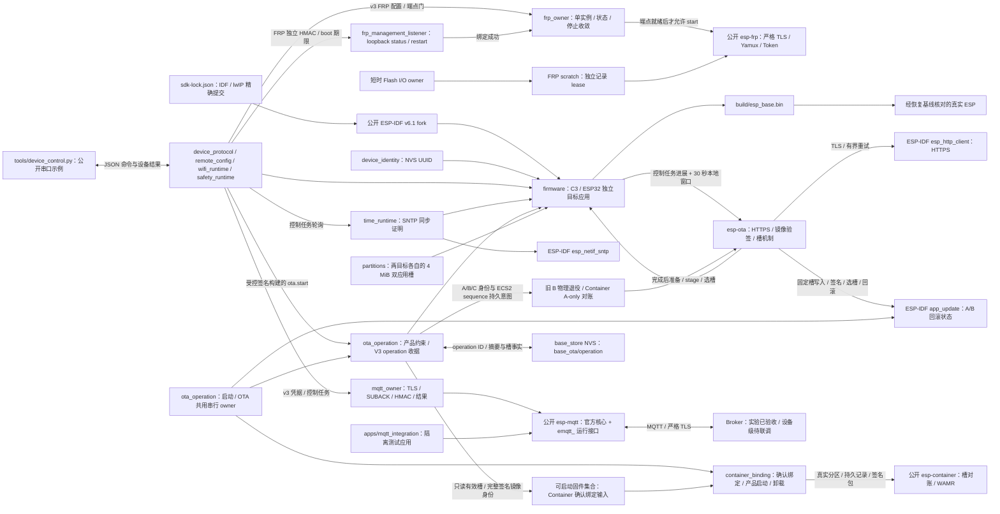

# ESP Base

签名包的宿主单次调用期限已接入 Base 产品运行策略：平台 `CONFIG_ESP_BASE_CONTAINER_MAX_HOST_CALL_MS` 同时约束包准入和运行实例，Container 在重新验签后取平台与清单的较小值。每次导入独立计时，超期失败后清退并显式回收；整个入口期限和停止只影响本次启动的策略保持。双目标软件验证及设备边界见[开发检查点](docs/operations/development-checkpoint.md)。

2026-10-04 产品事件准入修正的 C3 联合功能复验通过：真正 driver exit 0，一次 WRITE OTA、USB／MQTT 停止启动、重启自动运行已确认产品、十二项业务、卸载及 A/C 读回完成；原三码精确恢复、实验数据擦除与所属 UART／fixture 释放通过。前两失败和离线归档准备错误分别保留。150/150 下载网络 ready，历史 heap 21360 B 仍距 49152 B 门差 27792 B；213 个完整现场文件及必要材料已受限保存，有限独核通过，新增节省 0。容量取舍待维护者决定，满峰值／native、largest、争用、寿命 Y/f、ESP32及正式交付仍开放，见[分配诊断检查点](docs/operations/ota_allocation_diagnostic_checkpoint.md)。

2026-10-04 C3 相同 Wi-Fi 配置修正复验通过：Base 3e8e44e 的真实生命周期与双目标 host 检查通过，新 A/C 完整 SDK 构建及官方验签通过；实板最大合法64KiB记录、同boot单Pong、公开移除及原清理前自然退出门通过，driver exit0。fresh双4MiB、原三码恢复、擦实验数据与所属UART／fixture释放通过。仅此FRP切片取得资格，新增节省0；五能力容量、联合争用、满合法峰值、ESP32与交付仍开放，见[分配诊断检查点](docs/operations/ota_allocation_diagnostic_checkpoint.md)。

2026-10-03 C3 最大FRP控制记录有限实测：实际65536 B单记录与同boot单Pong，wall约2.565秒、整区erase约564毫秒、读1179648 B及native失败0；公开移除后84次只读status为unconfigured，但夹具自然退出十秒联合门未过，整轮与成本总体资格保持失败。两fresh基线、原三码恢复／擦数据、UART和实际listener释放通过，原失败完整保留；普通Pong沿用已有4096 B窗口不擦scratch，不按心跳计算寿命。软件新A/C签名构建及最终输入通过，DRAM观察成本＋80 B、实际节省0；容量、争用、ESP32及交付继续，见[分配诊断检查点](docs/operations/ota_allocation_diagnostic_checkpoint.md)。

2026-10-03 C3 同池共享观察器实验：固定1800 B记录区与实际A/C完整构建／验签、34903项冷审通过；本轮20条TLS新低无丢弃、资格与119实际PC区间通过，driver退出0。联合功能、停止启动／重启自动运行、十二项业务、A/C与原三码读回通过，147/147下载网络ready、458任务快照完整；history heap19628 B仍低于49152 B，观察成本不加回、实际节省0。完整217成员现场已受限保存，实体全档独核通过；满合法峰值、native、Flash实测、ESP32与最终交付继续，见[分配诊断检查点](docs/operations/ota_allocation_diagnostic_checkpoint.md)。

2026-10-03 C3 来源最大事件与完整生命周期续验：OTA 前单次 4096 B 公开帧／3893 B 事件返回来源累计结果 3912，confirmed 绑定保持；联合 OTA、USB／MQTT 停止启动、重启自动运行、十二项业务、卸载、A/C 读回和原三码恢复通过。145/145 下载网络 ready、11 条历史新低无丢弃；451 个完整任务快照、13 个已观察名称栈余量至少 1024 B。诊断历史 heap 23228 B 仍低于 49152 B，不证明满队列或与 OTA 并存峰值，双板总门继续开放，见[分配诊断检查点](docs/operations/ota_allocation_diagnostic_checkpoint.md)。

2026-10-03 C3 全 prepare 诊断：连续单 reader 收到 12 条完整历史新低记录，无丢弃，148/148 下载样本 MQTT／FRP ready；历史 heap 22016 B 仍未达 49152 B。目标确认期间驱动拒绝合法 `unknown/storage_uncertain/null`，后继功能未完成；原三码恢复、数据擦除与资源释放独立复核通过，失败证据保持，见[分配诊断检查点](docs/operations/ota_allocation_diagnostic_checkpoint.md)。

2026-10-03 C3 分配探针保留失败：139/139 下载状态 MQTT／FRP ready，联合功能、公开停止启动及原代码恢复通过；UART dump 缺失头部，完整解析拒绝，整轮未通过。独立诊断历史 heap 21360 B 仍低于 49152 B，下一候选修正连续捕获与 history 记录策略，见[分配诊断检查点](docs/operations/ota_allocation_diagnostic_checkpoint.md)。

2026-10-03 C3 公开停止／启动实体切片：USB 与认证 MQTT 各一次 stop/start、停止后重启自动运行 confirmed、旧 boot 原 ID unknown、十二项业务、A/C 字节读回和原代码恢复通过。130/130 下载样本 MQTT／FRP ready，441 个任务快照完整序列化；来源历史 heap 23888 B 仍未达 49152 B，完整容量、两板与生产继续开放，见[实体检查点](docs/operations/product_lifecycle_c3_checkpoint.md)。

2026-10-03 FRP 唯一配置 owner 软件候选：借用 control task 的 canonical 配置并复用已有 work 做完整失败重载，保留 native 深拷贝与销毁重试；两个目标 host、普通／签名 SDK 和官方验签通过。C3 签名普通堆起点前移 2736 B，实体容量仍待复验，见[检查点](docs/operations/frp_canonical_config_owner_checkpoint.md)。

2026-10-02 产品包 HTTPS 共享期限软件候选：读取器改为借用公开 OTA 的唯一 DNS／TCP／TLS 机制，保留 5 秒连接、1 秒单次操作、30 秒无进展与 5 分钟总期限，以及原 URL／长度／HTTP 策略。最终组合包含公开停止／启动改动；正式依赖保存与实板验收边界见[检查点](docs/operations/shared_http_deadline_consumer_checkpoint.md)。

2026-10-02 C3 新 MQTT 任务栈诊断：联合功能及恢复通过，325 份存活任务快照完整；来源历史 heap 22040 B 仍未达 48 KiB，观测开销不回加，正式 Wi-Fi 默认值保持，见[诊断检查点](docs/operations/mqtt_task_stack_diagnostic_checkpoint.md)。

2026-10-02 产品停止／启动软件接入：仅当前启动停止，重启自动运行已确认产品；公开 USB／MQTT 原 ID 查询、重新验签和真实 guest 回收通过双目标组合验证，Tool 全链路软件消费已保存，C3 有限实体切片见最新检查点，完整容量与双板仍待验收，见[检查点](docs/operations/public_product_lifecycle_checkpoint.md)。

2026-10-02 MQTT 消息 owner 精确消费：采用公开 `6443b71db761f4d667503f14108687bad5e6b5ee` 和官方生成双目标锁；双目标普通／签名构建、完整 host 与官方验签通过。SDK 双锁、provider 字节及实际编译输入已核对，实板容量未据此验收，见[软件消费检查点](docs/operations/mqtt_sized_message_owner_consumer_checkpoint.md)。

2026-10-02 C3 OTA 分配诊断：三轮联合功能和恢复通过；定向探针捕获 10 笔较大 TLS 分配，实际调用位置及全部释放已核对。原生 ALL 轮溢出，完整峰值仍开放；正常固件历史 heap 23800 B 未达 48 KiB。详见[分配诊断检查点](docs/operations/ota_allocation_diagnostic_checkpoint.md)。

2026-10-02 C3 配置所有权：长期 context 的 7640 B 移入 RTC，启动先清空再从 NVS 恢复；临时 7618 B 编解码 owner 按需申请并清零释放，ESP32 保持原策略。最新精确依赖下双目标普通／签名构建、官方验签及完整 host 回归通过；C3 一次 WRITE 联合 OTA、MQTT restart、十二项业务、卸载和原代码恢复通过。124 份下载采样均 MQTT／FRP ready，来源历史 heap 23800 B 仍低于 48 KiB；完整容量未通过，见[RTC 检查点](docs/operations/rtc_config_ownership_checkpoint.md)及[前轮 MQTT 消费](docs/operations/mqtt_owned_config_consumer_checkpoint.md)。

2026-10-02 命令载荷按类型分配、串口缓冲按实际长度增长并清零回收，已准入配置转交试运行 owner；两个目标控制栈统一 8192 B。双目标签名／官方验签及 ASan/UBSan 回归通过，C3 一次 WRITE 联合 OTA、MQTT restart、十二项业务和恢复通过。141 份下载采样均 MQTT/FRP ready，控制栈最低余量 2400 B；历史 heap 11404 B、采样连续块 16384 B 仍未达门，见[命令内存检查点](docs/operations/c3-command-memory-checkpoint.md)。

2026-10-02 C3 稳定 FRP 身份联合功能切片通过：公开一次 WRITE OTA 与一次 MQTT restart 后，目标和第三 boot 均经 FRP 认证状态核验，十二项消息计数业务、卸载、A／C 字节核对及原代码恢复完成。143 份实板证据冻结；来源下载最低历史 heap 4124 B，48 KiB 容量门继续失败，见[检查点](docs/operations/c3-five-capability-run-id-checkpoint.md)。

2026-10-02 FRP 稳定请求身份接线：已有设备 UUID 同时用于 client_id 与 run_id，公开组件 0.2.0 的精确提交及 SDK 生成的双目标锁已更新。两目标签名构建、官方验签和 host 回归通过；C3 联合重启恢复与容量继续复测，见[检查点](docs/operations/frp-stable-run-id-checkpoint.md)。

2026-10-02 C3 产品／FRP／MQTT／WRITE OTA 组合实测保留失败：来源产品与网络同机下载、目标产品和原 OTA ID 持久确认、C 上 FRP 认证状态均通过；再次重启后 MQTT ready、FRP 登录拒绝，官方 FRPS 报告相同 client_id 仍在线。来源下载 67 份采样均 MQTT/FRP ready，历史最低堆仅 6500 B，低于 48 KiB；该登录错误与容量缺口分别处理。109 份失败证据、数据丢弃、原代码恢复与清理已核对，见[组合缺口](docs/issues/c3-product-frp-mqtt-ota-capacity.md)。

2026-10-02 C3 空产品 FRP/MQTT 管理实板切片通过：官方 FRPS 0.71.0、严格 TLS 与设备 PSA HMAC 认证状态、错误 key 的空 401 拒绝及一次签名重启的新 boot 确认完成；revision 3、同设备身份及 MQTT/FRP ready 恢复。72 份私有证据逐项核对，数据丢弃、原代码恢复、服务和串口释放，无 eFuse 写入。首 boot 的最低堆为 125680 B；没有 guest 或 OTA，五能力容量与生产入口仍开放，见[实板检查点](docs/operations/c3-frp-mqtt-management-checkpoint.md)。

2026-10-02 C3 公开 WRITE 联合 OTA 与消息计数切片通过：严格 HTTPS 更新不同签名包至 counter v0-2-0，经代表事件和 30 秒健康门取得原 OTA ID 持久成功，再次重启保留结果及确认产品。十二项真实业务检查、公开卸载和 A／C Flash 字节核对通过，ECS2 1→6→11→11→12；实验镜像仅增加 timer 授权／一个定时器、既有实验 CA 和官方版本设置，生产信任未改。完整边界见[WRITE 检查点](docs/operations/c3-joint-ota-write-message-counter-checkpoint.md)。

2026-10-02 C3 公开 REUSE 联合 OTA 切片通过：已确认 counter 从签名固件 A 升级到 C，实际代表事件与 30 秒健康确认后，原 OTA ID 持久成功；再次重启仍成功、产品恢复，公开卸载与 A／C 完整 Flash 字节核对通过，ECS2 1→6→10→10→11。仅私有构建的实验 CA 与官方版本配置不同，生产信任未改；WRITE、FRP、ESP32 与五能力总验收继续开放，见[联合 OTA 检查点](docs/operations/c3-joint-ota-reuse-checkpoint.md)。

2026-10-02 C3 产品公开链实板切片：原始启动入口与正式分区完成一次 HTTPS 签名安装、MQTT 代表事件、实际 30 秒健康确认、一次重启后的确认产品恢复及公开卸载，ECS2 1→6→6→7。该私有镜像仅通过官方 SDK 配置加入既有实验 CA，生产信任未变；ESP32、升级、FRP／OTA 与五能力峰值仍待验收，见[安装检查点](docs/operations/c3-product-https-install-checkpoint.md)。

2026-10-02 C3 原始 Base MQTT 控制复验：修正重启回执的精确 PUBACK 观察顺序，双目标 host／固定 SDK 签名构建与官方验签通过；真实 C3 的严格 TLS、认证查询、HMAC／QoS 负例、远程配置写门、一次重启回执与新 boot 配置恢复通过。该轮为空产品切片，产品安装、FRP／OTA 联网组合与 ESP32 仍待验收，见[重启回执记录](docs/issues/mqtt-restart-receipt-delivery.md)。

2026-10-02 前序 C3 原始 USB 固件复验：修复空产品 `product.status` 的空指针容量读取后，真实空白数据首启、十字段状态查询、Wi-Fi 配置提交、公开重启与身份／配置／联网恢复通过。双目标 host、真实签名 guest 生命周期、固定 SDK 完整签名构建和官方验签通过；[故障与证据](docs/issues/c3-empty-product-status-null-pointer.md)单独记录，当时尚未验收 MQTT／FRP／OTA 联网组合。

2026-10-02 C3 签名产品实板切片：正式 Base 产品 owner 的 event／timer 原生取消、实际 stop／close／join 与 100 轮回收／199 次同 boot 重开已通过，完整边界见[取消检查点](docs/operations/async-cancel-checkpoint.md)。本任务维护者已允许丢弃 ESP 数据，C3 实验整片擦除后只恢复原代码制品，旧身份和配置不再保留；ESP32 未连接，五能力联网和公开管理全链仍未验收。

2026-10-02 产品 owner 异步取消：精确消费新 Container／WAMR 取消合同与可复现的 MQTT 归档，并将唯一 guest 线程优先级设为 3，使既有产品 worker 4／control 5 能提交取消请求。双目标 host、真实签名 init／event／timer 取消、停止失败阻断及百次生命周期回归通过；修正后的固定 SDK 两目标签名固件与官方验签通过，独立两目标 QEMU 与 C3 直接 API 实板切片证明调度关系，Base 签名产品的公开管理与联网组合仍待验证，见[检查点](docs/operations/async-cancel-checkpoint.md)。

2026-10-01 宿主工具归位：期限 guest 构包与 NVS QEMU runner 移至 `tools/`，固件 README 标准链接修正；双目标真实签名 guest、各 100 次重装和资源回归通过。中央检查器的嵌套 SDK 误报修正已在主工作区通过完整门禁，软件与实板边界见[开发检查点](docs/operations/development-checkpoint.md)。

2026-10-01 FRP 设备认证重启软件续进：新增固定 restart 端点，复用全设备写守卫，在签名 running 回执后有界延迟重启。两目标 host、真实 HTTP／HMAC／Base handler 回环与固定 SDK 测试签名构建通过；网关重启与新 boot 确认、真实 FRPS 和两板仍待验收，见[重启检查点](docs/operations/frp-restart-checkpoint.md)。

2026-10-01 FRP 只读状态认证软件续进：请求硬切为设备／请求 UUID 等四字段，可独立取得当前 boot／uptime；非空认证响应现由设备签发原始 JSON 的 HMAC，失败关闭。双目标 host、真实 OpenSSL 回环 HTTP、固定 SDK 测试签名构建与官方验签通过。私有网关、外侧 HTTPS、真实 FRPS 与两板仍未验收，见[认证状态检查点](docs/operations/frp-authenticated-status-checkpoint.md)。

2026-10-01 已确认 guest 异常退出宿主续验：真实签名 Wasm 在候选准备前／后失败时，替换与重开均拒绝，已确认绑定保持；精确卸载可等待线程退出、证明 native 回收并保留包字节。测试不覆盖公开 worker 的 unknown 恢复，停止／启动的公开语义仍待裁决，范围见[开发检查点](docs/operations/development-checkpoint.md)。

产品事件宿主发布器现有 16 项隔离真实 TLS Broker 软件验证：一次发布、目标权限、陈旧序号、最大 wire 帧及 unknown 行为通过；Broker 实收字节经本仓实际 C 帧解析器核对。设备 reported、guest 与健康仍为假件，IDF 密码端口与两板结果未据此验收；范围见[开发检查点](docs/operations/development-checkpoint.md)。

2026-09-30 活动产品元数据软件续进：`product.status` 的十字段链新增设备当前实际实例的完整版本、摘要、ABI／schema 和真实试运行状态。确认绑定与候选分别返回，停止后清除活动视图；公开 CLI 和 Tool 严格消费。正式发布、两板回读及峰值验收仍待闭合。

2026-09-30 C3 带包恢复诊断续验：`eb41a4a` 的仓外 UART 适配签名镜像完成 REUSE／WRITE 的离线 pending、旧 P0 回退恢复及幂等二启，主栈最低余量均为 2,260 B，二启均为 4,244 B；原 V3 除终态／失败码外逐字节保持，两模式二启整片 Flash 各自相同。该镜像仅在仓外改变控制台／VFS 与串口驱动装配，另跳过 QEMU 缺失的 ADC2 校准；正式 USB 镜像和实体 C3 未改，不能当作 USB／联网／实板验收。精确输入与模拟器 eFuse 前置见[开发检查点](docs/operations/development-checkpoint.md)。

2026-09-30 ESP32 带包回退主栈修正：完整产品授权的正式签名 app 在 QEMU 的 REUSE／WRITE 回退启动中复现默认 3,584 B 主栈溢出。两目标普通 Base 主栈现在统一配置 6,144 B 并拒绝更小配置，C3 实际值不变。重签 ESP32 的离线 pending、A 侧旧包恢复、原 ID 失败收据与重复冷启动均通过；恢复主栈最低余 2,324／2,308 B，二启完整 Flash 逐字节一致。双目标签名构建和官方验签通过；ESP32 完整授权 app 为 `0x10fff4/0x120000`，此前 `0xffff4` 属于空授权装配，不能代表完整产品容量。当前实体连接仅 C3，ESP32 已拔除，未写板卡或验收真实网络，详见[开发检查点](docs/operations/development-checkpoint.md)。

2026-09-30 公开带包联合 OTA worker 接线：`ota.start` 现执行 `REUSE`／`WRITE` 的原 V3 事务，重核来源后退役旧 B、准备新固件，停止并回收来源 guest，再重验复用包或经严格 HTTPS 写入新包；持久 `PREPARED` 和完整传输均读回后才选新 boot。退役也按原收据保留来源包，单固件已确认来源可原相位进入 stage／恢复；原 ID 的活跃 worker 或 pending C 查询为 running，VALID 未持久成功仍 unknown。双目标 host、真实签名 guest 的单／双固件来源与各 100 次重装、固定 SDK 签名构建、官方验签及客户端 15 项通过。真实 Broker／HTTPS、实体板与五能力资源未验收，详见[开发检查点](docs/operations/development-checkpoint.md)。

2026-09-30 联合 OTA pending 带包启动接线：主应用现消费原 V3 启动候选 guest，控制任务在准入后启动 MQTT、采集请求绑定代表事件及连续 30 秒 Wi-Fi／时间／MQTT 在线证据，主应用依次提交健康、确认固件 VALID、确认包并读回成功收据。离线保持未决，配置／升级写门和 FRP 启动门持续关闭；失败先停止并证明 native 回收，不确定保留 claim。双目标 host ASan/UBSan、固定 SDK 签名构建与官方验签通过，链接映射证明新成功链已进入 app，镜像仍为 `0x121000/0x130000`／`0xffff4/0x120000`。公开带包下载 worker、真实 Broker／设备事件和实板验收仍待完成，详见[开发检查点](docs/operations/development-checkpoint.md)。

2026-09-30 联合 OTA 内部带包 trial 续进：原 V3 与签名 pending C／回退 A 约束候选启动，先持久 trial boot，再执行请求绑定的代表事件；内部健康提交复核事件和失败计数，冻结 guest 调用并独立读回，固件 VALID 后才确认包绑定并恢复事件。双目标真实签名 guest 覆盖空来源 WRITE、两模式读回故障、真实 trap 与 A 回滚；host、固定 SDK 签名构建和官方验签通过。主应用尚未消费新入口，pending MQTT 与连续 30 秒在线窗口、公开带包 worker、实板均未完成，当前镜像尺寸不代表新成功链已深链接。详见[开发检查点](docs/operations/development-checkpoint.md)。

2026-09-30 联合 OTA 带包 C 侧 VALID 恢复：普通启动在本地基本检查后，按原 V3 收据核对签名 A/C、来源包、模式序号和原健康证据，持久确认并独立读回后才重开 guest、提交成功收据。错误证据或存储不确定保留写门；两模式及空来源 WRITE 的真实签名 guest、双目标 host、固定 SDK 签名构建和官方验签通过，app 尺寸仍为 `0x121000/0x130000`／`0xffff4/0x120000`。公开带包 worker 和新 pending trial 的真实事件／30 秒在线确认仍未接线，实板及 P6-10/P7-04 未验收。详见[开发检查点](docs/operations/development-checkpoint.md)。

2026-09-30 联合 OTA 带包 A 侧启动恢复接线：普通启动现用原 V3 收据处理 `REUSE`／`WRITE` 的中断或回滚。只有确切 inactive app 退役、来源签名固件与 ECS2／原包对账均通过，失败收据又持久提交并读回后，才重开旧确认包并解除启动事务锁；任何一步不确定均保持写门。带包 `FAILED` 可按原 operation ID 查询，重复启动不重新擦槽。双目标 host ASan/UBSan、固定 SDK 测试键签名构建与官方验签通过，C3／ESP32 app 仍为 `0x121000/0x130000`／`0xffff4/0x120000`。公开带包 worker 和目标 C 的业务试运行／确认仍未接通，实板与 P6-10/P7-04 未验收。

2026-09-30 联合 OTA 带包 A 侧中断恢复续进：内部回退入口硬切为消费原 V3 收据，核对来源包身份与真实引用、A/B 或 A/C 固件绑定、操作参数及模式对应的精确 ECS2 序号。旧 B 尚未退役、`WRITE` 停在 `WRITING`、`REUSE`／`WRITE` 的 `PREPARED` 或旧 boot `HEALTH_VERIFIED` 均可在物理 A-only 证明后放弃并删除不可启动 C 绑定，保留旧包；来源包损坏、收据冲突和同 boot trial 均阻断。双目标 host、真实签名 guest、测试键签名构建与官方验签通过。普通启动的带包执行门仍未开放，A 侧的软件原语不等于公开跨启动恢复已接通。

2026-09-30 联合 OTA 带包 selected C 只读预检续进：内部 Container 对账入口现在核对原 V3 收据、完整签名的 pending C／回退 A、ECS2 `PREPARED` 的操作与精确序号、来源包绑定，以及 `REUSE`／`WRITE` 目标包槽的真实字节摘要。`WRITING`、错误操作／包身份或损坏包均阻断，预检不改写 NVS 或 Flash。双目标真实签名 guest 生命周期与 host 回归、测试键签名构建及官方验签通过；普通启动和公开 `ota.start` 仍在带包执行门前停止，业务试运行及联合确认未接通。

2026-09-30 联合 OTA V3 收据只读恢复续进：收据层现可完整返回有效 `REUSE`／`WRITE` 的包模式、目标与来源包身份和代表事件摘要；旧格式或不一致字段继续拒绝。Base worker 与启动入口另设明确的无包执行门，故带包收据不会触发擦槽、选 boot 或确认。双目标 host 故障回归覆盖只读返回及门禁；带包事务恢复与联合健康仍未接通。

2026-09-30 联合 OTA 公开命令合同续进：`ota.start` 现强制声明 `package_mode`，`reuse`／`write` 还必须绑定包摘要、长度、ABI、schema 与代表事件 SHA-256，`write` 另需包 HTTPS URL；同一次请求的指纹包含所有字段。公开客户端同步生成该合同，`ota.result` 返回包模式与包摘要。带包命令目前在持久登记与任何 Flash 擦写前返回 `product_ota_unavailable`，待启动恢复及联合健康链完成后开放；无包命令仍按原路径执行。双目标 host 与客户端测试覆盖此边界。

2026-09-30 联合 OTA 内部 `WRITE` 续进：在已持久预约的 `WRITING` 包槽上，Base 现以原 V3 收据和 A/C 签名固件身份再次核对序号、操作、来源包及已停止 guest，再调用 Container 写入目标槽、完整回读摘要、验签授权并读回 `PREPARED`。错误操作在擦写前拒绝；写入开始后的失败保留未决，不选择新 boot。C3／ESP32 host、真实签名 guest 生命周期、固定 SDK 签名构建及官方验签通过。公开带包 `ota.start`、HTTPS 下载、启动恢复和联合确认仍未接通。

2026-09-30 联合 OTA 内部包槽 stage 续进：Base 的 `stage_firmware` 现消费原 V3 收据、目标已验签固件和退役后的 ECS2 序号。`REUSE` 在新固件身份下重验来源签名包并持久提交 `PREPARED`；`WRITE` 只预约非来源包槽并提交 `WRITING`，不擦写包字节，也不授权选择新 boot。来源 guest 必须停止并回收；错误序号、已损坏来源包及重复 stage 被拒绝。公开 `ota.start` 与启动恢复仍只允许无包，内部 stage 不代表联合 OTA 已开放。双目标 host 与真实签名 guest 生命周期、固定 SDK 签名构建及官方验签通过。

2026-09-29 带包 OTA 目标预检续进：来源快照现同时消费本次请求，在登记收据和任何 app 擦写前拒绝 `REUSE` 的包身份／长度／ABI／schema 不一致、`WRITE` 的无可用槽或跨 schema，以及缺少代表事件摘要的带包请求。内部 V3 收据登记现可校验并持久记录带包意图，但公开 `ota.start` 仍只接无包请求；本改动不执行包下载或联合确认。双目标宿主、真实签名 guest 生命周期、固定 SDK 签名构建和官方验签通过。

2026-09-29 带包 OTA 来源快照前置：在同一存储 claim 下，`REUSE`／`WRITE` 只读对账当前签名固件与 ECS2，复制已确认来源包的摘要、长度、ABI、schema 和序号；`WRITE` 从空绑定开始时记录无来源包，并为额外持久提交保留序号。双目标宿主和真实签名 guest 回归、固定 SDK 双目标测试键签名构建及官方验签通过。公开 `ota.start`、收据登记、包槽写入、启动试运行与联合健康确认仍只支持既有无包路径，不据此开放带包 OTA。

2026-09-29 OTA V3 持久意图软件续进：收据扩展为 308 字节，记录包模式、目标包与代表事件摘要以及来源包身份；当前公开请求与启动恢复仍只允许 `NO_PACKAGE`。旧 V2 长度、损坏记录及带包 V3 状态均阻断自动恢复，不将它们解释为空收据。固定 SDK 的 C3 十一页与 ESP32 六页合成 NVS 均已以 V3 形态完成 100 轮跨冷启动容量读回；带包 REUSE／WRITE 的公开授权、完整包写入和启动健康链仍待接线。

2026-09-29 OTA 槽状态仲裁：双目标精确消费 `esp-ota@04acb5e80a744649f8442607fb8d901d30880ca0`，启动、确认后的 Base 槽检查与 OTA 库的运行／boot／目标槽、otadata、回退资格读取共用 Flash I/O owner。双目标 host ASan/UBSan 与固定 SDK 测试键签名构建通过；整镜像验签和回退资格检查的最长物理占用、最大 FRP 记录并发及实机仍待验证，P4-05/P6-03/P7 不据此验收。

2026-09-29 OTA 显式读取接线：双目标锁更新到公开 `esp-ota@a6bf4e362756ea2cee9febc95555a6866af4c931`，组件摘要一致。OTA 分区读取每次最多 1024 字节持有共同 Flash I/O owner，SDK 整镜像验签在整次调用期间持有 owner；摘要计算在释放后进行。双目标 host ASan/UBSan、固定 SDK 仓外测试键签名构建及官方验签通过。槽状态观察、整镜像验签实际最长占用和 FRP 最大记录同机进展仍须验证，P4-05/P6-03/P7 未据此验收。

2026-09-29 OTA 短时 Flash I/O 软件接线：双目标精确消费 `esp-ota@195201aed3f7c5ddd13517b7d8ad3dc2877e4ab4`；Base 启动时将 OTA 库的每次 app/otadata 写调用、pending 确认／回滚和收据 NVS 读写绑定到与 FRP scratch 相同的短 owner。OTA 与 FRP 获取短 claim 的单次等待上界为 500 毫秒，HTTPS 等待和进度回调不占用该 owner。双目标 host ASan/UBSan、固定 SDK 普通与仓外测试键签名构建、官方验签通过；尚无正式五能力并发、全部大范围 Flash 读验签时延或实体板磨损证据，P4-05/P6-03/P7 不据此验收。

当前产品命令候选已接公开安装／升级、HTTPS 验包、持久操作账本和同 boot 候选试运行；`product.status` 在试运行期间只报告仍已确认的旧绑定。业务代表事件和 30 秒稳定窗口已有软件实现；生产 Broker／设备联调、正式分区迁移与实板验收仍未闭合，不能作为产品发布结果。

2026-09-29 C3 十一页 `base_store` 容量续验：同正式产品数据区几何的合成 QEMU Flash 在三次独立启动中完成 100 轮最大 v3 配置、当前 OTA V2 收据形态、Container ECS2 与八条产品账本的提交／回读，最终 revision 100 与全部键读回相符；官方 NVS parser 页 CRC 通过。它未运行正式 Base、未来联合 OTA 新收据或实体 Flash，详见[容量记录](docs/operations/c3-eleven-page-nvs-capacity.md)。

2026-09-29 独立 MQTT 业务事件已有公开严格 TLS 一次发布客户端：发布前核对本 boot 的 reported 高水位，发布后按包、序号和实际 guest 原始事件 SHA-256 对账最近完成结果。Base 在授权入口计算事件摘要，Container 随有界队列将它绑定到完成观察，内部 trial 确认也须核对已验证摘要。双目标 host、锁定签名 guest 生命周期和固定 SDK C3 签名／ESP32 离线构建通过；生产账户、真实 Broker/设备消息与业务健康最终确认仍待闭合。

2026-09-28 C3 三份 `0x77000` 包槽候选的仓外 QEMU 无包启动发现默认 3,584 B `app_main` 栈在后续签名校验时溢出；将正式 C3 产品主任务栈设为 6,144 B 并加构建下限后，同布局 UART 诊断首启／同片冷启动均到 `container=empty`，首次主栈最低余 2,440 B，公开 `product.status`、身份／序号持久读回与二启前后整片 Flash 一致。正式 USB 控制台副本重签后仍为 `0x121000` B，签名与双 app 容量门通过；[输入与边界](docs/operations/c3-slot-77000-capacity-probe.md)。

2026-09-28 C3 仓外三份 `0x77000` 包槽候选经正式 TLS 配置完整签名构建、RSA 验签和官方分区／app 容量门通过：双 `0x130000` app 槽各余 `0xf000` B；这会缩小通用签名包可接受范围，尚待维护者决定包槽上限，且未覆盖公开安装代码、同机网络负载或实板。[容量探针与边界](docs/operations/c3-slot-77000-capacity-probe.md)。

2026-09-28 C3 正式 JSON 卸载入口在仓外测试键 QEMU 中完成卸载、同片冷启动原 ID 查询与重复请求不重执行，6 KiB 控制任务栈没有溢出；为适配 QEMU UART 和装入当前签名 app，此镜像临时缩小包槽。独立保留正式 USB 控制台与三份 `0x82000` 包槽的签名构建得到 `0x121000` B app，超过双 `0x120000` 槽各 `0x1000` B；构建级收敛探针仅在 56 B 内容余量下装槽，不能容纳后续安装／升级功能。[输入、回执与容量边界](docs/operations/product-uninstall-c3-protocol-qemu-checkpoint.md)。P6-03 布局与 P6-04/P7 实板验收继续开放。

2026-09-28 ESP32 正式串口 `product.uninstall` 的双目标签名 QEMU 复测发现控制任务 4 KiB／6 KiB 栈分别在状态查询／卸载时溢出；ESP32 提至 8 KiB、C3 保持 6 KiB 后，最终源码重签镜像完成卸载、同片冷启动查询原操作及重复 ID 不重执行。官方 NVS parser 和逐区 Flash 读回通过；[完整输入与边界](docs/operations/product-uninstall-protocol-qemu-checkpoint.md)。这仍不是实板或 P6-04 完整验收。

2026-09-28 产品执行线程现将每条授权 MQTT 事件的 boot 内序号随队列副本送入 guest，保留当前产品实例最近一次 `on_event` 的包摘要、执行结果和 guest 原始返回值，并通过非 retained `reported` 区分入队、执行和业务失败。该观察在换包启动时清空，不能单独证明试运行健康或持久产品操作成功；真实 Broker、设备消息和产品写命令仍待闭合。

2026-09-28 产品执行线程新增有界事件 FIFO：容量取自 Container 对所选签名包本次重新验签的 `event_queue_limit`，每条事件还须匹配本次包 SHA-256；入队只表示接收，`on_event` 只在唯一 guest pthread 执行。独立 MQTT `event` Topic 现已接入设备端 HMAC、boot/包摘要、连续序号验证及入队后高水位报告；公开宿主工具可生成相同签名帧。C3／ESP32 的真实签名 counter 包宿主回归覆盖同 boot 换包、错误摘要、停止后拒绝及百次回收；Broker 源码 ACL 已另在 `mqtt-service` 加入。该轮未接公开产品写命令，生产账户／发布、真实消息、guest 业务结果与试运行健康判定也未验收。

2026-09-28 按维护者裁决增加产品操作持久幂等账本的软件候选：单个 910 字节 NVS blob 暂存最近 8 条及单调序号，写意图和终态提交后逐字节读回；只读 `product.status`／`product.result` 与公开串口客户端已接入查询。宿主故障测试及 NVS 短时 I/O 适配测试通过；固定 SDK／QEMU 的 C3 六／八页、ESP32 六页均完成 100 代四记录容量与重启读回，见[C3](docs/operations/c3-eight-page-nvs-capacity.md)和[ESP32](docs/operations/esp32-six-page-nvs-capacity.md)记录。该轮尚未接设备产品写命令；真实 Flash 磨损与两板掉电验收未完成，不能把账本视为 P6-04 完成。

基于公开 ESP-IDF v6.1 维护 fork 的设备业务基座。当前具备持久 UUID、硬件事实、心跳、分区、配置事务、Wi-Fi station、本次启动 SNTP 时间同步门、USB status/restart/config.set 协议、配置后启动的严格 TLS MQTT 命令通道，以及 OTA pending 新槽本地确认。受控签名构建还具备 `ota.start` 下载、按 operation ID 查询 `ota.result` 的 V3 持久收据、只读签名固件集合观察，以及与 Container 产品绑定的无包固件 OTA 和启动恢复软件链。FRP 已接入公开组件和单 owner；受控 loopback 管理端点已有认证 `status`／`restart` 软件候选，能在绑定成功后开放 FRP 启动门，但尚无同板资源及真实 FRPS 闭环；C3 当前用于受控仓外实验，数据按维护者授权清空，原 MQTT 实验代码制品作为恢复目标；ESP32 已拔除，五能力完整验收尚未完成。

2026-09-28 ESP32 产品源码现已采用此前签名 QEMU 使用过的完整 4 MiB 分区几何：双应用槽、三包槽、独立 FRP scratch、六页 Base NVS 与旧 AT 原字节区。scratch 的编译配置必须与该表精确一致；固定 SDK 测试键签名 app／分区表官方验签、容量门及 ESP32 host 回归通过。[源码几何检查点](docs/operations/p6-03-esp32-product-partition-source-checkpoint.md)记录完整输入。迁移恢复、正式 `ota.start` 全链及两块实板验收仍未闭合。C3 源码现采用双 `0x130000` app、三份 `0x77000` 包槽、`frp_scratch@0x3e5000` 与 11 页 `base_store`；旧 C3 表仅供离线迁移预检。

随后用该正式签名 app 的完整摘要重建真实签名 ABI 2 包、ECS2 sequence 6 与六页 NVS，原样产品镜像在 4 MiB 仓外 QEMU 两次冷启都达到 Container `RUNNING`／Base `READY`；第二次整片 Flash 与第一次完全相同。首次启动只改系统 NVS／otadata 并把非空 FRP scratch 擦成全 `0xff`，两个 app 槽、三包区、旧 AT 区与 Base NVS 字节未变。此次没有联网负载或正式固件 OTA，不替代实体板及 P6-03 资源验收；详见同一[检查点](docs/operations/p6-03-esp32-product-partition-source-checkpoint.md)。

2026-09-28 Base 串口行、配置候选、命令解析和 MQTT 装配区改为按存活期持有；MQTT 新修订缺少装配内存时先撤销旧连接及管理密钥。当前锁的 C3 签名 guest、严格 TLS／官方 FRPS 与 300001 B 双向工作流在仓外 QEMU 诊断切片的普通内部 8BIT 堆历史低水达到 **57,020 B**，高于 49,152 B 门 7,868 B。该诊断镜像的包槽小于既定三份 `0x82000` 目标；另有完整三包槽、独立 scratch 与 18 页 NVS 的[4 MiB 对齐软件候选](docs/operations/p6-03-c3-aligned-layout-software-probe.md)通过官方验签、装槽及无网络签名 guest 启动。两条证据不能拼作同一联网镜像，正式 MQTT／OTA 同机、旧数据迁移和实板 Wi-Fi 未验收；[逐轮容量检查点](docs/operations/p6-03-c3-current-lock-frps-work-qemu-checkpoint.md#base-控制工作区存活期收敛)给出输入与限制。

2026-09-28 当前主固件精确消费 `esp-frp@8f056273b3b93ea3273b4637038ddd0c6aea82a8`，ESP32 目标配置启用单核及 8BIT IRAM，FRP 的 client、TLS、会话与工作流私有对象按目标条件分配；C3 保持普通分配。官方 Component Manager 已重新生成两目标锁，签名容量与独立严格 TLS/FRPS 工作流的边界见[工作流 IRAM 精确锁检查点](docs/operations/p6-03-frp-work-iram-precise-lock-checkpoint.md)。现有两块 4 MiB 板和 48 KiB 堆门不变，正式 Base owner 的联网组合仍待验证。

2026-09-28 此前主固件精确消费 `esp-frp@b462c1497438cfeb514f022bc2d2d6c026599a41`，成功 TLS 握手后的 client 快照回报实际验签标志；固定 SDK 双目标普通构建和宿主回归通过。Base v3 配置提交与读回复用一份 7,618 B 静态缓冲，严格解码并逐字段校验持久结果；控制任务命令区与 MQTT 建连配置区串行复用。两目标普通 `.bss` 先分别减少 7,618 B 和 3,328 B，再将余下的 7,618 B 配置缓冲迁到 RTC 数据区。旧 FRP 锁与仓外 IRAM 会话变体的 ESP32 签名 QEMU 两次 FRPS 成功输入，在前两项改动后最低堆均为 44,100 B，迁移 RTC 缓冲后均为 50,248 B；此组合略高于 48 KiB 门，但不能代表正式 Base 五能力组合。[开发检查点](docs/operations/development-checkpoint.md)、[配置单缓冲收据](docs/operations/p6-03-config-single-buffer-checkpoint.md)、[MQTT 控制工作区收据](docs/operations/p6-03-mqtt-control-workspace-checkpoint.md)和[RTC 配置缓冲收据](docs/operations/p6-03-rtc-config-buffer-checkpoint.md)记录精确输入与验收边界。

2026-09-27 当前主固件将公开 FRP 精确锁更新到 `esp-frp@0af12209ee731617e635684309c026ae6b49c5ae`：该提交只复用会话私有阶段内存，公开头、ABI 和协议限额未变。固定 SDK 双目标普通构建、Base host ASan/UBSan 及各自 scratch 候选布局的仓外测试键签名容量门通过；[精确锁与签名容量检查点](docs/operations/frp-session-phase-union-base-dependency-checkpoint.md)记录输入。随后从该 Base 提交重新归档源码、解析双锁并重建 app／ECS2／Flash 的[双目标纯净签名 QEMU](docs/operations/p6-03-frp-phase-union-current-lock-qemu-checkpoint.md)均到产品 `RUNNING` 与 Base `READY`；C3／ESP32 启动内部堆历史最低空闲 54,104／52,596 B，完整 FRPS、MQTT、OTA 网络同存和实体板尚未验收。

同一新锁的[ESP32 仓外 FRPS 诊断](docs/operations/esp32-frps-phase-union-current-lock-qemu-checkpoint.md)另用额外 4 KiB 任务、OpenETH 和测试时钟：原样静态 TLS 缓冲三次握手超时且未验签，SDK 原生动态缓冲完成严格 CA/IP SAN 验签后在认证阶段因低内存停止；两份输入的启动堆历史最低分别只有 1,020／1,524 B。再次运行同一动态 app 时失败申请尺寸与先后停点变化，尚无唯一分配来源；正式 SNTP、FRPS 注册及五能力资源门未通过。

此前主固件在 MQTT `c0677e5` 的精确消费提交上，将唯一 OTA 清单和 C3／ESP32 锁更新到 `esp-ota@d98361f`。上游在旧备用固件退役前拒绝空主机及非法端口的 HTTPS 请求；当时同锁双目标普通编译与 Base host ASan/UBSan 分别通过。随后以当时的锁和仓外候选布局完成双目标签名产品镜像的官方验签与尺寸门，C3／ESP32 分别为 `0x111000`／`0x10fff4`；正式分区、设备 HTTPS／Flash 和完整五能力并发尚未验收。精确输入见[离线签名容量检查点](docs/operations/p6-03-five-repo-signed-capacity-checkpoint.md)。

该旧精确锁的 C3 原样测试键签名镜像重新绑定真实 ABI 2 包后，仓外 QEMU 到达产品 `RUNNING` 和 Base `READY`，内部堆最低 free **45,600 B**，低于 48 KiB 门 3,552 B；此次没有 FRPS、Broker、HTTPS 或实体板。输入、断点和 Flash 逐区读回见[旧锁 C3 签名 guest 容量检查点](docs/operations/p6-03-current-lock-c3-signed-guest-qemu-checkpoint.md)。

该旧五仓精确锁的 ESP32 仓外签名 guest 在 OpenETH DHCP 后建立 FRP client，原样静态 TLS 配置于 `mbedtls_ssl_setup` 的 4,429 B 出站缓冲申请失败；16,717 B 入站缓冲先前已分配。Base 正式 SNTP 门仍为 false，首次正式时间回调在建 client 前拒绝；该容量探针仅以仓外时钟回调继续，启动内部堆最低 43,032 B，低于 48 KiB 门。后续仓外固定时钟的同输入对照中，SDK 原生动态缓冲完成严格 TLS 验签，却在建立 FRP session 时的 1,024 B 分配失败、最低空闲堆仅 320 B；两种配置都未登录或注册。输入、失败阶段和原始收据见[旧锁 ESP32 FRP 会话容量检查点](docs/operations/esp32-frps-current-lock-qemu-capacity-checkpoint.md)。

当前 Base 将同步验包工作区移至产品 pthread 栈，产品配置的栈下界提高到 16 KiB。固定 SDK 双目标 host 回归及普通构建通过；后续源码核对发现旧双目标签名 QEMU 的仓外 Container 组件含 `P603_SAMPLE` 诊断插桩。ESP32 的 5,012 B 栈余量／49,100 B 堆低水和 C3 的 5,140 B／51,180 B 只属于诊断镜像，不能证明未插桩精确锁的容量；后续纯净锁双目标签名 guest 启动已单独重测，见下段。完整 FRPS/TLS、MQTT、OTA 并发和实板尚未验收。详见[工作区移栈检查点](docs/operations/product-workspace-stack-checkpoint.md)。

同锁的命令去重历史槽只保留重放判定及异步回执实际消费的字段，固定 SDK 双目标链接图各释放 2,304 B 常驻 `.bss`；host 回归通过。纯净锁双目标签名 guest 在无网络启动时均到 `RUNNING/READY`，C3／ESP32 的内部堆最低分别为 53,208／51,456 B，产品线程栈最低未用 5,140／5,012 B；仅该启动切片超过 48 KiB 初始观察门，P6-03 仍未通过。详见[命令去重表容量检查点](docs/operations/p6-03-request-guard-capacity-checkpoint.md)与[纯净签名 QEMU 检查点](docs/operations/p6-03-request-guard-clean-signed-qemu-checkpoint.md)。

命令配置、OTA 请求与结果 operation ID 的解析载荷互斥；该阶段固定 SDK 双目标链接图各释放 632 B 常驻 `.bss`，旧／新 host ASan／UBSan 与普通构建均通过。当时的候选配置、已提交配置、NVS 提交双缓冲和 MQTT 事件分别保留；后续 NVS 单缓冲改动见本页顶部。该阶段没有签名 guest 运行堆读数，P6-03 未据此验收。见[命令载荷容量检查点](docs/operations/p6-03-command-payload-capacity-checkpoint.md)。

控制任务复用互斥使用的 JSON result 与周期 reported 工作区；该阶段 reported 的格式上限为 512 B，当前为承载已完成事件 SHA-256 扩至 768 B，共用静态工作区仍为 1,024 B。精确锁 MQTT 的默认 outbox 在 enqueue 返回前复制报文；该阶段双目标 host 回归及普通构建通过，链接图各释放 512 B 常驻 `.bss`。该组合尚无网络运行堆或实板测量，见[网络回执工作区检查点](docs/operations/p6-03-network-json-scratch-checkpoint.md)。

移栈后的 Base `6ef7a02` 另用三份独立签名 ESP32 QEMU 探针接 OpenETH 与官方 FRPS：原样静态 TLS 在 `CONNECTING` 阶段因 2,212 B 分配失败；仓外 SDK 动态缓冲完成严格验签和 session 建立，进入 `AUTHENTICATING` 后认证超时，尚未证明 Login 收发、注册或 Pong。额外 4 KiB 探针任务与测试时钟不属于正式 FRP owner，Base SNTP 门保持 false；这批镜像也早于上述命令去重表收缩，堆读数不得混用。详见[移栈后 FRPS 容量检查点](docs/operations/esp32-frps-stack-workspace-qemu-capacity-checkpoint.md)。该批三份镜像的受管组件已严格重算并匹配精确锁，未受前述另一仓外目录的插桩影响；[认证超时只读诊断](docs/operations/esp32-frps-stack-auth-timeout-diagnosis.md)仍无法判定 Hello／Login 的实际收发。

移栈后 FRPS 探针的同 app trace 及另一份独立签名超时字段输入进一步确认：官方服务端识别 TLS，却没有接受首个 Yamux 控制流；四次认证超时中两次记录首个 12 B SYN 输出停滞约 5 秒，另两次由 TLS 待写期限先触发。TLS 内部待写字节数未采集，额外探针任务、测试时钟和插桩使容量读数不能回填正式 owner；没有可证明的 FRP 正式源码错误。见[认证输出追踪检查点](docs/operations/esp32-frps-auth-output-qemu-trace-checkpoint.md)。

对旧 Base `6ef7a02` 的两份新签名 FRPS 仓外探针做 TLS 发送回调取证：前置打印镜像在 socket 前遇 PSA 内存错误，低扰动镜像恢复五秒认证超时，其同一窗口内 178 次底层 `send` 均返回 WOULD_BLOCK、成功 0 次，最后 errno 为 EAGAIN；首个 12 B Yamux SYN 从未确认交付。两份输入的停止点不同，低堆和 OpenETH 收包不足并不能单独定位 lwIP 内部原因；正式 Base SNTP 门仍为 false。见[TLS 发送追踪检查点](docs/operations/esp32-frps-tls-send-qemu-trace-checkpoint.md)。

此前 Classic 期限组合消费 `esp-container@6ef74fa`、WAMR `c10736f` 和 `esp-ota@f4fb0b4`；当时 Base 与 NVS 探针的 C3／ESP32 四份锁均已重新生成。Container 在 WAMR Classic 安全分派点协作检查三个 guest 入口的墙钟期限。该组合的 Base 双目标普通构建和测试键签名产品构建通过；当时正式 ESP32 CSV 的隔离 ECDSA v1 签名应用为 `0x10fff4`，C3 候选 RSA v2 为 `0x111000`。Base 宿主 ASan/UBSan 的 C3 20 项、ESP32 19 项和真实签名包 100 次停止／卸载／重装循环通过。同步原生导入与 OS 调度仍不能被硬抢占，实板期限及五能力并发尚未验收；精确证据见[开发检查点](docs/operations/development-checkpoint.md)。

2026-09-27 当前集成候选补齐 Container 产品线程的确认停止、回收与同次启动重新接入，以及成功 OTA 收据与后续产品独立提交的对账。C3 新增 Container 相关局部 LTO 后，仓外测试键签名应用为 `0x111000`，双 `0x120000` 槽各余 `0xf000`；ESP32 签名应用为 `0x10fff4`。两目标官方签名和容量门通过，C3 合成 Flash 的 QEMU 到达 Base `READY`，ESP32 合成 Flash 两次冷启动均到达 `READY container=empty`。这仍不代表实板 guest、网络并发或正式分区迁移验收；输入与原始日志见[开发检查点](docs/operations/development-checkpoint.md)。

本轮 Base 内部接入公开 `esp-container@3b5f16f` 的产品专属卸载：持唯一存储 claim，以当前签名固件集合、ECS2 sequence 和包摘要定位绑定；运行 guest 必须停止/关闭/join，已停止或启动失败的 guest 必须证明 native 资源已回收，随后仅清当前包绑定，独立读回成功才允许同 boot 再次启动并得到 `EMPTY`。真实签名 counter 包在 ASan/UBSan 下验证了回退引用与包 Flash 保留、失键或读回不确定时阻断重开；仓外双目标签名镜像均通过官方验签及尺寸门。尚无设备端 `product.*` 命令与结果收据，实板未升级；验证详情见[开发检查点](docs/operations/development-checkpoint.md)。

此前 Base `bdf1647`／Container `3b5f16f` 曾以仓外 C3 候选几何、测试键和预置签名包，在 QEMU 两次冷启动中到达 guest `RUNNING` 与 Base `READY`。候选 OTA policy 必须仅在隔离构建副本中与候选 CSV 一致；遗漏时产品启动在读取 ECS2 前阻断。精确输入、失败分支与运行读回见 [C3 产品卸载版本 QEMU 检查点](docs/operations/c3-product-uninstall-branch-qemu-checkpoint.md)。

`e536b3d` 的仓外双目标签名 QEMU 测试变体已用正式 Base API 完成运行 guest 停止、产品卸载、同 boot 空绑定及同片冷启动空绑定；测试任务、签名输入、串口/GDB 与逐区 Flash 读回见 [产品卸载 QEMU 检查点](docs/operations/product-uninstall-qemu-checkpoint.md)。正式镜像仍无产品操作消费者和重装入口，该证据不等于实板验收。

`325ee51` 的新 Container／WAMR 精确锁在双目标签名 QEMU 测试变体上复验上述产品卸载与冷启动空绑定，ESP32 使用当前正式 CSV 的仓外签名构建；输入、源码宏、运行和 NVS 读回见 [Classic 期限锁 QEMU 检查点](docs/operations/classic-deadline-qemu-checkpoint.md)。本轮没有故意耗尽 guest 墙钟期限。

同一精确锁的 ESP32 隔离候选还将 `frp_scratch@0x3ea000/0x10000` 与六页 `base_store@0x3fa000/0x6000` 放入合成 Flash；签名 guest 启动、scratch 启动恢复擦除、产品卸载和冷启空绑定通过，见 [ESP32 FRP scratch QEMU 检查点](docs/operations/esp32-frp-scratch-qemu-checkpoint.md)。该测试不冻结正式布局。

后续 FRP `9a0839a` 精确锁的仓外 ESP32 签名 QEMU 在 guest `RUNNING` 时，以正式 Flash provider、AEAD reader 和 Base storage owner 完成 64 KiB 认证记录、16 个窗口复验、坏 tag 拒绝与冷启 scratch 擦除；内部 heap 最低仅 33,164 B，未达到组合资源门，也没有 FRPS 会话。输入与边界见 [ESP32 FRP 认证记录检查点](docs/operations/esp32-frp-authenticated-record-qemu-checkpoint.md)。

同输入资源归因进一步用原签名镜像量到探针任务退出后的 46,776 B，并用去掉探针、其余策略相同且重新签名的 guest 镜像量到启动最低 43,636 B；后者仍低于 48 KiB 门。最大单项是 ABI 2 一页 guest 所需的 65,536 B 线性内存，未证明可安全消除足量重复分配；详见 [ESP32 产品资源归因](docs/operations/esp32-product-resource-attribution.md)。

同一旧资源锁的仓外 ESP32 签名 QEMU 在产品 pthread 内测得验包至 guest `RUNNING` 的 16 KiB 栈最低未用 10,564 B、内部堆最低 43,640 B；相同产品入口源码与 Container/WAMR 锁的较早 Base C3 独立签名输入测得栈最低未用 10,732 B、内部堆最低 45,408 B。未覆盖 timer/stop、真实联网或后续 MQTT 锁，未据此移动静态 workspace。详见 [双目标产品线程栈检查点](docs/operations/dual-target-product-pthread-stack-checkpoint.md)。

## 架构拓扑


```mermaid
flowchart LR
    sdk_lock["sdk-lock.json：IDF / lwIP 精确提交"] --> sdk["公开 ESP-IDF v6.1 fork"]
    sdk --> firmware["firmware：C3 / ESP32 独立目标应用"]
    identity["device_identity：NVS UUID"] --> firmware
    state["device_protocol / remote_config / wifi_runtime / safety_runtime"] --> firmware
    state -->|"v3 凭据 / 控制任务"| mqtt_owner["mqtt_owner：TLS / SUBACK / HMAC / 结果"]
    mqtt_owner --> mqtt
    state -->|"v3 FRP 配置 / 端点门"| frp_owner["frp_owner：单实例 / 状态 / 停止收敛"]
    state -->|"FRP 独立 HMAC / boot 期限"| frp_management["frp_management_listener：loopback status / restart"]
    frp_management -->|"绑定成功"| frp_owner
    frp_owner -->|"端点就绪后才允许 start"| frp["公开 esp-frp：严格 TLS / Yamux / Token"]
    time["time_runtime：SNTP 同步证明"] --> firmware
    state -->|"控制任务轮询"| time
    time --> idf_time["ESP-IDF esp_netif_sntp"]
    ota["esp-ota：HTTPS / 镜像验签 / 槽机制"] --> firmware
    receipt["ota_operation：产品约束 / V3 operation 收据"] --> firmware
    receipt -->|"只读有效槽 / 完整签名镜像身份"| image_set["可启动固件集合：Container 确认绑定输入"]
    firmware -->|"控制任务进展 + 30 秒本地窗口"| ota
    state -->|"受控签名构建的 ota.start"| receipt
    receipt -->|"A/B/C 身份与 ECS2 sequence 持久意图"| retire["旧 B 物理退役 / Container A-only 对账"]
    retire -->|"完成后准备 / stage / 选槽"| ota
    ota -->|"TLS / 有界重试"| https["ESP-IDF esp_http_client：HTTPS"]
    ota -->|"固定槽写入 / 签名 / 选槽 / 回滚"| slot["ESP-IDF app_update：A/B 回滚状态"]
    receipt <-->|"operation ID / 摘要与槽事实"| nvs["base_store NVS：base_ota/operation"]
    owner["ota_operation：启动 / OTA 共用串行 owner"] --> receipt
    owner --> slot
    io_owner["短时 Flash I/O owner"] --> scratch["FRP scratch：独立记录 lease"]
    scratch --> frp
    binding["container_binding：确认绑定 / 产品启动 / 卸载"] -->|"真实分区 / 持久记录 / 签名包"| container["公开 esp-container：槽对账 / WAMR"]
    owner --> binding
    image_set --> binding
    layout["partitions：两目标各自的 4 MiB 双应用槽"] --> firmware
    host["tools/device_control.py：公开串口示例"] <-->|"JSON 命令与设备结果"| state
    firmware --> image["build/esp_base.bin"]
    lab["apps/mqtt_integration：隔离测试应用"] --> mqtt["公开 esp-mqtt：官方核心 + emqtt_ 运行接口"]
    mqtt <-->|"MQTT / 严格 TLS"| broker["Broker：实验已验收 / 设备级待联调"]
    image --> board["经恢复基线核对的真实 ESP"]
```

## 开发

```bash
source "$IDF_PATH/export.sh"
idf.py -C firmware build
```

2026-09-26 五仓源码候选已更新 FRP、MQTT、OTA 的唯一依赖锁及可选 Container 清单。C3 专属配置进一步关闭未使用的 SoftAP 并只保留 TLS 客户端：固定 SDK 的普通 C3 构建为 898800 字节，测试键签名 C3 构建为 1052672 字节且 RSA v2 验签通过；Base host ASan/UBSan 全套、离线预检假件 12/12、串口伪终端 5/5 通过。Container 探针只完成组件编译，主应用未链接包操作入口；此后 ESP32 新增独立分区、OTA/ECDSA v1 策略和旧 AT 可逆归档的软件候选，P7-02 五能力运行组合与实板验收尚未完成。各制品 SHA-256、精确锁、可选组件链接范围见[开发检查点](docs/operations/development-checkpoint.md)。

2026-09-27 主应用已接入 Container 产品入口，使用 Base 已持有的 owner、精确分区事实、仓外信任锚及独立授权。首次启动仅在持久键确实不存在且签名固件集合已确认时初始化无包绑定；现有 confirmed 包可验签启动。无包固件 OTA 在擦除旧 B 前先用 OTA 库的同源 HTTPS URL／最小镜像头长度规则校验请求，并持久登记 V2 收据，记录签名 A、原独立 B、目标 C、精确槽和 ECS2 sequence；随后物理擦除旧 B 的镜像头并读回 `0xff`、使旧 B 的 otadata 失效，再将 Container 绑定退役为 A-only。完成这些步骤才下载 C、持久 stage、选槽。重启后启动 claim 在产品启动前用原收据对账：A 仍运行时清理 C 并收敛 Container 至 A-only，再记失败；C 已选中时复核其完整签名摘要、旧 A 的签名与回退资格；配置 Container 时再核对原 operation、A/C 绑定与 ECS2 sequence，保留 pending/已确认路径。pending C 仍须通过本地控制窗口、OTA VALID 回读与 Container confirm。任一步事实不确定时阻断启动或保留本次 boot 的 claim。带包联合 OTA 在写 inactive app 前拒绝，因为联合操作的授权、收据和启动恢复尚未接通。默认 C3 因未配置产品授权不可运行 guest；软件构建与 host 假件不代表实板断电、bootloader 回退或五能力并发验收，P6-03/P7-02 仍未完成。详见[产品装配](firmware/integrations/container_binding/README.md)与[开发检查点](docs/operations/development-checkpoint.md)。

2026-09-27 仓外完整产品测试策略的静态深链接进一步确认：ESP32 当前 Base/五仓锁的真实 Container `product_open` 与 WAMR 入口进入 ELF，测试键 ECDSA v1 签名镜像为 `0x10fff4`，双 `0x120000` app 各余 `0x1000c`；C3 在保留三份 `0x82000` 包槽的候选表中，真实产品入口签名镜像为 `0x121000`，超过双 `0x118000` app 各 `0x9000`，官方尺寸门禁拒绝。两项仅为仓外测试输入，不改变本仓分区或授权，也未运行实板 guest、网络并发和掉电恢复。数据见[开发检查点](docs/operations/development-checkpoint.md)。

2026-09-27 C3 完整产品镜像在固定 SDK 与当时五仓锁下，通过仅对 WAMR、MQTT 两库启用选择性 LTO，测试键 RSA v2 签名尺寸降至 `0x111000`；仓外双 `0x118000` app 候选槽各余 `0x7000`，官方尺寸门和验签通过。产品测试策略、候选分区与密钥仍在仓外；QEMU 未出现 Base 启动或 guest 调用证据，正式分区及实体设备没有改动。更新 FRP 精确锁至 `6609fbc` 后的两目标签名复建仍通过，输入哈希、节差额和验证边界见[开发检查点](docs/operations/development-checkpoint.md)。

2026-09-27 FRP Flash reader 的 Base 接线已在当前源码中使用公开 FRP 的单一 ESP-IDF provider：启动时以显式 label/type/subtype/offset/`0x10000` 大小绑定独立 scratch，先于 OTA pending 确认执行 boot recover，再经独立短时 I/O owner 为每次 Flash 操作取 claim，不再因 OTA 持有升级事务 claim 而立即 BUSY。已恢复的 store 沿主控制任务传到 FRP client；无 store 时物理 USB 不接受新 FRP 配置，已有配置只报告失败。clear 只撤销 RAM lease。当前 Container IDF provider 的包分区和专用 NVS 回调也使用这一短时 owner，并保留独立的槽操作锁；OTA app、Base 其他 NVS 路径尚未接入共同仲裁，最大记录与正式 OTA 下载的进展、期限及实板 Flash 时延仍未验收。C3 正式源码已声明 scratch，现役设备仍需迁移；见[应用装配](firmware/apps/esp_base/README.md)和[开发检查点](docs/operations/development-checkpoint.md)。

此前低内存与双目标整合候选的普通 C3 构建为 957904 字节、SHA-256 `727cbde420c661cb54fc9ff0c24c119be55bb5845b58022070d5086b6b178a0d`。P1-04 C3 私有双份 Flash 的**真实**只读预检因 `base_store` 后 31 页不是有效 NVS 页而阻断，没有生成 v3 候选。此前 ESP32 仓外副本以临时 ECDSA P-256 测试键构建的签名 Base 为 `0xffff4` 字节，离线验签有效；其早期三包槽各仅 `0x60000`，不能作为目标布局。本轮产品源码使用公开容量报告中的双 `0x120000` app、三 `0x82000` 包槽、16 KiB 旧 AT 原始归档区及 `0x16000` Base NVS；该离线候选不授权刷写。P2-08/P6-03 仍在进行中。

C3 `base_store` 后 31 页的脱敏逐页字节计数和旧 `ota_1` 同字节映射见[异常页只读分类](docs/operations/c3-base-store-page-forensics.md)；来源与处置仍未确认，迁移预检继续阻断。

`IDF_PATH` 指向 [sdk-lock.json](sdk-lock.json) 固定的公开 ESP-IDF v6.1 fork `578cf89c343e388db43ba1f4ddcd602fedcb763c`，其 lwIP 子模块固定为公开 `esp-lwip@2758df4cd3666b3b2a5b53830148379326425c0d`；准备及检查见[宿主工具](tools/README.md#sdk-源码准备)。构建会核对这两个提交、SDK 工作树、其他子模块及实际 lwIP 组件路径。其余依赖来自本仓、官方 cJSON 和 Component Manager 锁定的公开 `esp-mqtt@a46e209cc98c7b910774dbb77d11b34f79492720`、`esp-ota@04acb5e80a744649f8442607fb8d901d30880ca0`、`esp-frp@8f056273b3b93ea3273b4637038ddd0c6aea82a8`、`esp-container@52d94d696d4cb0de3ce6a037c844c16be7edfb54`，不读取工作区相邻仓库。普通基座的软件候选使用 v3 配置；MQTT 的 HMAC、Topic 和 ClientID 合同未变，无凭据时不创建客户端。FRP 有独立 Token、CA、代理名和管理 key，loopback 管理 listener 未绑定时不创建连接；完整请求合同见[设备协议](docs/design/device-protocol.md#frp-base-软件接线边界)。隔离测试应用直接调用 `emqtt_` 接口。构建制品和实板结论以[开发检查点](docs/operations/development-checkpoint.md)为准；编译不写设备。

NVS 初始化失败时保留原分区并停止初始化，不自动擦除。Base 身份使用 `nvs/base_identity/device_uuid`；C3 旧分区表保留为离线迁移预检输入；正式源码已切换到新分区，旧 ESP-AT 的 ESP32 没有可沿用的 Base UUID，须在新布局首次启动时建立独立身份。配置 `base_store/base_config/committed` 只接受 v3，旧 v1/v2 记录会使启动停止且不写入；保留旧身份和配置的历史迁移流程要求完整 Flash 归档、两槽与同一 NVS key 离线验证。本任务维护者已明确丢弃 ESP 数据，受控 C3 实验采用整片擦除后生成新身份和配置，不恢复旧 NVS；不能把该实验称作旧数据迁移或正式双板验收。只读预检和候选见[离线迁移](docs/operations/base-v3-offline-migration.md)。C3 与 ESP32-D0WD-V3 均按各自 4 MiB 布局独立构建，无 GPIO 动作。ESP32 的 UART0/CH340 控制入口、产品分区与 ECDSA v1 OTA 约束已有软件候选，但旧 ESP-AT 启动链、身份、持久区和新 Base 不能直接混用；需保留完整旧 Flash、仓外旧持久区归档、双签名 Base 与恢复步骤，再另行受控实板迁移。[旧 AT 配置只读检查点](docs/operations/esp32-at-nvs-readonly-checkpoint.md)说明现物 Wi-Fi 空值、MAC 与新 UUID 的边界，以及原始归档与活动配置迁移的区别。

pending OTA 槽只在身份、配置、USB 控制任务初始化成功，控制循环实际开始、在本地 30 秒窗口内持续报告进展，且跨过窗口终点再完成一轮后确认。Wi-Fi 初始化失败时状态为 `failed`，USB 控制仍启动，不因此回滚；窗口内 `config.set` 返回 `ota_verification_pending`，确认成功后恢复；不等待 Wi-Fi、Broker 或 FRPS 在线。确认 SDK 报错但 otadata 已为 VALID 时按持久状态清门。启动或活性检查失败时由 IDF 尝试回滚；无可回退镜像时当前执行暂留，但下次复位不保证可启动，需人工恢复。

普通应用使用编译期 `CONFIG_ESP_BASE_TIME_SERVER`（默认 `pool.ntp.org`）启动官方 SNTP。本次启动收到同步事件且时间合理后才报告 `time_ready=true`；初始化或同步失败时保持 false，USB 与 pending OTA 本地确认继续运行。签名构建的 HTTPS OTA 必须先有 Wi-Fi IP 和 `time_ready`。普通未签名构建拒绝 OTA；签名镜像的首次迁移、真实 TLS/回滚和 SNTP 网络行为仍待实板验收。

ESP32 未签名构建必须显式声明 `ESP_BASE_ESP32_OFFLINE_PROBE=ON` 且关闭硬件 Secure Boot/签名输出，只作离线源码/容量检查；签名构建要求 ECDSA v1、boot/update 验签、rollback 与仓外绝对路径密钥。当前测试键制品不是可刷写的首次迁移组合。

签名构建的 `ota.start` 在下载和擦除目标槽前将最近一次 operation ID、设备 ID、目标 C 的完整镜像摘要/长度、运行 A 与原独立 B 的签名摘要、物理槽及 Container ECS2 sequence，以 V3 blob 写入 `base_store/base_ota/operation` 并读回。启动端只用该原始收据授权精确 inactive 槽恢复；旧 V1/V2、损坏或读失败的 blob 会阻断，不作为空收据。只读 `ota.result` 可在新 boot 按原 operation ID 查询：worker 活跃和新槽 pending 为 running，新槽 VALID、镜像摘要相同、产品启动与配置时的 Container 确认完成，且 V3 `SUCCEEDED` 收据提交并读回后才 succeeded；A 仍运行且未写目标槽前可证明失败，或写入后完成物理槽与 Container 对账，并已持久记失败，才返回 failed；其余为 unknown。旧回滚镜像若不含此查询代码，工具仍须报告 unknown；本轮没有升级实板上的旧镜像。

签名构建的 `esp_base_ota_observe_firmware_set` 在调用方串行化所有 app/otadata 写入时读取运行、下次启动及另一槽状态，再调用锁定 `esp-ota` 验签并计算完整 signed bin 摘要。已确认模式要求当前槽为 `VALID`；显式 pending trial 模式仅允许当前槽为 `PENDING_VERIFY`、另一槽 `VALID` 且经 IDF 证明可回滚。新增 prepared candidate 模式只消费本次 `eota_prepare` 成功返回的收据，要求当前 A 已确认且仍被选为 boot，待选 C 的旧 otadata 已失效，重新验签 A/C 并核对 C 的完整长度与摘要；随后仍须在选 boot 前完成 Container 持久绑定。已确认的 A-only 模式还要求 inactive 槽首字节实际擦除为 `0xff`，不能仅由应用侧验签失败推断 bootloader 不会后备扫描。三种观察均拒绝状态变化与歧义；观察本身不批准业务试运行。C3／ESP32 正式源码均声明独立包分区，现役设备仍须完成迁移。host 假件和编译不证明实板启动/回滚。

启动与 `ota.start` 使用同一本次 boot 的串行 owner；[Container 产品装配](firmware/integrations/container_binding/README.md)使用启动已持有的 claim，将签名固件集合逐字段送入 Container 并复读。无包初始化、写入 C 前的旧 B 退役、准备后 stage、pending trial、确认及 A 仍运行时的中断恢复已接线；guest 线程存活不长期占有 claim。VALID C 与 ECS2 `HEALTH_VERIFIED` 的重启确认必须凭原 V3 收据完成；收据缺失、已失败或 OTA 不可用时，残留固件迁移会阻断产品启动，普通启动不改写 ECS2。启动控制任务在恢复完成前关闭配置写入和 MQTT/FRP owner。带包 A 侧回滚与 VALID C 健康证据恢复已消费原 V3；新 pending 包 trial、公开带包 worker、真实板卡掉电及五能力并发仍未闭合。

2026-09-29 产品包未决安装／升级恢复已前移至普通 guest 装载之前：按原持久账本和签名固件集合核对 ECS2，可在候选包损坏时安全放弃未确认 trial，独立读回 `ABORTED` 与旧绑定并记失败后再启动旧包；无法证明或已确认候选保持阻断。[冷启动恢复检查点](docs/operations/product-package-cold-recovery-checkpoint.md)记录双目标签名 guest、双目标宿主和 C3 签名 QEMU 结果。持久确认及实体设备掉电仍待完成。

产品包的[HTTPS 顺序来源](docs/operations/product-package-https-source-checkpoint.md)已加入 Base；公开 `product.install`／`product.upgrade` 现按原操作意图启动异步下载、验包和同 boot 候选试运行，拒绝后的 `ABORTED` 状态及旧绑定可读回后记失败。[公开串口工具](tools/README.md)从本地已签名包计算整包摘要与长度，复核设备当前绑定后发送一次写命令，再按原 ID 查询。完整传输一结束即释放 TLS/HTTP 客户端，再由 Container 验签。此前双目标 host 与真实签名 guest 回归、隔离固定 SDK 完整链接通过；当时 C3 测试键签名 app 为 `0x121000` B，候选 `0x130000` app 槽余 `0xf000` B，ESP32 显式离线镜像为 `0xedc60` B。这些是历史隔离构建尺寸，当前软件确认候选与待验收边界见下一段。

试运行中候选 guest 的运行时失败现在会在取得长存储 claim 后停止并回收原实例，读回同一操作的 `ABORTED` 和旧确认绑定，再重开旧 guest、把原操作记为失败；任一步不能证明时保留 claim 并报告不确定。真实签名 event-loop 包的双目标宿主测试覆盖事件预算失败和同 boot 旧 guest 重开。

2026-09-29 公开安装／升级请求已绑定代表业务事件的原始字节 SHA-256，并纳入原操作请求指纹；公开串口客户端从 `--trial-event-file` 计算同一摘要。候选试运行只有收到授权事件、guest 成功处理且摘要与包均匹配后，才开始连续在线 30 秒观察；控制循环间隙超过 1 秒、离线或最近事件改变会重新计时。通过后 Container 持久确认包并读回，Base 再把原操作记为成功；确认不确定时保留 claim 和未决账本。C3／ESP32 宿主回归、真实签名 guest 生命周期及固定 SDK 双目标签名构建通过，真实 Broker、两板设备和容量总门仍待验证。

- [固件入口](firmware/README.md)
- [C3 签名产品包 QEMU 检查点](docs/operations/c3-signed-product-qemu-checkpoint.md)
- [C3 产品卸载版本 QEMU 检查点](docs/operations/c3-product-uninstall-branch-qemu-checkpoint.md)
- [双目标产品卸载 QEMU 检查点](docs/operations/product-uninstall-qemu-checkpoint.md)
- [Classic 期限锁 QEMU 检查点](docs/operations/classic-deadline-qemu-checkpoint.md)
- [ESP32 FRP scratch QEMU 检查点](docs/operations/esp32-frp-scratch-qemu-checkpoint.md)
- [ESP32 FRP 认证记录 QEMU 检查点](docs/operations/esp32-frp-authenticated-record-qemu-checkpoint.md)
- [当前锁 ESP32 FRP 会话容量检查点](docs/operations/esp32-frps-current-lock-qemu-capacity-checkpoint.md)
- [当前锁 ESP32 签名产品冷启动检查点](docs/operations/p6-03-current-lock-signed-product-qemu-checkpoint.md)
- [当前锁 C3 签名产品冷启动检查点](docs/operations/p6-03-current-lock-c3-signed-product-qemu-checkpoint.md)
- [当前 FRP 锁 ESP32 会话内存归因](docs/operations/p6-03-current-frp-session-placement-checkpoint.md)
- [MQTT 消息存活期双目标精确锁检查点](docs/operations/p6-03-mqtt-message-lifetime-precise-lock.md)
- [MQTT IRAM 双目标精确锁与并发容量检查点](docs/operations/p6-03-mqtt-iram-precise-lock-checkpoint.md)
- [产品验包工作区移栈检查点](docs/operations/product-workspace-stack-checkpoint.md)
- [P6-03 网络回执工作区复用检查点](docs/operations/p6-03-network-json-scratch-checkpoint.md)
- [设备协议](docs/design/device-protocol.md)
- [公开串口主机示例](tools/README.md)
- [配置候选断电验收](docs/operations/config-power-loss-acceptance.md)
- [ESP32 六页 NVS 合成容量验证](docs/operations/esp32-six-page-nvs-capacity.md)
- [官方 MQTT 集成测试应用](firmware/apps/mqtt_integration/README.md)
- [MQTT 实板验收记录](docs/operations/mqtt-hardware-acceptance.md)
- [MQTT 公开组件硬切软件候选](docs/operations/mqtt-hard-cut-candidate.md)
- [FRP 平台接线软件候选](docs/operations/development-checkpoint.md#frp-平台接线软件候选)
- [乐鑫官方仓库全景与 ESP Base 选型](docs/design/espressif-official-solutions.md)
- [乐鑫 342 个公开仓库逐项清单](docs/design/espressif-repository-catalog.md)
- [来源记录](docs/design/source-provenance.md)
- [嵌入式工程标准](https://github.com/darren-you/darren-space/blob/master/harness/docs/workspace/standards/embedded-firmware/embedded-firmware-golden-path.md)

## 许可

新代码及维护者拥有的选定迁移代码使用 Apache-2.0。未导入 GPL FRP POC、私有历史、设备恢复字节或生产配置。
