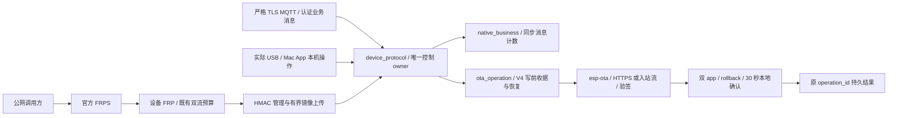

# ESP Base

基于锁定 ESP-IDF 的 ESP32-C3／ESP32 原生业务固件。消息计数业务直接编译进 app，与 Wi-Fi／时间、严格 TLS MQTT、设备 FRP 和签名 A/B OTA 共存。动态业务包、运行引擎、产品账本和联合包 OTA 已从生产源码与消费者中移除。

2026-10-09 维护者要求立即完成退役清理，运行组件及自有引擎的云端仓库已删除，工作区登记、本地checkout和历史构建入口已退出。Base 的生产源码、组件清单和双目标锁此前已改为原生业务与独立固件 OTA，本轮清理退役实验正文和失效入口，保留有效凭据、当前恢复工具及既有私有原始资料。

后续以[唯一执行计划](docs/operations/ota-allocation-diagnostic-checkpoint.md)为准。R1／R2／R4和R3软件子项已有离线结果；真实公网／App／USB、双板容量／断电／百次／连续72小时与正式交付仍未完成，维护者安排实板稍后接入。软件输入与限定结果见[原生软件检查点](docs/operations/native_software_checkpoint.md)。仓库删除不等于取得设备或生产资格。
实板接入前已补官方FRPS宿主六场景互操作、双目标LAB容量观察签名构建和百次／72小时有限驱动；输入、运行命令与未取得的实板资格见[宿主工具](tools/README.md)和[准备检查点](docs/operations/native_software_checkpoint.md#实板接入前的软件验证准备)。

## 运行链路

```mermaid
flowchart LR
    mqtt["严格 TLS MQTT / 认证业务消息"] --> protocol["device_protocol / 唯一控制 owner"]
    usb["实际 USB / Mac App 本机操作"] --> protocol
    public["公网调用方"] --> frps["官方 FRPS"] --> frp["设备 FRP / 既有双流预算"]
    frp --> listener["HMAC 管理与有界镜像上传"] --> protocol
    protocol --> native["native_business / 同步消息计数"]
    protocol --> intent["ota_operation / V4 写前收据与恢复"]
    intent --> ota["esp-ota / HTTPS 或入站流 / 验签"]
    ota --> app["双 app / rollback / 30 秒本地确认"]
    app --> result["原 operation_id 持久结果"]
```

设备独立 FRP 路线要求控制、固件字节和结果经设备隧道；不依赖 Mac 或 USB，Server／Web 的远程管理直接使用设备 FRP／MQTT。Mac App 只通过本机实际 USB 管理设备，不再作为远程 Bridge，也不依赖宿主 FRP 或远程绑定；设备身份核对与 USB 租约继续保留。有线 OTA 保留 URL 命令、设备 HTTPS 拉取；官方有线刷写／恢复另用于首次布局装配。不能把 USB 发命令称为全部固件字节走 USB；删除 App 的 FRP 功能不删除 ESP 固件自身的 FRP 能力。

两个 4 MiB 目标的 app 槽均为 `0x1e0000`。C3 保留 11 页 `base_store` 与 `frp_scratch@0x3e5000`；ESP32 保留六页 `base_store`、`frp_scratch@0x3ea000` 和只读 `at_old_raw@0x3e5000/0x5000`，逐字节保存旧 AT NVS 前三页及 `at_customize` 前两页。布局变化须按一次性有线迁入工具准备，不由普通 app OTA 修改分区表。

## 开发入口

先按 [SDK 与工具说明](tools/README.md)准备仓外 SDK，使用 [sdk-lock.json](sdk-lock.json)核对 IDF／lwIP。Component Manager 从唯一 [组件清单](firmware/components/device_protocol/idf_component.yml)解析 MQTT／OTA／FRP 与 cJSON，分别生成 [C3 锁](firmware/dependencies.lock)和 [ESP32 锁](firmware/dependencies.lock.esp32)。两目标使用独立 build 与 sdkconfig，签名键保留在仓外。

- [固件构建与架构](firmware/README.md)
- [设备协议](docs/design/device-protocol.md)
- [宿主回归](firmware/tests/README.md)
- [固件独立 OTA 与恢复](firmware/components/ota_operation/README.md)
- [设备控制及公网 OTA 工具](tools/README.md)

资源门保持内部历史堆至少 16,384 B、最大连续块至少 24,576 B、每个实际任务栈余量至少 1,024 B；尚须本轮双板真实 Wi-Fi／TLS／FRP／MQTT／原生业务／OTA 同存峰值验证。软件构建不证明这些运行门已通过。
