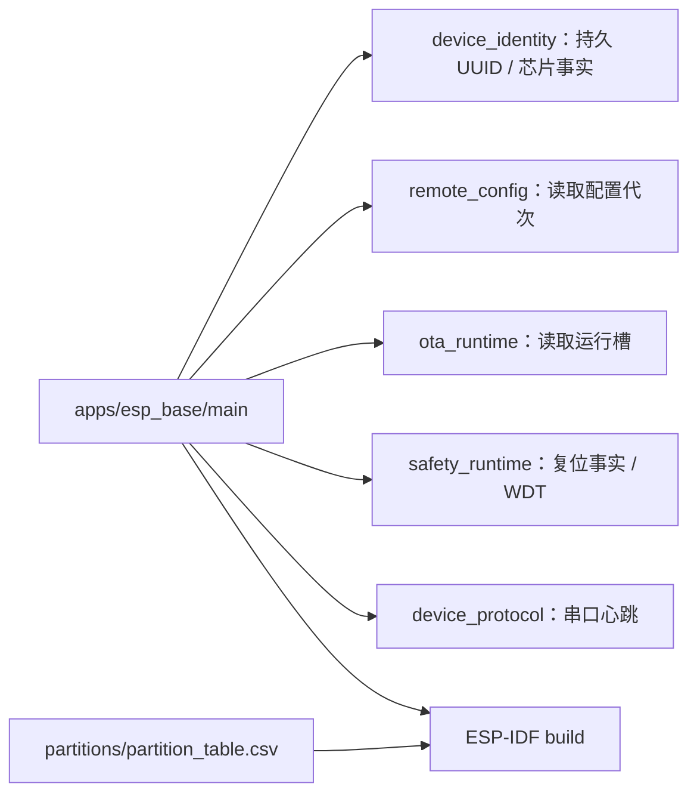

# ESP Base 固件

当前应用是迁移后的 ESP32-C3 启动基线；不是五能力完成版本。

## 架构拓扑

从仓库根执行 `idf.py -C firmware build`，官方工具链固定 ESP-IDF v6.1 / esp32c3。保留两个 `0x1e0000` 应用槽，NVS 不自动擦除。烧录前重新枚举并核对芯片、身份与两份完整 Flash 备份；不得用固定串口名识别设备，不执行 eFuse、整片擦除或执行器输出。

[嵌入式标准](https://github.com/darren-you/darren-space/blob/master/harness/docs/workspace/standards/embedded_firmware/embedded_firmware_golden_path.md)。测试在 `tests/`，公开主机调用示例将在固件根之外的 `tools/` 提供。
