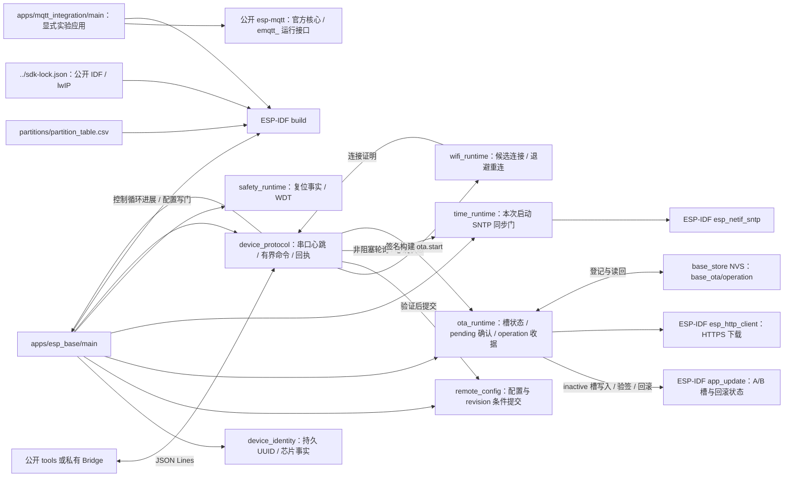

# ESP Base 固件

当前应用包含 ESP32-C3 启动与 USB 命令运行面；不是五能力完成版本。

## 架构拓扑

从仓库根执行 `idf.py -C firmware build`，工具链固定 ESP-IDF v6.1 / esp32c3，SDK 源码按仓根 `sdk-lock.json` 精确锁定公开 IDF fork 与 esp-lwip。CMake 核对两个提交、工作树、其他子模块和实际 lwIP 组件路径。保留两个 `0x1e0000` 应用槽，NVS 不自动擦除。烧录前重新枚举并核对芯片、身份与两份完整 Flash 备份；不得用固定串口名识别设备，不执行 eFuse、整片擦除或执行器输出。

[嵌入式标准](https://github.com/darren-you/darren-space/blob/master/harness/docs/workspace/standards/embedded_firmware/embedded_firmware_golden_path.md)。测试在 `tests/`，公开主机调用示例在固件根之外的 [tools/](../tools/README.md)。Component Manager 依赖由 `dependencies.lock` 固定；`mqtt` 唯一来源是公开 `esp-mqtt@9cac455b0184420353ff0283df3f100abaac3e6b`。host tests 使用同一已解析 cJSON 源码，不读取相邻仓。

默认 `ESP_BASE_APP=esp_base` 保留普通 USB/Wi-Fi 基座。显式 `ESP_BASE_APP=mqtt_integration` 构建[隔离 MQTT 测试应用](apps/mqtt_integration/README.md)，要求仓外私有输入与独立 build/sdkconfig，沿用同一分区。普通应用拒绝实验输入和明文选项；测试应用具有实验标记。公开 MQTT 组件已进入共同锁文件，实验应用直接消费 `emqtt_`；普通基座尚无 MQTT 设备控制或命令 ACK 闭环。

普通应用仅在本地启动检查成功、控制循环已实际运行且持续 30 秒报告进展，并跨过窗口终点再完成一轮后确认 pending OTA 槽；构建要求 `CONFIG_BOOTLOADER_APP_ROLLBACK_ENABLE=y`。pending 窗口内拒绝 `config.set`，确认后恢复。SDK 确认失败后读回持久槽状态，若已 VALID 则清门。无可回退镜像时当前执行虽保留，下次复位仍有失去可启动槽风险。控制循环进展的 5 秒阈值是策略值，复杂负载、真实新槽和回滚仍待实板验收。

普通应用从编译期 `CONFIG_ESP_BASE_TIME_SERVER` 初始化 SNTP，默认 `pool.ntp.org`；控制任务每秒非阻塞查询一次同步结果。`time_ready` 只在本次 boot 收到有效同步事件后为 true。时间失败不阻塞 USB 控制或 pending 本地确认；签名构建的 HTTPS OTA 在无可信时间时拒绝启动。服务器不写 NVS；时间同步与 Wi-Fi 重连仍待实板验收。

签名构建要求 `CONFIG_SECURE_SIGNED_APPS_NO_SECURE_BOOT=y`、`CONFIG_SECURE_SIGNED_ON_UPDATE_NO_SECURE_BOOT=y`、RSA-3072、证书包和构建签名密钥。当前未签名实板不能直接打开这些选项：IDF 在签名配置启动时需要运行镜像中的公钥。首次迁移必须保全原设备、核对旧 bootloader 的 rollback、建立已签名且 otadata 为 VALID 的基座与回退槽；本轮只使用仓外临时测试键编译，不写板卡或生成生产凭据。签名构建的软件路径检查完整 signed bin 长度、inactive 槽大小、project/芯片、SHA-256 与 IDF 签名结果，下载/配置提交互斥；外部串口 Flash 租约仍由工具侧控制。

`ota.start` 在目标槽写入前将 operation ID、设备 ID、摘要、长度与源/目标槽作为单 blob 保存到 `base_store` 的 `base_ota/operation`，commit 和读回成功才启动 worker；同 ID 不再次下载。签名构建的只读 `ota.result` 查询最近一次收据，只有新槽本地确认 VALID 且完整运行镜像摘要匹配才成功；回滚到尚无查询代码的旧镜像不能由设备提供最终结果，工具必须记 unknown。旧身份 NVS 与配置 `base_config/committed` 保持原位，真实回滚和 NVS 掉电行为待实板验证。

MQTT 装配要求 `CONFIG_MBEDTLS_HAVE_TIME_DATE=y` 和 `CONFIG_MQTT_REPORT_DELETED_MESSAGES=y`。新 sdkconfig 从 defaults 得到这些值；已有 sdkconfig 若显式关闭，需在 menuconfig 启用，编译器会拒绝缺少日期验证或消息过期通知的配置。
