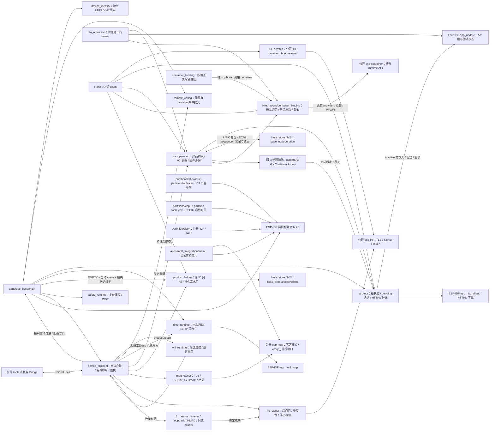

# ESP Base 固件

当前 OTA 收据为 V3、308 字节；来源和目标包字段已编码，但公开命令、worker 和启动恢复只允许无包模式。旧 V2 长度与带包 V3 状态均视为存储事实不确定，不能重放或清理目标槽。带包联合升级须在授权请求、Container stage、代表事件和回滚对账完整接通后再开放。

当前软件候选分别构建 ESP32-C3 的 USB 与 ESP32-D0WD-V3 的 UART0 命令运行面；两目标都有独立分区、OTA/签名策略和精确组件锁。ESP32 旧 AT 到新布局、双签名 Base 与真实启动链仍待受控迁移和实板验收。两者都不是五能力完成版本。

## 架构拓扑

```mermaid
flowchart LR
    main["apps/esp_base/main"] --> identity["device_identity：持久 UUID / 芯片事实"]
    main --> config["remote_config：配置与 revision 条件提交"]
    protocol --> wifi["wifi_runtime：候选连接 / 退避重连"]
    wifi -->|"连接证明"| protocol
    protocol -->|"验证后提交"| config
    main --> ota["esp-ota：槽状态 / pending 确认 / HTTPS 升级"]
    receipt["ota_operation：产品约束 / V3 收据 / 固件身份"] --> ota
    main --> time["time_runtime：本次启动 SNTP 同步门"]
    protocol -->|"控制循环进展 / 配置写门"| main
    protocol -->|"非阻塞轮询 / 心跳状态"| time
    time --> sntp["ESP-IDF esp_netif_sntp"]
    ota -->|"inactive 槽写入 / 验签 / 回滚"| rollback["ESP-IDF app_update：A/B 槽与回滚状态"]
    protocol -->|"签名构建 ota.start"| receipt
    ota --> https["ESP-IDF esp_http_client：HTTPS 下载"]
    receipt <-->|"A/B/C 身份 / ECS2 sequence / 登记与读回"| nvs["base_store NVS：base_ota/operation"]
    receipt --> retire["旧 B 物理擦除 / otadata 失效 / Container A-only"]
    retire -->|"完成后才下载 C"| ota
    owner["ota_operation：跨任务串行 owner"] --> receipt
    owner --> rollback
    binding["integrations/container_binding：确认绑定 / 产品启动 / 卸载"] -->|"真实 provider / 验签 / WAMR"| container["公开 esp-container：槽与 runtime API"]
    event_queue["container_binding：按验签包限额排队"] -->|"唯一 pthread 调用 on_event"| binding
    owner --> binding
    io_owner["Flash I/O 短 claim"] --> frp_scratch["FRP scratch：公开 IDF provider / boot recover"]
    io_owner --> ota
    io_owner --> receipt
    io_owner --> binding
    io_owner --> product_ledger["product_ledger：原 ID 只读 / 持久高水位"]
    main -->|"EMPTY + 启动 claim + 精确初始绑定"| product_ledger
    protocol -->|"product.result"| product_ledger
    product_ledger --> product_nvs["base_store NVS：base_product/operations"]
    frp_scratch --> frp
    receipt --> binding
    main --> safety["safety_runtime：复位事实 / WDT"]
    main --> protocol["device_protocol：串口心跳 / 有界命令 / 回执"]
    protocol --> mqtt_owner["mqtt_owner：TLS / SUBACK / HMAC / 结果"]
    mqtt_owner --> mqtt["公开 esp-mqtt：官方核心 / emqtt_ 运行接口"]
    protocol --> frp_owner["frp_owner：端点门 / 单实例 / 停止收敛"]
    protocol --> frp_status["frp_status_listener：loopback / HMAC / 只读 status"]
    frp_status -->|"绑定成功"| frp_owner
    frp_owner --> frp["公开 esp-frp：TLS / Yamux / Token"]
    host["公开 tools 或私有 Bridge"] <-->|"JSON Lines"| protocol
    c3["partitions/c3-product-partition-table.csv：C3 产品布局"] --> build["ESP-IDF 两目标独立 build"]
    esp32["partitions/esp32-partition-table.csv：ESP32 离线布局"] --> build
    lock["../sdk-lock.json：公开 IDF / lwIP"] --> build
    main --> build
    lab["apps/mqtt_integration/main：显式实验应用"] --> mqtt
    lab --> build
```

从仓库根执行 `idf.py -C firmware build`，默认工具链固定 ESP-IDF v6.1 / esp32c3，SDK 源码按仓根 `sdk-lock.json` 精确锁定公开 IDF fork 与 esp-lwip。CMake 核对两个提交、工作树、其他子模块和实际 lwIP 组件路径。`sdkconfig.defaults` 只包含共同选项，C3 的原生 USB、现行分区表、纯 STA 与 TLS 客户端配置在 `sdkconfig.defaults.esp32c3`；FRP status 是本机明文 HTTP，不需要 TLS server。ESP32 的 UART0、独立分区、STA/TLS client 和 ECDSA v1 bootloader 所需的日志/分区 MD5 约束在 `sdkconfig.defaults.esp32`。C3 产品源码使用两个 `0x130000` 应用槽、三个 `0x77000` 产品包槽、`0x10000` FRP scratch 与 `0xb000` 的 `base_store`；ESP32 软件分区表容纳两个 `0x120000` 应用槽、三个 `0x82000` 产品包槽、`0x10000` FRP scratch 与 `0x6000` 的 `base_store`，旧 AT 原字节区保留。C3／ESP32 构建均必须启用并精确绑定各自的 scratch；已有 sdkconfig 若保留旧的关闭值，须重新生成。此表仍待迁移恢复和实体负载验证，不能据此刷板。NVS 不自动擦除。两目标使用独立 build/sdkconfig 与 `dependencies.lock`／`dependencies.lock.esp32`，组件提交一致，target 精确分离；现存 ESP-AT 与 C3 设备分区均不能作为新的产品布局。烧录前重新枚举并核对芯片、身份与两份完整 Flash 备份；不得用固定串口名识别设备，不执行 eFuse、整片擦除或执行器输出。

两目标默认启用 IDF 的 TLS 动态收发缓冲，仍接受完整 16 KiB 入站和 4 KiB 出站记录；两目标静态 Wi-Fi RX 缓冲均与 BA 窗口 6 对齐，C3 另关闭两项 Wi-Fi IRAM 优化。CMake 检查这些容量选项，旧生成 `sdkconfig` 若保留冲突值须重新生成。Base 串口行、候选配置、命令解析和 MQTT 装配工作区现按实际存活期持有；当前锁的 C3 签名 guest 与官方 FRPS 严格 TLS 工作流完成 300001 B 双向回显，诊断切片的普通内部堆历史低水为 **57,020 B**，高于 48 KiB 门 7,868 B。此镜像使用缩小包槽的仓外诊断几何；完整三包槽和 scratch 的[对齐软件候选](../docs/operations/p6-03-c3-aligned-layout-software-probe.md)已另做签名装槽、guest 启动验证。两者不是同一联网镜像，正式 MQTT／OTA 同存、目标分区迁移和实板无线仍未验收。[容量检查点](../docs/operations/p6-03-c3-current-lock-frps-work-qemu-checkpoint.md#base-控制工作区存活期收敛)保留逐次输入与边界。

ESP32 产品目标由可设置的 `CONFIG_FREERTOS_UNICORE=y` 选出 SDK 派生的 `CONFIG_ESP_SYSTEM_SINGLE_CORE_MODE=y`，再启用 `CONFIG_ESP32_IRAM_AS_8BIT_ACCESSIBLE_MEMORY=y`；构建同时核对三项。FRP 会话对象使用该目标能力放置到内部 IRAM 8BIT；C3 不启用此路径。单核调度、IRAM 字节访问代价及五能力联网低水仍须在现有两块 4 MiB 板上测量；[精确锁检查点](../docs/operations/p6-03-frp-session-iram-precise-lock-checkpoint.md)区分签名容量与正式运行验收。

ESP32 未签名普通编译只允许显式 `-DESP_BASE_ESP32_OFFLINE_PROBE=ON`，并要求关闭硬件 Secure Boot 与签名输出；它只用于离线容量与源码检查，**绝非可刷写候选**。ESP32 签名构建必须提供仓外绝对路径的 P-256 签名键，并在独立 sdkconfig 中启用 `CONFIG_SECURE_SIGNED_APPS_NO_SECURE_BOOT=y`、`CONFIG_SECURE_SIGNED_APPS_ECDSA_SCHEME=y`、`CONFIG_SECURE_SIGNED_ON_BOOT_NO_SECURE_BOOT=y`、`CONFIG_SECURE_SIGNED_ON_UPDATE_NO_SECURE_BOOT=y`、`CONFIG_SECURE_BOOT_BUILD_SIGNED_BINARIES=y` 与 rollback；CMake 会拒绝缺失或错目标。测试键只用于仓外软件验证，不能作为设备首次启动密钥。签名 bin 还必须经固定 SDK 的 `espsecure verify-signature --version 1` 验证，并核对双槽与分区表。旧 ESP-AT 板卡的新启动链、两个已签名 Base 槽、otadata、旧区归档与完整恢复仍待 P7-01 受控实板验收。

[嵌入式标准](https://github.com/darren-you/darren-space/blob/master/harness/docs/workspace/standards/embedded_firmware/embedded_firmware_golden_path.md)。测试在 `tests/`，公开主机调用示例在固件根之外的 [tools/](../tools/README.md)。Component Manager 依赖由两个 target 专属锁固定；`mqtt` 唯一来源是公开 `esp-mqtt@bebde3971c2f4b4ee99e150348213222bfd9e27e`，`esp_ota` 唯一来源是公开 `esp-ota@04acb5e80a744649f8442607fb8d901d30880ca0`，`esp_frp` 唯一来源是公开 `esp-frp@8f056273b3b93ea3273b4637038ddd0c6aea82a8`，`esp_container` 唯一来源是公开 `esp-container@e8a0d0b6384bbba813b955ed08ebc315c134a707`。host tests 使用同一已解析 cJSON、`eota.h` 与 `esp_frp.h`，不读取相邻仓。

当前 FRP 精确锁将 ESP32 的工作流及 TLS 私有对象条件分配至 8BIT IRAM；双目标签名容量、Base host 回归和 ESP32 一条真实 FRPS 工作流的仓外 QEMU 检查见[工作流 IRAM 精确锁检查点](../docs/operations/p6-03-frp-work-iram-precise-lock-checkpoint.md)。正式 Base owner、MQTT／OTA／Container 并发与实体板容量尚未验收。

ESP32 命令／配置临时工作区此前按[协议工作区容量检查点](../docs/operations/p6-03-protocol-workspace-iram-checkpoint.md)收敛；后续正式串口产品卸载暴露 4／6 KiB 控制栈溢出，现将 ESP32 控制任务栈设为 8 KiB，C3 保持 6 KiB，见[签名 QEMU 复测](../docs/operations/product_uninstall_protocol_qemu_checkpoint.md)。双流、三条 MQTT 消息与一次真实配置提交的旧仓外 QEMU 切片仍低于 49,152 B 普通堆门，正式 OTA 与实体板未验收。

后续[HTTPS OTA 并发检查点](../docs/operations/p6-03-ota-https-combination-checkpoint.md)在同片签名 ESP32 QEMU 中经严格 HTTPS 将 **1,114,100 B** 独立签名 app 完整准备到备用槽，同时完成双 FRP 工作流与三条 MQTT 消息；普通堆历史最低 **26,416 B**，比不变的容量门低 **22,736 B**。探针未执行正式 Base `ota.start` 收据、Container stage、选槽及实板流程，P6-03/P7-01/P7-02 仍开放。

ESP32 静态 Wi-Fi RX 缓冲后续与 BA 窗口一同收敛为 6；[六缓冲 OTA 同片续验](../docs/operations/p6-03-esp32-rx6-ota-capacity-checkpoint.md)的签名 QEMU 完成相同完整下载、双 FRP 与三 MQTT 工作流，普通堆历史最低 **30,052 B**，仍比容量门低 **19,100 B**。正式 ESP32 产品分区签名构建和 app 槽尺寸门通过，实体 Wi-Fi 与完整产品 OTA 调用链尚未验收。

早期仓外[静态 IRAM BSS 容量实验](../docs/operations/p6-03-esp32-iram-bss-ota-experiment.md)将 Base 协议与 MQTT 的五个静态对象共 **17,408 B** 放入可字节访问 IRAM，双 FRP／三 MQTT／公开 `eota_prepare` HTTPS 下载同片成功轮次的普通堆最低 **50,708 B**，高于容量门 **1,556 B**；实验首轮遭遇 QEMU OpenETH 在 Flash 擦除期间的 cache 错误。后续[产品静态 IRAM 检查点](../docs/operations/p6-03-esp32-static-iram-product-checkpoint.md)将这五个对象放置落入 Base 源码，双目标 host 和正式签名构建通过；额外第三预备 FRP 请求在双流活跃时被正式容量规则拒绝，前两流完整回显、HTTPS OTA 准备及三 MQTT 交付，普通堆最低 **52,664 B**，高于门 **3,512 B**。第三请求时 IRAM 最大连续块仅 **2,176 B**，正式产品 OTA 调用链、重连和实体 Wi-Fi 仍待验收，P6-03/P7-01/P7-02 均开放。

本轮 FRP 会话阶段复用仅改变公开组件的私有 `src/session.c`；两目标主固件锁由官方 Component Manager 重新生成，固定 SDK 普通构建、host ASan/UBSan 与仓外 scratch 候选布局的测试键签名容量通过。正式 ESP32 CSV 没有 `frp_scratch`，本轮签名 ESP32 镜像使用仓外候选 CSV；[精确锁检查点](../docs/operations/frp-session-phase-union-base-dependency-checkpoint.md)记录静态输入。从该提交另行重建双目标签名 app、ECS2 和 Flash 的[无网络 QEMU 检查点](../docs/operations/p6-03-frp-phase-union-current-lock-qemu-checkpoint.md)均到产品 `RUNNING` 与 Base `READY`，不代表 FRPS、Broker、HTTPS 同存或实体板验收。

另签的[ESP32 FRPS 容量诊断](../docs/operations/esp32-frps-phase-union-current-lock-qemu-checkpoint.md)使用额外任务和测试时钟：静态 TLS 缓冲未完成验签；SDK 原生动态缓冲完成严格验签后仍因内存失败，没有注册或 Pong。诊断镜像与无网络原样产品不能混作同一容量读数。

配置 v3 唯一 NVS 工作缓冲现置于两目标 RTC 数据段，每次读取或编码前后擦除；[双目标链接与仓外签名容量检查点](../docs/operations/p6-03-rtc-config-buffer-checkpoint.md)记录 app 增长、RTC 余量及旧 FRP 诊断的适用边界。此缓冲位置变更不改变设备正式分区或签名迁移前置。

当前 ESP32 精确依赖锁与 RTC 缓冲的仓外签名产品完成两次 QEMU 冷启动和逐分区读回，范围与未覆盖的联网容量见[当前锁签名产品检查点](../docs/operations/p6-03-current-lock-signed-product-qemu-checkpoint.md)。

同一 Base 运行源码与当前 C3 锁在仓外双槽候选上完成 RSA v2 签名产品的两次 QEMU 启动、包区和 NVS 读回；模拟器 ADC2 跳过及联网未测边界见[C3 当前锁检查点](../docs/operations/p6-03-current-lock-c3-signed-product-qemu-checkpoint.md)。

默认 `ESP_BASE_APP=esp_base` 保留普通 USB/Wi-Fi 基座，并只读装载 v3 持久配置，经物理 USB `config.set` 写入完整 Wi-Fi/MQTT/FRP 凭据；未配置时不创建相应客户端。MQTT 已配置时只在 Wi-Fi IP 和本次启动可信时间齐备后启动严格 TLS，会在 command SUBACK 后报告 ready，并通过同一控制任务执行已认证命令、发布 QoS 1 结果和脱敏 reported；远端 config.set 被拒绝。显式 `ESP_BASE_APP=mqtt_integration` 构建[隔离 MQTT 测试应用](apps/mqtt_integration/README.md)，要求仓外私有输入与独立 build/sdkconfig，沿用同一分区。普通应用拒绝实验输入和明文选项；测试应用具有实验标记。现有实板仍为 v1 存储，未完成双槽与 NVS 离线迁移前不得启动 v3-only 镜像；正式 Broker/Tool 和实板网络 ACK 闭环尚待联调。FRP owner 只有独立 HMAC 鉴权的只读 HTTP listener 成功绑定配置中的 `127.0.0.1:local_port` 后才允许启动；端点失败仍报告 `endpoint_unavailable`。当前只完成软件装配，不表示 P4-05 或真实 FRPS 闭环完成。

普通应用仅在本地启动检查成功、控制循环已实际运行且持续 30 秒报告进展，并跨过窗口终点再完成一轮后确认 pending OTA 槽；构建要求 `CONFIG_BOOTLOADER_APP_ROLLBACK_ENABLE=y`。pending 窗口内拒绝 `config.set`，确认后恢复。SDK 确认失败后读回持久槽状态，若已 VALID 则清门。无可回退镜像时当前执行虽保留，下次复位仍有失去可启动槽风险。控制循环进展的 5 秒阈值是策略值，复杂负载、真实新槽和回滚仍待实板验收。

普通应用从编译期 `CONFIG_ESP_BASE_TIME_SERVER` 初始化 SNTP，默认 `pool.ntp.org`；控制任务每秒非阻塞查询一次同步结果。`time_ready` 只在本次 boot 收到有效同步事件后为 true。时间失败不阻塞 USB 控制或 pending 本地确认；签名构建的 HTTPS OTA 在无可信时间时拒绝启动。服务器不写 NVS；时间同步与 Wi-Fi 重连仍待实板验收。

C3 签名构建要求 `CONFIG_SECURE_SIGNED_APPS_NO_SECURE_BOOT=y`、`CONFIG_SECURE_SIGNED_ON_UPDATE_NO_SECURE_BOOT=y`、RSA-3072、证书包和构建签名密钥。ESP32-D0WD-V3 的同一 SDK 构建使用 ECDSA v1 P-256 方案；签名构建必须选择对应 Kconfig，不能复制 C3 的 RSA policy。当前未签名实板不能直接打开这些选项：IDF 在签名配置启动时需要运行镜像中的公钥。首次迁移必须保全原设备、核对旧 bootloader 的 rollback、建立已签名且 otadata 为 VALID 的基座与回退槽；本轮只使用仓外临时测试键编译，不写板卡或生成生产凭据。签名构建的软件路径检查完整 signed bin 长度、inactive 槽大小、project/芯片、SHA-256 与 IDF 签名结果，下载/配置提交互斥；外部串口 Flash 租约仍由工具侧控制。

`ota.start` 先用 OTA 库的 HTTPS URL 与最小镜像头长度规则做静态校验，再在目标槽写入前将 operation ID、设备 ID、目标 C 摘要/长度、签名 A 与原独立 B 摘要、源/目标物理槽和已对账 ECS2 sequence 作为 V3 单 blob 保存到 `base_store/base_ota/operation`，commit 和逐字节读回成功才启动 worker；同 ID 不再次下载。签名构建的只读 `ota.result` 查询最近一次收据，只有新槽本地确认 VALID、完整运行镜像摘要匹配、产品启动与配置时的 Container 确认完成，且 V3 `SUCCEEDED` 收据持久读回才成功；A 仍运行时，目标槽未开始写入前的可证明失败，或写入后按原收据完成物理槽与 Container 清理并持久记失败，才报告 failed。旧 V1/V2 或不可信 blob 阻断新操作和自动清理；回滚到尚无查询代码的旧镜像不能由设备提供最终结果，工具必须记 unknown。身份 NVS 保持原位；配置仍用 `base_config/committed` 单键，v3-only 读写不兼容旧 v1/v2 记录。真实回滚和 NVS 掉电行为待实板验证。

只读 `product.status` 在同一长存储 claim 下返回账本高水位、下一序号、未决 ID 和当前签名固件的 ECS2 绑定序号／可选包摘要；本 boot 精确产品包试运行期间返回试运行序号与仍已确认的旧绑定，不把候选包报为已确认。摘要仅是持久元数据，不证明包字节或 guest 健康。键缺失明确返回未初始化，不自行建账；绑定或固件观察不确定时保留 claim。`product.result` 从独立的 `base_product/operations` 账本按原 operation ID 查询；账本候选为 910 字节、最近 8 条和不回退的操作序号，提交后精确读回。窗口外旧 ID 返回 unknown，绝不触发安装重放。固定 SDK／QEMU 的 C3 六／八页和 ESP32 六页已完成 100 代四记录容量与重启读回；公开 `product.uninstall` 已接持久意图、内部停止／卸载和按原 ID 查询终态；新 boot 只根据实际 ECS2 结果裁决未决操作。`product.install`／`product.upgrade` 已接异步 HTTPS 来源、候选准备、同 boot 试运行及确定性失败收尾；guest 运行时失败可持久放弃候选并重开旧确认包。试运行没有产品专属健康判据时保持未决，尚不提交成功终态。实板磨损、掉电、真实业务事件和最终成功闭环仍缺，不能将当前入口当作完整产品生命周期交付。

`ota_operation` 另提供只读固件集合观察：已确认模式要求运行槽 `VALID`；显式 pending trial 模式要求运行槽 `PENDING_VERIFY`、另一槽 `VALID` 且 IDF 证明可回滚。prepared candidate 模式需要本次 `eota_prepare` 的收据，要求 A 仍运行且被选为 boot、otadata 为 `VALID`，C 未选 boot 且旧 inactive otadata 已失效；重新验签 A/C 并核对 C 的完整长度/摘要。三种模式都要求运行槽与当前 boot selector 一致，拒绝过程中变化。已确认模式中若另一槽未受管，镜像校验必须明确无效且目标首字节须擦除为 `0xff`，才输出单固件集合；应用侧验签失败不足以证明 bootloader 不会后备扫描。调用方在观察及消费结果期间独占 app/otadata 写入；prepared 观察现由无包 OTA worker 在选 boot 前持久 stage，pending 观察用于候选 trial。

本次 boot 的启动存储操作和 pending 确认持有 `ota_operation` 串行 owner；完成后释放，已启动 guest 不长期占用。`ota.start` 在持久登记前取得 claim，跨控制任务与 worker 保持到下载、验签和选择完成。worker 凭原 V3 收据先调用 `eota_retire_inactive` 擦除旧 B 首扇区、回读首字节 `0xff` 并使其 otadata 失效，再将 Container 持久绑定退役为 A-only；此后才允许 `eota_prepare` 写 C。重启后的启动 claim 在产品装载之前读取同一收据：仍运行 A 时按原目标清理部分 C，并将 Container 的精确 PREPARED/TRIAL_STARTED/HEALTH_VERIFIED/ABORTED 操作收敛到 A-only，成功后才记失败；运行 C 时验其完整摘要、旧 A 的签名与回退资格；配置 Container 时再核原 operation、A/C 绑定和 ECS2 sequence。VALID C 的 `HEALTH_VERIFIED` 状态只凭该收据确认并读回；收据缺失、已失败或 OTA 不可用时，残留固件迁移只读阻断，普通产品启动不改写 ECS2。控制任务在恢复完成前保持配置写入与 MQTT/FRP owner 关闭。任一步不能核实就保持阻断；`ota.result` 不从 target otadata 单独推断失败。未知选择或存储结果保留本 boot claim；可证明失败并记账后释放。[Container 产品装配](integrations/container_binding/README.md)复用启动已持有的 claim，不二次争抢。策略完整且持久无包绑定时，首次确认启动可初始化，后续固件 OTA 依精确 prepared 收据 stage、pending trial 和 OTA VALID 回读确认；现有 confirmed 包仍可验签启动。带包联合升级在写 inactive app 前拒绝，因为联合操作的授权、收据和启动恢复尚未接通；无板的编译与 host 测试不证明电源中断、bootloader 回退或 guest 与五能力并发。

MQTT 装配要求 `CONFIG_MBEDTLS_HAVE_TIME_DATE=y` 和 `CONFIG_MQTT_REPORT_DELETED_MESSAGES=y`。新 sdkconfig 从 defaults 得到这些值；已有 sdkconfig 若显式关闭，需在 menuconfig 启用，编译器会拒绝缺少日期验证或消息过期通知的配置。

FRP 组件还要求 `CONFIG_MBEDTLS_MD5_C=y`、`CONFIG_LWIP_SO_LINGER=y` 和至少 12 个 lwIP socket；默认配置与 CMake 同时检查。普通镜像中保留库符号只证明编译组合，不能代替真实管理端点、FRPS/MQTT 同时运行或堆峰值测量。

FRP Flash reader 的 Base 接线由 `apps/esp_base/main/Kconfig.projbuild` 控制。C3／ESP32 产品配置均启用，分别固定 `frp_scratch@0x3e5000/0x10000` 和 `frp_scratch@0x3ea000/0x10000`。启用时公开 FRP provider 核对实际 64 KiB 分区，并在任何 pending OTA 确认前擦除本次启动遗留的密文。FRP 每次物理操作使用独立短 claim，升级事务 claim 不再使它立即返回 BUSY；`clear` 不再次擦除。OTA app、Container 包和 NVS 尚未全部接入同一个短时 I/O 仲裁，FRP 最大记录与正式 OTA 下载的进展、期限和实板 Flash 时延仍未验收。C3 对齐软件候选及 ESP32 新源码几何仍按五仓计划完成容量、迁移与实体运行裁决。无已恢复 store 时，USB `config.set` 不写入新的 FRP 配置，旧配置只报告失败。
