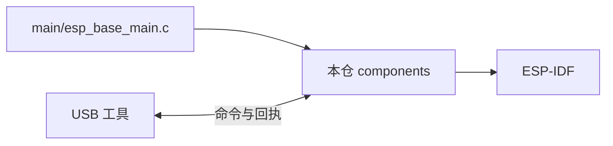

# 无业务基座应用

装配身份、完整配置读取、Wi-Fi、槽状态、复位事实、串口心跳及 status/restart/config.set 命令；不配置 GPIO。

## 架构拓扑

```mermaid
flowchart LR
    main["main/esp_base_main.c"] --> components["本仓 components"]
    usb["USB 工具"] <-->|"命令与回执"| components
    components --> sdk["ESP-IDF"]
```

在仓库根使用 `idf.py -C firmware build`。
