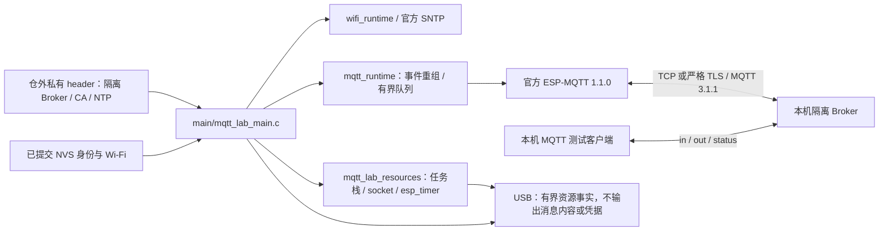

# 官方 MQTT 集成测试应用

此应用消费本仓 MQTT 适配层与锁定的官方 `espressif/mqtt == 1.1.0`，运行在同一 ESP32-C3 / 4 MiB 分区布局。它是带 `ESP_BASE_LAB_ONLY MQTT_INTEGRATION` 标记的实验固件，已通过部分实板矩阵，不能作为产品或 OTA 发布。

## 架构拓扑



先用普通基座配置 Wi-Fi 并保存同板恢复基线；本应用只读取已提交配置，不提交新的 Wi-Fi 配置、不自动擦 NVS、不驱动 GPIO。身份沿用当前 UUID；已有身份不存在时，身份组件仍按正常初始化合同建立身份，因此刷写前必须核对本轮基线。

将仓库 `tools/mqtt-lab-inputs.example.h` 复制到仓外权限 0700 的目录，文件设 0600，填写本轮隔离 Broker、用户名密码、CA 和 NTP。TLS 必须先收到 SNTP 同步，使用 CA 与主机名验证；认证或证书失败不切换明文。默认构建不允许 TCP；只有明文实验可在独立 sdkconfig 中显式设置 `CONFIG_EBASE_MQTT_PLAINTEXT_LAB=y`，并将私有输入设为 `.tls=false`、`.ca_pem=""`；TCP 与非空 CA 的矛盾配置会被拒绝。

从仓库根构建，两个应用使用不同 build 与 sdkconfig，避免缓存混用：

```bash
idf.py -C firmware -B /private/path/mqtt-build \
  -D SDKCONFIG=/private/path/mqtt-sdkconfig \
  -D ESP_BASE_APP=mqtt_integration \
  -D ESP_BASE_MQTT_LAB_INPUTS=/private/path/mqtt-inputs.h build
```

普通 `esp_base` 构建拒绝实验输入与明文实验选项。此门禁只覆盖本地构建选择；正式签名/发布制品门禁仍属于后续交付阶段。输入 header 会复制进私有 build，凭据和 CA 编进实验镜像；整个 build、配置、串口日志和固件必须按私有资料保存。

应用使用 `esp-base-lab/<持久UUID>/in`（QoS 1 订阅）、`out`（按收到的 QoS 0/1 回显原始字节与 retain）和 `status`（retained online / LWT offline）。只有 SUBACK 全部获准才发布 online；动态退订获得匹配 UNSUBACK 后也重报 online。`extra` 是实验动态订阅主题，Broker 的设备 read 与控制端 write ACL 必须显式允许它；enqueue 成功或 PUBACK 不表示业务完成。连接重建后重新订阅。

`in` 的精确实验控制载荷：

- `:stats` 打印当前摘要、所有当前任务的栈余量、有界 socket 扫描和完整 esp_timer 列表。
- `:restart` 执行 stop/start；`:cycle` 执行 destroy/create/start，每次销毁后让 Idle 运行 100 ms 再记录资源，随后重建客户端。
- `:subscribe` 动态订阅 `extra`，`:unsubscribe` 退订；正常重新连接恢复当前期望订阅。只提交新增项，避免重复订阅旧主题触发无关 retained 消息。
- `:wifi-cycle` 通过既有 Wi-Fi owner 将本板 station 停止五秒，再使用原已提交配置恢复；不写 NVS、不重建 MQTT 实例，不代表外部 AP 断电测试。

控制字只在 `in` 主题、QoS 0、交付的 retain=false、duplicate=false 时生效；`extra` 上同名字节只作为普通载荷回显。MQTT 3.1.1 的实时转发会清除 RETAIN 标志，接收端不能据此判断发布者是否请求了 retain；这里拒绝的是重连后的 retained 控制字回放。其他不超过 4096 字节的二进制载荷回显到 `out`，超过上限拒绝。控制字仅属于实验应用，不是正式设备协议。

实验应用自动追加专属 `sdkconfig.defaults`，要求 FreeRTOS trace 与 esp_timer profiling。已有实验 sdkconfig 若关闭这两项会在编译时拒绝，需重新配置；普通基座默认配置不启用。任务名在 C3 暂停调度时复制，不跨采样借用 TCB 指针；超过 32 个任务返回 0，表示采样不完整。socket 从 SDK 描述符范围只读扫描，可能与 SDK 开关连接并发；销毁后和稳定在线样本需分别比对。esp_timer profiling 包含已停用但尚未销毁的计时器，不表示枚举了 FreeRTOS 软件计时器或所有 lwIP 内部超时。诊断本身会占用资源、暂停调度并输出串口，数据只属于实验制品。

100 次资源测试应逐次等待新 READY、验证新消息并采集销毁后及在线数据，不能连续发送 100 条后把丢失当成功。公开检查器的 `--resource-samples --subscriptions --wifi-cycles 3` 可覆盖相应网络操作；串口与 Broker 的实际事件仍须共同核对。

已完成的同板 TLS、QoS/载荷、100 次重建与故障子项见 [实板验收记录](../../../docs/operations/mqtt-hardware-acceptance.md)。动态订阅/退订、显式 TCP 与逐轮任务/socket/esp_timer 观测已补齐；完整验收仍需真实 AP 中断恢复及后续组合资源验证。编译和 SDK 事件注入不代替这些结论。烧录只能按本轮设备、分区、OTA 选择与完整备份核对后的应用槽进行。
