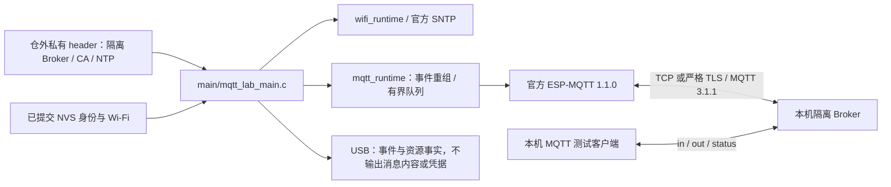

# 官方 MQTT 集成测试应用

此应用消费本仓 MQTT 适配层与锁定的官方 `espressif/mqtt == 1.1.0`，运行在同一 ESP32-C3 / 4 MiB 分区布局。它是带 `ESP_BASE_LAB_ONLY MQTT_INTEGRATION` 标记的实验固件，尚未完成实板矩阵，不能作为产品或 OTA 发布。

## 架构拓扑



先用普通基座配置 Wi-Fi 并保存同板恢复基线；本应用只读取已提交配置，不提交新的 Wi-Fi 配置、不自动擦 NVS、不驱动 GPIO。身份沿用当前 UUID；已有身份不存在时，身份组件仍按正常初始化合同建立身份，因此刷写前必须核对本轮基线。

将仓库 `tools/mqtt-lab-inputs.example.h` 复制到仓外权限 0700 的目录，文件设 0600，填写本轮隔离 Broker、用户名密码、CA 和 NTP。TLS 必须先收到 SNTP 同步，使用 CA 与主机名验证；认证或证书失败不切换明文。默认构建不允许 TCP；只有明文实验可在独立 sdkconfig 中显式设置 `CONFIG_EBASE_MQTT_PLAINTEXT_LAB=y`。

从仓库根构建，两个应用使用不同 build 与 sdkconfig，避免缓存混用：

```bash
idf.py -C firmware -B /private/path/mqtt-build \
  -D SDKCONFIG=/private/path/mqtt-sdkconfig \
  -D ESP_BASE_APP=mqtt_integration \
  -D ESP_BASE_MQTT_LAB_INPUTS=/private/path/mqtt-inputs.h build
```

普通 `esp_base` 构建拒绝实验输入与明文实验选项。此门禁只覆盖本地构建选择；正式签名/发布制品门禁仍属于后续交付阶段。输入 header 会复制进私有 build，凭据和 CA 编进实验镜像；整个 build、配置、串口日志和固件必须按私有资料保存。

应用使用 `esp-base-lab/<持久UUID>/in`（QoS 1 订阅）、`out`（按收到的 QoS 0/1 回显原始字节与 retain）和 `status`（retained online / LWT offline）。只有 SUBACK 全部获准才发布 online；enqueue 成功或 PUBACK 不表示业务完成。连接重建后重新订阅。

`in` 的三个精确实验控制载荷：`:stats` 打印资源；`:restart` 执行 stop/start；`:cycle` 执行 destroy/create/start。其他不超过 4096 字节的二进制载荷回显到 `out`，超过上限拒绝。控制字仅属于实验应用，不是正式设备协议。100 次资源测试应逐次等待新的 READY 并采集 heap、最大连续块、任务数、outbox 与栈，不能连续发送 100 条后把丢失当成功。当前打印的栈余量只覆盖应用 owner 任务，不代表 SDK 内部所有任务。

完整验收还需要真实 Broker/板卡的 QoS、SUBACK 拒绝、retain/LWT、认证/证书错误、重启/断网、丢 ACK、outbox 满与过期、4 KiB 分片、超限、订阅/退订及 100 次启停。编译和 SDK 事件注入不代替这些结论。烧录只能按本轮设备、分区、OTA 选择与完整备份核对后的应用槽进行。
