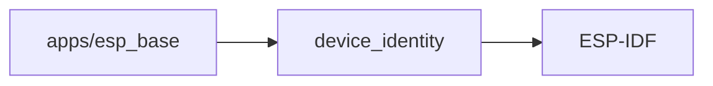

# device_identity

读取芯片、Flash、MAC，并在 NVS 保存或验证 UUID v4

正式 Base 启动入口在调用身份读取前取得共同 Flash I/O owner，NVS 读写或身份读取失败后仍须释放；释放失败停止启动。独立 MQTT 实验应用不作为正式五能力并发入口。

## 架构拓扑

```mermaid
flowchart LR
    app["apps/esp_base"] --> component["device_identity"]
    component --> sdk["ESP-IDF"]
```

