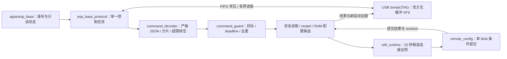

# device_protocol

单一控制任务拥有 8192 字节 JSON 行缓冲、命令裁决与设备回执；每 5 秒报告 UUID 启动身份和设备心跳。当前实现 status、restart 和 config.set；Wi-Fi 由单一控制任务调度，其他未接入能力报告 unsupported。

## 架构拓扑

解析使用精确锁定的官方 `espressif/cjson`；解析前限制长度、UTF-8、NUL、整数、深度和成员数量，解析后拒绝重复/未知字段。半帧超过 2 秒不完整时排空至下一换行。命令在同一任务即将执行时检查 boot 和 uptime 期限；restart 先回 running，最终结果由工具核对同设备的新 boot_id，不能将该回执当成功。

使用 ESP-IDF v6.1 官方无缓冲 VFS 直接消费硬件 FIFO，每轮最多读取 256 字节并让出任务调度。实板发现缓冲驱动的 RX ring 满时会丢弃接收字节，因此不安装该驱动；硬件 FIFO 提供 USB 背压。8193 字节非法帧、后续有效命令及半帧超时恢复均已在同一 C3 验证。
