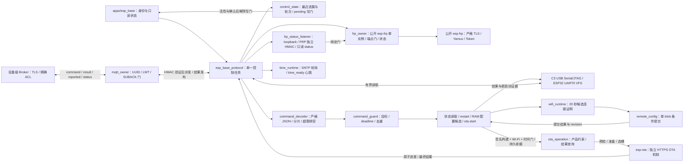

# device_protocol

单一控制任务拥有 8192 字节 JSON 行缓冲、命令裁决与设备回执；每 5 秒报告 UUID 启动身份和设备心跳。当前实现 status、restart、config.set 与受控签名构建中的 ota.start/ota.result；Wi-Fi 由单一控制任务调度，SNTP 同步结果每秒非阻塞轮询。每轮完成后记录原子进展时刻和轮次，供 pending OTA 启动门核对；pending 和下载期间拒绝配置写入。

## 架构拓扑

解析使用精确锁定的官方 `espressif/cjson`；解析前限制长度、UTF-8、NUL、整数、深度和成员数量，解析后拒绝重复/未知字段。物理 USB `config.set` 只接受 schema_version 3 完整 Wi-Fi/MQTT/FRP 配置，使用规范 v3 blob 的 SHA-256 做同启动幂等指纹；status 保持既有脱敏字段，MQTT/FRP 能力按各自 owner 状态报告。半帧超过 2 秒不完整时排空至下一换行。命令在同一任务即将执行时检查 boot 和 uptime 期限；restart 先回 running，最终结果由工具核对同设备的新 boot_id，不能将该回执当成功。

C3 使用 ESP-IDF v6.1 官方无缓冲 USB Serial/JTAG VFS，FIFO 提供背压；ESP32 使用 UART0 非阻塞 VFS，经 CH340 传输，尚须在实板验证整帧和超载行为。每轮最多读取 256 字节并让出任务调度。C3 实板曾发现缓冲驱动 RX ring 满时丢字节，改无缓冲 VFS 后 8193 字节非法帧、后续有效命令及半帧超时恢复已验证；此证据不外推到 ESP32 UART。

pending OTA 自检期间，`config.set` 在身份、期限和去重裁决后返回 `failed/ota_verification_pending`，不进入候选 Wi-Fi 或 NVS 提交；下载期间返回 `ota_in_progress`。`ota.start` 与配置候选互斥，要求签名构建、Wi-Fi IP 与本次启动时间同步；独立 worker 不阻塞 USB 控制循环，`status` 提供 `ota_received_bytes`/`ota_total_bytes`。升级写入后先回 `running` 再重启，新 boot 的本地自检与 30 秒窗口才确认有效。原请求 ID 重放返回原结果；未签名构建明确返回 `ota_signing_unavailable`。外部串口 Flash 租约由工具侧持有，设备软件无法阻止外部刷写；真实并发与 USB 负载尚待实板验收。

Wi-Fi 驱动初始化失败时记录 `ESP_BASE_WIFI_UNAVAILABLE`，运行状态为 `failed`；USB 控制任务继续启动，pending 槽仍按本地控制进展确认。网络故障不自动触发固件回滚，`config.set` 候选因 Wi-Fi 未就绪而失败并保留已提交配置。

普通固件在配置 v3 MQTT 凭据存在且 pending OTA 本地确认结束后创建严格 TLS 客户端；Wi-Fi IP 与本次启动可信时间齐备后才连接，订阅 `command` 的 SUBACK 批准后发布 retained `status=online` 并标记 `ready`。入口只对精确设备 Topic、QoS 1、非 retained 和原始请求字节的有效 HMAC tag 派发，复用同一 JSON decoder、身份/期限/幂等裁决；无认证输入不回显。MQTT `config.set` 只返回 `physical_usb_required`；结果与每 5 秒的脱敏 reported 以 QoS 1 非 retained 发布，异步 OTA 结果回到发起通道。失去 Wi-Fi 或可信时间会停止会话，重新连接必须重新取得 SUBACK；订阅故障有界重试。主动停止或重配之后旧 retained online 可能仍在 Broker，Tool/网关须用当前会话、新鲜非 retained reported 与 boot_id 判定在线。完整 wire 与跨 Tool/Broker 前置见[设备控制协议](../../../docs/design/device-protocol.md#mqtt-网络命令合同固件软件接线候选)。此路径尚无普通 Base 与设备级 Broker 的实板端到端验收。

QoS 1 outbox 消息过期时，owner 撤销 `ready`、停止当前会话并在退避后重新建立订阅。过期的结果不能证明命令失败或成功；控制端在同一 boot 重新取得 SUBACK 后可使用原 request_id 重投，写命令由去重表回送已保存结果，只读命令重新查询设备事实。

签名构建的只读 `ota.result` 按 operation ID 读取最近一次持久收据，返回目标 signed bin 摘要/长度和当前 running/succeeded/failed/unknown；旧启动的 `request_id` 不会重放写动作。活跃 worker 查询保持 running，目标槽 VALID 且整镜像摘要匹配后才 succeeded。NVS 登记必须先 commit+读回再创建 worker；失败收据持久化不确定时返回 unknown 并关闭本次启动配置写入。只有新旧两个镜像都含此查询命令时，回滚到旧槽才能由设备回报最终失败；较旧镜像缺少命令时工具报告 unknown。

FRP owner 消费公开 `esp-frp@36e1506a2145321fc292294de59c0aa4532f73a7`，先要求独立 Token/CA、Wi-Fi IP、本次启动可信时间，并以受控 loopback 管理 listener 已绑定为启动门。listener 与 FRP owner 同属唯一控制任务，只在 `127.0.0.1:local_port` 绑定，只接受独立 FRP key 的 HMAC 后解析只读 `status`；重配先撤销旧 listener，再等旧 FRP worker 销毁才装配新 key。HTTP 请求和结果字段见[设备协议](../../../docs/design/device-protocol.md#frp-base-软件接线边界)。host 测试覆盖半包、超限、重复长度头、错 tag、重配撤销旧 key、2 秒总时限、boot/期限和同 ID 结果缓存/冲突；固定 SDK C3 编译不代表真实 FRPS、MQTT/OTA 并行或内存门槛通过。
