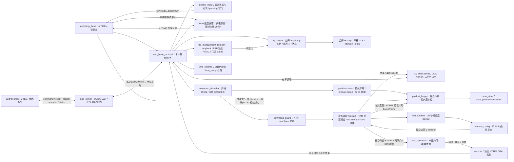

# device_protocol

2026-10-02 C3 稳定 FRP 身份联合功能切片通过：公开一次 WRITE OTA 与一次 MQTT restart 后，目标和第三 boot 均经 FRP 认证状态核验，十二项消息计数业务、卸载、A／C 字节核对及原代码恢复完成。143 份实板证据冻结；来源下载最低历史 heap 4124 B，48 KiB 容量门继续失败，见[检查点](../../../docs/operations/c3_five_capability_run_id_checkpoint.md)。

2026-10-02 FRP 稳定请求身份接线：已有设备 UUID 同时用于 client_id 与 run_id，公开组件 0.2.0 的精确提交及 SDK 生成的双目标锁已更新。两目标签名构建、官方验签和 host 回归通过；C3 联合重启恢复与容量继续复测，见[检查点](../../../docs/operations/frp_stable_run_id_checkpoint.md)。

2026-10-02 C3 的实际 FRPS 管理链路通过：设备 SDK PSA HMAC 的状态／重启响应由 Tool 验证，错误 key 返回空 401，只发送一次 restart 并经 FRP 确认新 boot，USB 与 MQTT 独立核对配置和恢复。该轮为空产品，具体输入及未完成范围见[实板检查点](../../../docs/operations/c3_frp_mqtt_management_checkpoint.md)。

2026-10-02 C3 公开 WRITE 联合 OTA 切片完成：不同签名 message-counter 包在真实代表事件与原健康门后取得原 ID 成功，重启恢复、十二项业务检查、卸载及 A／C Flash 字节核对通过。预期暂停拒绝按 business_failed／负结果与公开发布器退出码 2 消费，运行合同未改；私有 timer 授权和证据见[WRITE 检查点](../../../docs/operations/c3_joint_ota_write_message_counter_checkpoint.md)。

2026-10-02 C3 公开 REUSE 联合 OTA 实板切片通过：只发送一次 `ota.start`，沿原 ID 只读查询，经真实代表事件和 30 秒健康门后持久成功；再次重启保留成功与确认产品，公开卸载回读空绑定，A／C Flash 字节精确核对。过程中两次有绑定结果的 unknown 均保留，未重发写命令；实验输入与边界见[联合 OTA 检查点](../../../docs/operations/c3_joint_ota_reuse_checkpoint.md)。

2026-10-02 C3 公开产品切片：原始 Base 经实际 HTTPS 下载验签、代表 MQTT 事件与原 30 秒健康门确认 counter，MQTT 重启后确认绑定和活动产品恢复，再由公开卸载取得持久成功及空绑定。ECS2 1→6→6→7，安装／重启／卸载各发送一次；实验 CA 只进入私有 SDK 构建，源码与生产信任未改，边界见[安装检查点](../../../docs/operations/c3_product_https_install_checkpoint.md)。两板、升级、完整宿主能力、FRP／OTA 与五能力组合仍待验证。

2026-10-02 C3 隔离 Broker 切片：正式 Base 的严格 TLS、当前 boot 的 reported、HMAC 状态／产品查询、错误 HMAC／QoS 0 拒绝及远程配置写门通过。重启由唯一控制任务有界观察回执的精确 PUBACK；两目标 host、固定 SDK 签名重建与官方验签通过，C3 一次重启取得 running 并由同设备新 boot、版本 2 配置及联网恢复完成复验。原回执未交付的失败单独保留，见[故障说明](../../../docs/issues/mqtt_restart_receipt_delivery.md)。此为空产品切片，生产 Broker、完整产品安装／OTA 与 ESP32 仍待验收。

只读产品状态现硬切为十个 required 字段：原五字段加 `firmware_sha256`、`runtime_guest_abi_version`、`package_guest_abi_version` 、`package_data_schema_version` 与 `active_product`。运行固件摘要来自同一 Base claim 下双次核对的实际签名镜像，按 SDK 验签后确定的完整镜像长度计算，包含该签名方案的尾部；不是 ELF 或包摘要。运行时 ABI 来自实际 Container 编译常量；包 ABI／schema 来自同一当前固件对应的 ECS2 确认绑定，无包时二者必须同时为 `null`，有包时必须同时为正 uint32。公开 CLI 与 Tool 同批拒绝缺字段、全零摘要及摘要／包元数据不一致。活动版本复制本次验签装载结果；状态查询没有新增包 Flash 读取或验签，不证明 guest 健康。

`product.status` 现硬切为十个 required 字段，新增 required nullable 的 `active_product`。非 null 对象精确包含 `product_id`、完整 `product_version`、非零 `package_sha256`、正 uint32 `guest_abi_version`／`data_schema_version`、布尔 `is_trial` 和 required nullable `operation_id`。ID／版本沿用 Container 的小写连字符 ASCII 合同，两者合计不超过 v1 manifest 的 4096 字节边界，不截为 64 字节。确认实例的摘要／ABI／schema 与根确认绑定一致且 operation ID 为 null；候选来自本 boot 的实际验签装载，操作 ID 必须匹配未决账本，确认绑定仍保留旧包。活动 ABI 必须等于实际运行时 ABI。null 只表示未取得可确认的活动实例，不能证明 guest 健康或所有 native 资源已回收。

产品命令的持久幂等底座已加入 `product_ledger.c`：按维护者裁决采用最近固定条数，当前软件合同为 8 条，`base_store/base_product/operations` 为单个带版本和 CRC 的 NVS blob，另存持久 `high_watermark`。新操作只接受连续递增的 `operation_sequence`；旧记录被覆盖后按原 ID 查询为 `unknown`，旧序号仍被拒绝。产品策略生效时，主应用先持启动存储 claim 读取既有账本；未决安装／升级在 guest 装载前按原 ID、摘要、ECS2 序号与签名固件集合对账：未确认候选安全放弃后记失败；旧 boot 精确 `CONFIRMED` 且新绑定与包字节有效时记成功；无法证明则阻断 READY。未决卸载仍走原有启动后只读裁决。Container 启动为空或运行已确认包时再准备账本；若 NVS 键缺失，只有独立读回的 ECS2 仍为序号 1、无包且从无操作，并与双次观察的签名固件集合精确相符，才显式初始化空账本。既有账本直接沿用；损坏、读取不确定或已有历史序号而账本缺失时保留 claim 并阻断 READY。此检查不能替代整片 Flash 丢失后的外部恢复事实。写入意图及终态均在 NVS commit 后逐字节读回，未决 `PREPARED` 不自动重放。NVS 读写只在持有共享短时 Flash I/O owner 时进行。只读 `product.status`／`product.result` 已接此账本；`product.status` 另在同一长存储 claim 下读取当前签名固件的 ECS2 持久绑定序号与可选包摘要。两次固件观察不一致时保留 claim 并返回不确定；查询本身不验证包字节或 guest 健康。公开 `product.uninstall` 已接同一长存储 claim：精确核对当前绑定后写入并读回 PREPARED，再调用内部停止／卸载、同 boot 空绑定读回，并持久写入终态；同 ID 不重执行。复位后只按 ECS2 原 operation ID／序号裁决已提交或未提交，不重放卸载；不可证明时保留未决并阻断 READY。公开安装／升级 worker 已接入持久意图、HTTPS 验包、候选试运行和确定性失败收尾；请求绑定代表事件、连续在线健康窗口、Container 确认读回与原操作持久成功已有软件接线；真实 Broker／两板端到端和完整 ABI／资源验收仍未闭合，不能计 P6-04 完成。八条账本在 C3 六／八页和 ESP32 六页的固定 SDK／QEMU 正常写入容量测试通过，实际写入频率与 Flash 磨损仍待设备验收；ESP32 正式串口卸载在[签名 QEMU](../../../docs/operations/product_uninstall_protocol_qemu_checkpoint.md)通过 8 KiB 控制栈，设备掉电与实体板控制栈仍待验证。

单一控制任务使用 EBASE_LINE_LIMIT 定义的 9216 字节 JSON 行上限、命令裁决与设备回执；每 5 秒报告 UUID 启动身份和设备心跳。当前实现 status、restart、config.set、只读 product.status／product.result、公开 product.uninstall 与受控签名构建中的 ota.start/ota.result；product.install／product.upgrade 已接严格解码、完整请求指纹、持久意图、异步 HTTPS 包来源与同 boot 候选试运行；试运行未决时按原 operation ID 查询仍为 unknown，不自动确认成功。Wi-Fi 由单一控制任务调度，SNTP 同步结果每秒非阻塞轮询。每轮完成后记录原子进展时刻和轮次，供 pending OTA 启动门核对；pending 和下载期间拒绝配置写入。

公开带包 `ota.start` 的 worker 重读原 V3 并逐项核对固件、包与代表事件字段，退役旧 B 前再核对来源完整快照；新固件 prepare 成功后停止来源 guest 并证明 native 回收，再 stage。`REUSE` 不打开包下载；`WRITE` 只从精确 WRITING 预约进入严格 HTTPS 顺序来源、验包及 PREPARED 读回，SDK 完整传输判定成功后才选 boot。source／包操作／selector 不确定保留原 claim 与 unknown，交由新 boot 按原收据恢复。`ota.result` 的活跃 worker 与新 pending 槽为 running，不代表持久成功。

产品包 HTTPS 来源已有独立的顺序读取原语：要求可信时间和精确已授权长度、证书 bundle TLS、HTTP 200、非 chunked、禁止重定向，按 Container 候选槽连续 offset 供字节；正文末尾必须由 SDK 判为完整，单次读、无进展和总期限均有单调时钟检查。公开安装／升级 worker 已调用此来源；传输完成后释放 HTTP/TLS 客户端，再启动候选试运行。真实 HTTPS 设备下载仍待验证；原语的早期边界见[来源检查点](../../../docs/operations/product_package_https_source_checkpoint.md)。

候选准备在预留槽前返回 `BUSY` 时，安装／升级 worker 只在独立读回旧绑定与原 ECS2 序号完全一致后，把原操作记为失败并释放长存储占用；读回不确定则保留未决和占用，交由新 boot 对账。已预留候选的失败由 Container 返回精确 `ABORTED` 或不确定，不套用这个预留前规则。

pending 固件包验证由主应用持原升级 claim，在 V3、ECS2 与候选 guest 准入后调用 `begin_firmware_package_verification`。控制任务随后启动既有 MQTT owner，复用产品 trial 的连续 30 秒 Wi-Fi／时间／MQTT 与代表事件窗口，通过非阻塞原子锁只提供 RAM 快照，不写 ECS2／otadata。主应用复核并持久提交健康、固件和包；离线、错误包／事件、失败计数变化、时钟逆行或超过 1 秒的采样间隔重算窗口。pending 写门及 FRP 门保持关闭；失败退出后 MQTT 由控制任务撤销并重试不完整清理，成功转入普通模式保留本次会话。

## 架构拓扑

```mermaid
flowchart LR
    app["apps/esp_base：身份与只读状态"] --> owner["esp_base_protocol：单一控制任务"]
    owner --> state["control_state：最近进展与轮次 / pending 写门"]
    app -->|"原收据候选准入"| business_health["RAM 健康快照：代表事件 / 连续在线 30 秒"]
    owner --> business_health
    business_health -->|"无 Flash 的读证据"| app
    state -->|"活性与确认后解除写门"| app
    serial["C3 USB Serial/JTAG / ESP32 UART0 VFS"] <-->|"有界读取"| owner
    broker["设备级 Broker：TLS / 精确 ACL"] <-->|"command / event / result / reported / status"| mqtt["mqtt_owner：UUID / LWT / 双 SUBACK 门"]
    mqtt <-->|"HMAC 验证后派发 / 结果发布"| owner
    owner --> frp_owner["frp_owner：公开 esp-frp 单实例 / 端点门 / 状态"]
    owner --> frp_listener["frp_management_listener：loopback / FRP 独立 HMAC / 只读 status"]
    frp_listener -->|"绑定门"| frp_owner
    frp_owner --> frp["公开 esp-frp：严格 TLS / Yamux / Token"]
    owner --> parser["command_decoder：严格 JSON / 分片 / 超限排空"]
    parser --> product_query["product.status：持久序号 / product.result：原 ID 查询"]
    product_query --> product_ledger["product_ledger：最近八条 / 持久高水位"]
    app -->|"EMPTY + 启动 claim + 精确 ECS2 初始绑定"| product_ledger
    product_ledger --> product_nvs["base_store：base_product/operations"]
    parser --> guard["command_guard：目标 / deadline / 去重"]
    guard --> action["状态读取 / restart / RAM 配置候选 / ota.start / product 操作"]
    action --> wifi["wifi_runtime：20 秒候选连接证明"]
    owner --> time["time_runtime：SNTP 轮询 / time_ready 心跳"]
    action -->|"签名构建 + Wi-Fi + 时间门 / 持久收据"| receipt["ota_operation：产品约束 / 结果查询"]
    action -->|"持久意图 / HTTPS 验包 / 同 boot 试运行"| product_ledger
    receipt -->|"预检 / 准备 / 选槽"| ota["esp-ota：独立 HTTPS OTA 机制"]
    ota -->|"原子进度 / 最终结果"| owner
    wifi --> store["remote_config：单 blob 条件提交"]
    store -->|"提交结果与 revision"| action
    action -->|"结果与新启动证据"| serial
```

解析使用精确锁定的官方 `espressif/cjson`；解析前限制长度、UTF-8、NUL、整数、深度和成员数量，解析后拒绝重复/未知字段。物理 USB `config.set` 只接受 schema_version 3 完整 Wi-Fi/MQTT/FRP 配置，使用规范 v3 blob 的 SHA-256 做同启动幂等指纹；status 保持既有脱敏字段，MQTT/FRP 能力按各自 owner 状态报告。半帧超过 2 秒不完整时排空至下一换行。命令在同一任务即将执行时检查 boot 和 uptime 期限；restart 先回 running，最终结果由工具核对同设备的新 boot_id，不能将该回执当成功。

C3 使用 ESP-IDF v6.1 官方无缓冲 USB Serial/JTAG VFS，FIFO 提供背压；ESP32 使用 UART0 非阻塞 VFS，经 CH340 传输，尚须在实板验证整帧和超载行为。每轮最多读取 256 字节并让出任务调度。C3 实板曾发现缓冲驱动 RX ring 满时丢字节，改无缓冲 VFS 后 8193 字节非法帧、后续有效命令及半帧超时恢复已验证；此证据不外推到 ESP32 UART。

pending OTA 自检期间，`config.set` 在身份、期限和去重裁决后返回 `failed/ota_verification_pending`，不进入候选 Wi-Fi 或 NVS 提交；下载期间返回 `ota_in_progress`。`ota.start` 与配置候选互斥，要求签名构建、Wi-Fi IP 与本次启动时间同步；独立 worker 不阻塞 USB 控制循环，`status` 提供 `ota_received_bytes`/`ota_total_bytes`。升级写入后先回 `running` 再重启，新 boot 的本地自检与 30 秒窗口才确认有效。原请求 ID 重放返回原结果；未签名构建明确返回 `ota_signing_unavailable`。外部串口 Flash 租约由工具侧持有，设备软件无法阻止外部刷写；真实并发与 USB 负载尚待实板验收。

`ota.start` 的参数现强制包含 `package_mode`：`no_package` 只带固件字段；`reuse` 增加目标包 SHA-256、长度、guest ABI、data schema 与代表事件 SHA-256；`write` 另增加包 HTTPS URL。严格键集合、数值上限和非零摘要在解码时检查，完整内容进入请求指纹。三种模式在产品装配准入和来源快照通过后登记同一 V3 收据并启动上述 worker；带包模式缺少产品策略或 provider、来源 guest／空绑定不符合所选模式、已有 trial 等条件仍在登记和擦写前返回 `failed/product_ota_unavailable`，不把软件接线当作设备验收。`ota.result` 显式返回 `package_mode` 和可空的 `package_sha256`，旧缺字段结果不作为当前客户端的持久证据。

Wi-Fi 驱动初始化失败时记录 `ESP_BASE_WIFI_UNAVAILABLE`，运行状态为 `failed`；USB 控制任务继续启动，pending 槽仍按本地控制进展确认。网络故障不自动触发固件回滚，`config.set` 候选因 Wi-Fi 未就绪而失败并保留已提交配置。

普通固件在配置 v3 MQTT 凭据存在且 pending OTA 本地确认结束后创建严格 TLS 客户端；Wi-Fi IP 与本次启动可信时间齐备后才连接，`command` 和 `event` 两个精确订阅均取得 SUBACK 后发布 retained `status=online` 并标记 `ready`。命令入口只对精确设备 Topic、QoS 1、非 retained 和原始请求字节的有效 HMAC tag 派发，复用同一 JSON decoder、身份/期限/幂等裁决；无认证输入不回显。独立业务 `event` 的 HMAC 使用同一设备管理密钥及 `esp-base-product-event-v1` 域隔离；签名字节绑定设备 UUID、当前 boot_id、32 字节包摘要、连续递增的 64 位事件序号及 guest 原始字节。只有当前运行包的有界队列实际接收才推进本次启动的序号；重连与同 boot 重配不清零。MQTT QoS 1 PUBACK 只是 Broker 交付，设备每 5 秒的非 retained `reported.last_accepted_event_sequence` 才表示入队；同一消息的最近完成序号、包摘要、事件字节 SHA-256、执行 outcome 与 guest 返回值区分执行和业务失败，但不能单独确认产品试运行健康。队列满、离线、错包、错序号或授权失败时不推进序号，发布方应先读新鲜 reported 再使用原序号重发同一帧。MQTT 回调不直接运行 guest。MQTT `config.set` 只返回 `physical_usb_required`；命令结果与脱敏 reported 以 QoS 1 非 retained 发布，异步 OTA 结果回到发起通道。失去 Wi-Fi 或可信时间会停止会话，重新连接必须重新取得两个 SUBACK；订阅故障有界重试。主动停止或重配之后旧 retained online 可能仍在 Broker，Tool/网关须用当前会话、新鲜非 retained reported 与 boot_id 判定在线。完整 wire 与跨 Tool/Broker 前置见[设备控制协议](../../../docs/design/device-protocol.md#mqtt-网络命令合同固件软件接线候选)。当前尚无普通 Base 与设备级 Broker 的实板端到端验收，产品试运行健康结果仍缺真实设备证据。

产品安装／升级请求另绑定随后应完成的原始业务事件 SHA-256；候选 guest 完成同包、同摘要事件且返回非负结果后，控制循环连续 30 秒核对 Wi-Fi、可信时间、MQTT ready 与最近事件。任一离线、事件不匹配或超过 1 秒的控制轮询间隙会重新计时。通过后 Container 在原操作的试运行序号上确认并读回绑定，Base 再将原操作记为持久成功；任何存储结果不确定时保留 claim。此路径尚未由生产 Broker 和两块实体板验收。

控制任务在命令回调之外同步配置 MQTT；客户端创建时复制配置。因此命令解析区与 MQTT 配置输入共用一个常驻工作区，借出的配置在返回前清零；消息事件另存，供命令回调读取完整 payload。双目标静态节省和仓外签名容量边界见[MQTT 控制工作区检查点](../../../docs/operations/p6-03-mqtt-control-workspace-checkpoint.md)。

QoS 1 outbox 消息过期时，owner 撤销 `ready`、停止当前会话并在退避后重新建立订阅。过期的结果不能证明命令失败或成功；控制端在同一 boot 重新取得 SUBACK 后可使用原 request_id 重投，写命令由去重表回送已保存结果，只读命令重新查询设备事实。

签名构建的只读 `ota.result` 按 operation ID 读取最近一次持久收据，返回目标 signed bin 摘要/长度和当前 running/succeeded/failed/unknown；旧启动的 `request_id` 不会重放写动作。活跃 worker 或原 PREPARED 对应的新 pending 槽查询保持 running；目标槽运行且被选为 boot、VALID、完整 signed bin 摘要匹配，并有独立读回的 SUCCEEDED 收据后才 succeeded。仅 VALID 或 INVALID／ABORTED 不补出成功／失败；旧来源槽以 VALID 运行且被选为 boot，又有原 FAILED 收据，才返回 failed。NVS 登记必须先 commit+读回再创建 worker；失败收据持久化不确定时返回 unknown 并关闭本次启动配置写入。只有新旧两个镜像都含此查询命令时，回滚到旧槽才能由设备回报最终失败；较旧镜像缺少命令时工具报告 unknown。

FRP owner 消费[组件清单](idf_component.yml)及 [C3](../../dependencies.lock)／[ESP32](../../dependencies.lock.esp32) 依赖锁固定的唯一公开 `esp-frp`，先要求独立 Token/CA、Wi-Fi IP、本次启动可信时间，并以受控 loopback 管理 listener 已绑定为启动门。启用 FRP 配置还要求启动期已恢复的独立 Flash scratch provider；每次 Flash I/O 通过 Base storage owner 取得短 claim。listener 与 FRP owner 同属唯一控制任务，只在 `127.0.0.1:local_port` 绑定，在独立 FRP key 的 HMAC 验证后，仅接受四字段只读 `status` 或七字段 `restart`，并对原始响应 JSON 签发 HMAC；重配先撤销旧 listener，再等旧 FRP worker 销毁才装配新 key。HTTP 请求和结果字段见[设备协议](../../../docs/design/device-protocol.md#frp-base-软件接线边界)。host 测试覆盖半包、超限、重复长度头、错 tag、重配撤销旧 key、2 秒总时限、响应签发失败关闭、设备目标、30 秒同 ID 首次快照、新 ID 新状态与缓存容量；只读查询无需预知 boot／uptime，restart 复用跨通道写守卫与互斥门，在签名 running 回执后有界重启，202 不证明新 boot；固定 SDK 双目标编译及 Flash reader QEMU 探针不代表真实 FRPS、MQTT/OTA 并行或内存门槛通过。
