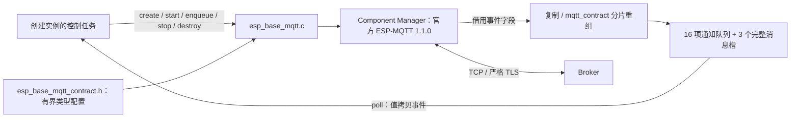

# mqtt_runtime

ESP Base 对官方 `espressif/mqtt == 1.1.0` 的装配层。MQTT 报文、packet ID、QoS、重传与 RAM outbox 由官方组件负责；本层维护配置输入、业务事件交接和订阅就绪证明。目前由独立集成测试应用消费，普通基座尚未接入 MQTT 配置、设备命令或 reported，不把编译完成标为五能力完成。

## 架构拓扑

一个实例、一个控制 owner。所有公开 API 由创建实例的任务串行调用；回调不持有调用者栈或官方事件指针，不调用订阅、停止、销毁或业务处理。`poll` 返回的是调用者拥有的副本；事件包含 4 KiB 消息，调用者使用静态/堆内存，避免放入小任务栈。stop 等待官方任务和回调结束后清空本层队列，destroy 再释放全部资源及凭据。SDK stop 失败时保留实例，禁止释放仍在使用的内存。官方任务正常 stop 会关闭 transport 并清空 RAM outbox；此前没有取得最终证据的发送不能因 stop/start 被当作成功，业务结果仍为 unknown。普通网络断开后的自动重连与显式 stop 是不同操作。

官方客户端使用 MQTT 3.1.1、clean session、30 秒 keepalive、2 秒自动重连间隔、5 秒消息重传间隔、3 秒网络操作超时和 16 KiB outbox 阈值。接收缓冲 1024 字节，发送缓冲 2304 字节，后者容纳八个 256 字节过滤器组成的 SUBSCRIBE。outbox 计数不包含完整节点/协议/分配开销，不是总 heap 上限；没有自建 ACK 重传或第二个重连计时器。官方 API 锁、DNS 和网络操作仍可能等待，不能把这些调用称为全程非阻塞。

每次 CONNECTED 后恢复最多八项订阅。只有同一订阅请求 ID、精确条目数且逐项获准的 SUBACK 才进入 READY；拒绝、错误 ID、超时十秒均报告失败并停止会话。动态订阅/退订只能在 READY 提交；增加订阅只发送新增项并核对单项 SUBACK，不重发已有主题；退订等待对应 UNSUBACK。提交失败、回执错误或超时停止会话，显式 start 才恢复。重新连接使用当前期望订阅列表；断开前未收到的操作回执不能因重连被伪造。

收发 payload 最大 4096 字节，topic 最大 256 字节，QoS 仅 0/1。主题过滤器验证通配符位置，发布主题拒绝通配符；UTF-8、空字符和控制字符严格拒绝。重组核对总长度、偏移、message ID、QoS、retain、duplicate，只把完整消息送到 owner，二进制零长度载荷有效。发送总是使用官方 enqueue、store=true；零长度传 NULL，避免官方 API 隐式 strlen。返回 -2 映射 outbox 满、-1 映射失败；返回 ID 只证明入队，PUBACK 只证明协议确认。DELETED 明确表示 outbox 过期，QoS 0 的协议 ID 为 0，不能据此关联多笔独立业务。

完整消息槽或通知队列溢出时，本层停止客户端并报告事件丢失，不继续宣称在线；只有 owner 显式重新 start 才恢复。此时未取得最终证据的业务结果应为 unknown，不能重发来掩盖丢失。

TLS 配置只接受显式 CA、hostname 与端口，不暴露 skip verification、备用明文地址或 URI 覆盖。客户端 ID 必须来自持久 UUID；配置按值复制，CA 在 SDK 生命周期内始终有效。编译强制 `CONFIG_MBEDTLS_HAVE_TIME_DATE=y`；start 还要求 owner 已取得可信时间。证书解析、链、日期、主机名/SNI 由官方 TLS 层验证，配置预检不把 PEM 标记存在当作证书有效。TCP 仅在 `CONFIG_EBASE_MQTT_PLAINTEXT_LAB=y` 的实验构建中开放，普通基座 CMake 拒绝该选项。

ASan/UBSan host 测试使用已锁定的官方头文件注入 SDK 回调，验证本层参数装配、队列、错误映射与 100 次资源释放；fake 没有实现 Broker 或 MQTT 协议，不能证明真实网络互操作。实板入口见 [集成测试应用](../../apps/mqtt_integration/README.md)，结果见 [开发检查点](../../../docs/operations/development-checkpoint.md)。
