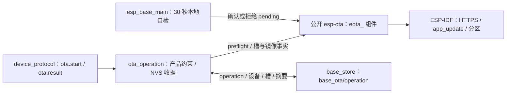

# ota_operation

Base 自有的 OTA 产品约束与持久 operation 收据。固定项目 `esp_base`、ESP32-C3 芯片、现有双 `0x1e0000` 应用槽和下载期限；`ota.start` 请求不能修改这些约束。收据保存在 `base_store/base_ota/operation`，首次目标槽写入前必须 commit 并逐字节读回。同 operation ID 不重新下载，前次结果未决时不覆盖唯一收据。

## 架构拓扑

通用 HTTPS 下载、镜像头/完整摘要、SDK 验签、槽观察与确认/回滚均由锁定的 `esp-ota` 维护；本组件不保留这些实现或旧 `esp_base_ota_*` 转发入口。收据查询通过 `eota_observe_slots` 和 `eota_sha256_running` 读取当前事实：worker 活跃或新槽 pending 为 running，新槽 VALID 且完整 signed bin 摘要吻合才 succeeded，明确失败或回滚才 failed，其余 unknown。存储写入或读回不确定时拒绝启动升级。普通未签名构建不登记收据。

当前实板是未签名旧基座，签名首次迁移与真实 HTTPS、Flash、bootloader 回滚尚未验收；构建和 host 假件不代表实板结果。
