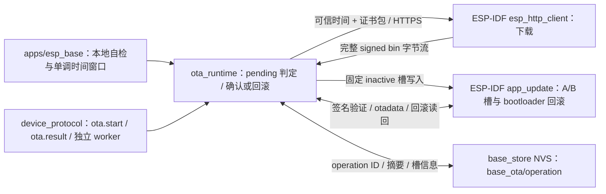

# ota_runtime

读取当前运行槽与 pending 状态；调用方完成本地启动与控制任务活性检查后确认新槽，失败时调用 IDF 无效回滚。受控签名构建通过官方 `esp_http_client` 的 HTTPS 与 `app_update` 下载到另一应用槽，下载前后核对 target、完整长度与 SHA-256，最后由 IDF 验证 RSA-3072 签名并切换启动槽。组件在 `base_store` 登记最近一次 operation 收据，供跨启动只读查询。普通未签名构建拒绝 OTA。

## 架构拓扑

`esp_base_ota_confirm_if_stable` 在 30 秒前返回 `ESP_ERR_NOT_FINISHED`，时钟倒退返回 `ESP_ERR_INVALID_STATE`；SDK 返回错误但 otadata 已为 VALID 时按持久事实确认成功，调用方清除配置写门。启动或活性失败时，`esp_base_ota_reject_pending` 使用 IDF 的无效回滚重启；若无可回退镜像，SDK 返回错误并保留当前执行，但后续复位仍可能失去可启动槽，必须人工恢复。Wi-Fi、MQTT Broker 与 FRPS 在线不参与本地确认。

`esp_base_ota_update_run` 只在 IDF 同时启用软件签名应用、更新验签、RSA-3072、证书包和 bootloader rollback 时可用。它要求当前运行槽与选择槽相同且 otadata 为 VALID，目标是另一 OTA 槽，并在发起写入前检查声明大小不超过目标分区。HTTPS 使用证书包验证和禁用重定向，要求 HTTP 200、确定且相等的 Content-Length。首段镜像读取后先核对格式、项目名 `esp_base` 与 SDK 芯片/修订检查，再调用 `esp_ota_begin` 写入固定目标槽。流完整接收后按声明长度读回 staged signed bin 算 SHA-256；匹配才调用 `esp_ota_end` 验签，随后用 `esp_ota_set_boot_partition` 二次验证并更新选择槽。切槽后核对目标与可回退旧槽；异常则尝试选回旧槽并读回，恢复失败报告 `ota_boot_state_unknown`，设备不能安全复位。

`esp_base_ota_receipt_register` 在创建 worker 前将设备 ID、operation ID、完整 signed bin 摘要/长度及源/目标槽写入 `base_store` 的 `base_ota/operation` 单 blob，commit 后按原字节读回；该 namespace 与 key 均不超过 NVS 15 字符限制，也不改动 `base_config/committed` 或默认身份 NVS。收据只保留最近一次操作，相同 operation ID 不重下载；前次 unknown 时不能覆盖唯一收据，可能需要外部恢复。新 ID 还须满足当前运行槽 VALID、boot selector 一致、目标槽状态安全且无活动 worker。失败 worker 会写入失败原因；写入不确定时对命令返回 unknown，不自动重试。`ota.result` 在 worker 活跃、目标 pending、目标 VALID 且运行镜像完整摘要匹配、失败记录或目标 ABORTED/INVALID 等事实之间裁决 running/succeeded/failed/unknown。只有已完成本地确认的 VALID 新槽可报 succeeded；旧槽缺少新查询代码时工具只能报告 unknown。这里的 host 假件不模拟真实 NVS 断电原子性、bootloader 或跨版本回滚。

首次启用需要已签名且 otadata 为 VALID 的运行基座，以及已知可回退的旧槽和经核对的 bootloader rollback；现有未签名设备不能仅改 sdkconfig 直接 OTA。临时测试键只用于隔离编译。应用对 `esp_http_client_fetch_headers` 与每次 `esp_http_client_read` 返回的 EAGAIN、零字节及成功读取检查 30 秒无进展和 5 分钟总期限；单次 SDK 调用内部可反复读取，持续慢速滴流下不能把这两个策略值当作严格墙钟上界。真实 TLS、签名更新、掉线、慢速滴流、坏摘要/签名、回滚及旧 bootloader 的能力仍待实板验收。
