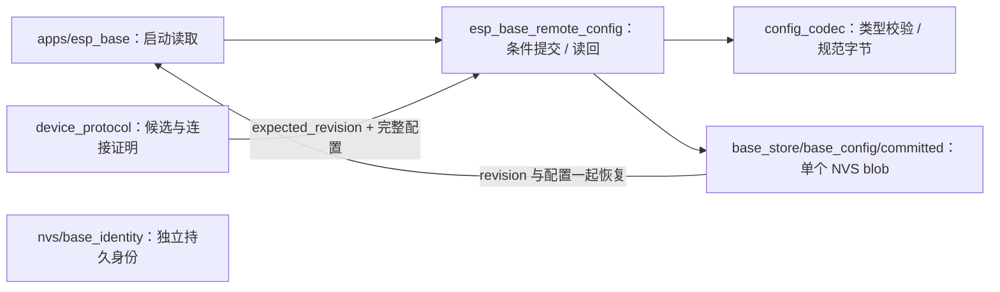

# remote_config

拥有完整配置、单调 revision 和 NVS 提交边界。候选验证由单一控制任务调度，本组件只在连接证明成立后提交。

## 架构拓扑

USB `config.set` 使用 schema_version 2 的完整配置。Wi-Fi 为 null，或含 `ssid`、`password` 的精确对象；SSID 为 1–32 个 UTF-8 字节，不含控制字符；密码为 8–63 个可打印 ASCII 字符，或 64 位十六进制 PSK。接入至少 WPA2-Personal，不静默尝试开放网络。MQTT 为 null，或含 `hostname`、`port`、`username`、`password`、`ca_pem`、`management_key_hex` 的精确对象；均由物理 USB 注入，不生成凭据。FRP 与业务配置仍必须为 null。普通固件的软件 owner 消费已提交的 MQTT 配置；仅保存凭据不等于客户端 ready，状态以实际 Wi-Fi、时间和 SUBACK 门报告。

存储使用既有 128 KiB `base_store` 分区，唯一 key 为 `base_config/committed`。v2 是 24–4885 字节的单个规范 blob：`EBCF`、版本 2、Wi-Fi/MQTT 配置位、各字段长度、LE revision/端口、4 字节零保留区，然后依次紧排 SSID、Wi-Fi 密码、主机、用户名、设备密码、CA PEM、配置时的 32 字节独立管理 HMAC key。不保存 C 结构填充、指针或 SDK 私有布局。全长必须精确匹配；未配置字段必须全零；v1 112 字节记录明确拒绝，启动停止且不写 NVS。官方 IDF NVS v2 多页 blob generator 已用最大 4885 字节配置和 OTA 收据在相同 128 KiB 分区生成成功；这只验证容量/格式，真实提交与掉电行为仍待实板。

写入前重新读取 revision，拒绝冲突和溢出；完整 blob 写入、`nvs_commit` 与读回一致后才成功。失败不回显密码、PEM 或管理密钥；status 仍仅返回现有 revision、能力与资源事实。旧迁移代码读取的 `nvs/base_config/generation` 在已核对实板上不存在，不保留兼容读取或双写。

配置候选只在 RAM；没有连接证明不调用写接口。写入开始后的错误为 `storage_uncertain`，不能假设原值未变，也不自动重试；控制任务重新读取真实持久状态并停止后续写命令，待重启重新核验。读取失败或格式损坏停止初始化，不自动擦除。身份 namespace 和分区布局保持不变。

NVS blob 的底层原子更新与掉电恢复使用[官方 NVS 实现](https://docs.espressif.com/projects/esp-idf/en/v6.1/esp32c3/api-reference/storage/nvs_flash.html)。host 故障注入验证调用层的错误语义，不能替代真实断电测试。
