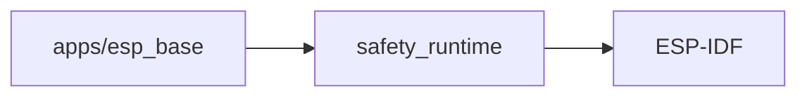

# safety_runtime

读取 ESP-IDF 的本次复位原因；看门狗当前由 firmware 的 sdkconfig.defaults 配置，不由该组件初始化。

## 架构拓扑

```mermaid
flowchart LR
    app["apps/esp_base"] --> component["safety_runtime"]
    component --> sdk["ESP-IDF"]
```

