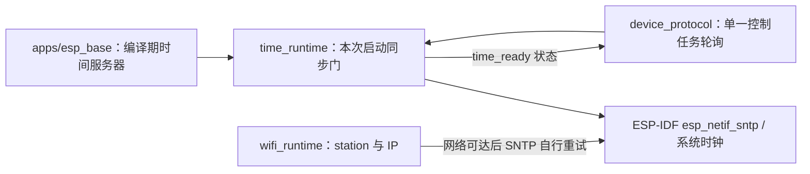

# time_runtime

普通 Base 应用以编译期 `CONFIG_ESP_BASE_TIME_SERVER` 初始化官方 `esp_netif_sntp`，由控制任务非阻塞轮询同步结果。每次启动只有收到 SNTP 同步事件且 Unix 时间不早于 2024-01-01，`esp_base_time_ready()` 才为真；只看设备时钟数值不能证明本次启动已同步。Wi-Fi 断开后设备时钟仍继续运行，后续同步事件会刷新判断。没有同步或初始化失败时网络 TLS 消费者须保持未就绪，USB 控制和 pending OTA 本地确认不受其阻塞。

## 架构拓扑

服务器名称仅保存在构建配置中，不写 Wi-Fi NVS。组件持有服务器名称直到本次 boot 结束；SNTP 初始化失败后允许再次调用 start。该门只证明 SDK 收到 SNTP 同步事件与时间下界，不提供加密时间认证。普通基座的 MQTT 与签名构建的 HTTPS OTA 均读取此门；实板 SNTP、Wi-Fi 重连与服务失败恢复尚未验收。
