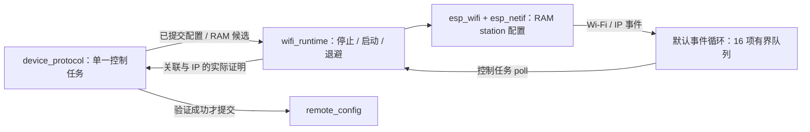

# wifi_runtime

ESP-IDF station 生命周期由 Base 控制任务独占。Wi-Fi 不再依赖 FRP 调试路径，也不从 SDK 历史 NVS 自动读取网络凭据。

## 架构拓扑

切换配置先停止当前 station，再应用新参数并启动。SDK 回调只投递事件，不执行存储、重连或阻塞任务。取得 IP 后重新读取当前 AP 与 netif，按实际 SSID 长度、认证类型和有效地址核对；AP 记录中 SSID 终止符后的填充字节不参与比较，旧 IP 事件不能直接证明候选成功。停机超过 2 秒或事件队列溢出时报告 failed。

断线只保留一项连接尝试和一个重连期限，退避从 1 秒增至 16 秒，附加不足 500 ms 的抖动；成功取得地址后清零。配置候选总验证期限为 20 秒，由控制任务裁决，超时选择原已提交配置。未配置、连接中、已连接、已断开和失败均来自运行状态，不用 provisioned 推断在线。

初始化失败会清理已取得的驱动、事件队列和 netif 资源，并将状态设为 `failed`；调用方保持 USB 管理可用。此时本次启动的配置候选不能提交，下一次设备启动重新初始化 Wi-Fi。

本轮仅验证当前 C3 与实际使用的 WPA2 网络，已提交配置的真实断电恢复已通过；WPA3、提交期间掉电、其他芯片及长稳尚未验收。模块不创建 MQTT/FRP 客户端，不配置 GPIO，不输出密码。
