# Base 与 Container 产品装配

主应用编译本组件，并在启动时沿唯一 `ota_operation` claim 调用它。默认产品授权输入全部为空：C3 保持原无包分区流程；任一输入出现但合同不全，启动明确阻断并保留 claim。C3 当前分区表没有包分区；ESP32 源码表已包含 `product_pkgs` 三槽、独立 FRP scratch 与六页 Base NVS，但布局迁移和实体负载尚未验收，不可据此写板。

## 架构拓扑

```mermaid
flowchart LR
    main["esp_base_main：启动 claim"] --> binding["签名固件与 otadata 观察"]
    binding --> provider["真实分区 / 独立存储锁"]
    provider --> slots["无包初始化或既有绑定对账"]
    slots --> guest["confirmed 包验签、授权和唯一 pthread"]
    ingress["独立 MQTT event：ACL / 设备 HMAC"] --> queue["Base：签名上限 FIFO / 包摘要核对"]
    queue --> guest
    slots --> release["完成启动存储操作后释放 claim"]
    release --> uninstall["产品专属卸载：确认停止 / 清当前绑定 / 独立读回"]
    uninstall --> slots
    release --> ota["ota.start：同一 owner"]
    ota --> receipt["V2 收据：A/B/C 摘要、槽与 ECS2 sequence"]
    receipt --> retire["eota 擦除旧 B / Container 退役为 A-only"]
    retire --> prepared["prepare 后精确 A/C 观察与 NO_PACKAGE stage"]
    prepared --> select["选 boot"]
    select --> trial["C pending：BOOT_START_TRIAL / begin_trial"]
    trial --> health["本地窗口 / mark_healthy"]
    health --> confirm["OTA VALID 回读 / Container confirm"]
    receipt --> recovery["重启在产品装载前按原收据恢复"]
    recovery -->|"A 仍运行"| retire
```

`esp_base_container_with_firmware_set` 使用调用者**已持有**的 Base claim，不再二次 claim。它支持 `CONFIRMED`、`PENDING_TRIAL`，以及仅在 `eota_prepare` 成功后、`eota_select` 前使用精确收据的 `PREPARED_CANDIDATE`；每次逐字段映射实际可启动签名固件集合，执行一次 Container 操作后复读。不一致返回 `UNCERTAIN`。provider 的槽操作信号量与 Base 高层 claim 分开；其包分区、专用 NVS 初始化及 blob 操作通过启动时绑定的短时 owner 与 FRP scratch 串行。映射从 map 至 unmap 持有该租约，含验包与解释器装载的持有时间仍待测量。OTA app 和 Base 其他 NVS 路径尚未接入，不能据此声称全局 Flash 仲裁已完成。

产品策略通过 `Kconfig` 的显式构建输入提供：产品 ID、RSA-3072 PKCS#1 公钥 DER 十六进制与 key ID、包分区和 NVS 分区的真实 label/offset/size、三个绝对槽区域，以及独立的 Wasm 大小、栈、事件队列、指令、宿主调用、capability、timer/log 与入口期限上限。公钥必须来自仓外受控产品信任源；签名包中的请求不能扩大这些授权。固定 ABI 2 只接受一页 Wasm 线性内存，持久包记录使用指定 NVS 分区的 `base_pkg/slots`。受控测试输入只供仓外容量原型，不能冒充生产信任源。

在真实表中 `esp_container_slots_idf_bind` 校验包分区 `data/undefined`、NVS 分区、精确地址/大小、槽几何与可写属性。若指定 NVS key **确实不存在**，启动 claim 下的 `CONFIRMED` 双重观察先验证实际一个或两个签名 Base 固件，再通过公开 `econtainer_slots_initialize` 持久写入对应无包绑定；损坏、读失败或部分授权配置均不会被当成首装。既有绑定经 `reconcile` 对账。若启动结果为 `EMPTY`，Base 在释放 claim 前另行双重观察签名固件并独立读取 ECS2：只有序号 1、IDLE、无操作、无包且全部固件绑定精确匹配时，才允许缺失的产品账本首次创建；任一观察不确定则阻断启动。confirmed 包随后在唯一 `pthread` 中通过公开 `econtainer_product_open` 回读、映射、验签、验产品和授权，释放映射后执行 `init`；线程轮询已授权 timer 并排出 log。对账与装载结束后释放高层 claim，guest 存活不会长期占用 OTA owner；出错时保持阻断。

Container 成功 open 返回本次重新验签包的 SHA-256 与签名 `event_queue_limit`；Base 在 `init` 后据此分配有界 FIFO。只有已经完成设备端授权的入口才能调用 `esp_base_container_product_offer_event`，它复制事件并在同一包摘要、长度、队列空位和运行状态均满足时入队。唯一产品 pthread 依次取出并调用 `on_event`，退出时清除未交付事件；停止请求后与同 boot 换包后旧摘要都不能投递。`ACCEPTED` 不是 guest 成功结果；最近一次事件观察区分 runtime 结果与 guest 返回值，仍不构成业务试运行健康证明。独立 MQTT `event` Topic 的设备 HMAC、boot／包摘要／连续序号门和有界入队已有软件接线，Broker ACL 生成及隔离实测已完成；生产账户、真实设备消息、产品业务成功判定与试运行持久确认仍待闭合。

验包与 Wasm 校验的 5,504 B 工作区在 `open_selected` 的产品 pthread 栈中，仅供同步 `econtainer_product_open` 借用；Container 自己生成本次 `verified_info`。配置了产品策略时，owner pthread 栈至少为 16,384 B；无产品策略仍为 0。双目标签名 QEMU 的启动路径已量到约 5 KiB 最低未用栈，但 ESP32 内部堆最低仍未过 48 KiB 门，event／timer／stop 与完整网络并发的栈深尚未验收，见[工作区移栈检查点](../../../docs/operations/product-workspace-stack-checkpoint.md)。

同一 boot 内需要改动已确认产品绑定时，调用方先取得 Base storage claim，再调用 `esp_base_container_product_stop_confirmed`。仅在 guest 主动停止、Container `stop/close` 成功、唯一 pthread 已 join 且无实例引用后才允许再次调用 `product_boot`；失败保留 claim 并阻断重开。首次启动得到 `EMPTY` 时，已退出的线程 join 后也允许在有效 claim 下重试；重试仍由真实固件集合观察、ECS2 reconcile 和签名包 open 决定结果。`BLOCKED`、trial 和未完成停止都不开放重试；一旦卸载观察或提交进入 `UNCERTAIN`，即便后续单独停止 guest 也不开放本 boot 重试。此处只提供运行时收敛入口，尚未接入 `product.*` 命令、包来源和产品操作收据。

内部包准备成功后，旧确认 guest 必须先经上述停止与回收证明，才能用原 operation ID 和 `PREPARED` 序号启动产品专属 trial。启动前只读预检持久操作和签名固件，错误参数不消耗同 boot 重开机会；正式 Container 将状态推进 `TRIAL_STARTED` 后才重新验签、打开并执行候选 guest。只有候选包摘要匹配的已授权事件可入队；事件执行、离线和 Base ready 均不会自动确认产品。放弃时先停止候选并回收 native 实例，再以原操作及 boot 身份持久提交 `ABORTED`、独立读回并核对全部固件绑定，成功后才允许同 boot 重新打开旧包；不确定结果仍阻断。该入口尚未接入公开安装／升级命令、业务健康策略及持久账本终态，详见[产品试运行检查点](../../../docs/operations/product_package_trial_checkpoint.md)。

内部 `esp_base_container_product_uninstall` 在有效 Base claim 下，以独立签名固件集合双次观察、精确 ECS2 sequence、当前包 SHA-256 和新的 operation UUID 预检当前绑定，避免把参数错误变成 guest 停机。运行中的已确认 guest 由该入口停止、关闭并 join；已 `STOPPED` 或因包损坏而 `BLOCKED` 的 guest 只有在同一 worker 已 join 且 native runtime 未创建或确已停止、关闭后才能进入卸载。它以该真实回收证明调用 `esp-container@3b5f16f` 的公开 `econtainer_slots_uninstall`，只清运行固件的包绑定。Base 在 Container 提交/读回之外再次读取 ECS2，核对新的 sequence、无包 operation、清空的当前绑定及逐字段未变的回退固件绑定。只有此读回和固件双观察全部成功才开放同次启动 `product_boot`，此时真实槽返回 `EMPTY`；失去 ECS2 key、停止、提交、独立读回或物理固件观察不确定均保留本 boot claim、禁止重开，需由新启动从持久事实重新对账。签名包原始 Flash 与回退包引用不会被擦除。

当前 Base 候选有只读 `product.status`／`product.result` 和独立的最近八条持久操作账本；`product.status` 以签名固件双次观察读取 ECS2 当前绑定序号与可选包摘要，供正式写入前获取精确参数，公开 `product.uninstall` 已将该内部入口接入持久账本和本地串口客户端；安装／升级及包来源仍缺。ECS2 只保留最近 operation ID 和卸载后的无包状态，不保留旧包 SHA/长度；跨 boot 的请求参数与历史结果不能由 ECS2 单独推断。新 boot 的只读卸载恢复按原 operation ID、原 ECS2 序号和当前签名固件绑定裁决，不能重放写入；未能证明持久结果时保留未决。此软件路径未授权物理设备刷写。

当前只允许**持久无包绑定**进入联合固件 OTA。`ota.start` 在同一 owner 下取得已对账的签名 A/原独立 B 与 ECS2 sequence，并在写 app 槽前持久登记和读回 V2 收据。登记前的只读快照按实际路径检查 ECS2 序号余量：C 成功时需要 stage、begin_trial、mark_healthy、confirm 共 4 次提交；若 C 在 `HEALTH_VERIFIED` 后回滚到 A，恢复需要 stage、begin_trial、mark_healthy、abandon、drop 共 5 次。原 A/B 还需先退役旧 B，多 1 次；原 A-only 无需退役。因此 A/B 至少保留 6 个序号，A-only 至少保留 5 个。余量不足直接拒绝，不登记收据或擦除旧 B。worker 重新核对该收据后先调用 `eota_retire_inactive`：擦除确切 inactive 槽首扇区、读回首字节 `0xff`，使旧 B 的 otadata 失效，并核对 A 仍为 VALID 且被选为 boot；然后调用 `econtainer_slots_retire_inactive_firmware` 将 A/B 持久绑定退役为 A-only。原本已是 A-only 时仍验证物理单槽事实和原 sequence。只有退役完成才运行 `eota_prepare` 下载 C，以 prepare 收据重新核对 A/C，调用 `econtainer_slots_stage_firmware(NO_PACKAGE)` 持久 stage，成功后才 `eota_select`。C 的 `PENDING_VERIFY` boot 必须由 Container 返回精确 `BOOT_START_TRIAL`，先 `begin_trial`，再经过 Base 本地控制进展与稳定窗口、`mark_healthy`、`eota_confirm_pending`、VALID 与签名集合回读，最后 `confirm`。C 已 VALID 而 Container 仍为 `HEALTH_VERIFIED` 的复位恢复，在本 boot 完成本地基本检查后，用持久旧 `trial_boot_id` 补交 confirm。

重启后的启动 claim 在产品装载前读取原 V2 收据。A 仍运行且为 VALID、boot selector 仍指向 A 时，按收据再调用物理退役，清除可能只写了一部分的 C；Container 恢复只接受原 ECS2 sequence 所限定的 A/B 或 A-only，或与原 operation ID、C 摘要和不同 boot ID 相符的 NO_PACKAGE `PREPARED`、`TRIAL_STARTED`、`HEALTH_VERIFIED`、`ABORTED` 状态，必要时执行 `abandon` 和 `drop_aborted_firmware`，最终复读 A-only。三层都对账成功后才把原收据记为 `FAILED` 并继续产品启动。C 已被选中并运行时复核 pending/VALID、完整签名 C 与旧 A 的签名及 IDF 回退资格；配置 Container 时还要核对原 operation、A/C 身份与 ECS2 sequence，绝不把 C 当作 inactive 槽擦除。若 C 已为 VALID、原 V2 收据仍为 `PREPARED` 且 ECS2 为精确 `HEALTH_VERIFIED`，就在本次收据对账中持久确认并读回 `CONFIRMED`；已 `CONFIRMED` 的同一 operation 只读通过。随后才进行已确认产品启动，成功后持久写入读回 `SUCCEEDED` 收据。普通产品启动不再自行确认、放弃或删除固件迁移。

`SUCCEEDED` 是此前 C 已为签名 `VALID` 且 ECS2 原操作确认完成的持久证明。后续产品操作可推进 ECS2 sequence 并替换原 operation；下次启动仍须用旧 V2 收据核对 C/A 签名固件集合，再让 Container `reconcile` 检查包引用和未决候选。原确认序号只接受原 operation 精确匹配；更高序号只接受目标仍为运行 C、无固件迁移且非 `IDLE` 的产品操作，决策须为 `CONFIRMED` 或 `RECOVER_CONFIRMED`。`PREPARED` 收据保留原 operation/sequence 约束，不能借后续产品路径放宽；包损坏、错误固件集合或未决固件迁移都阻断启动。

收据确实不存在、已标记 `FAILED` 或 OTA 不可用时，在产品启动前只读检查真实 ECS2：允许缺键首装与无固件迁移的绑定，任何残留 `firmware_transition`（包括 `CONFIRMED`）都阻断启动且不写 ECS2。旧 V1、损坏或读失败收据、身份/sequence 不匹配和任何存储不确定也阻断产品启动，不能改写成新的空状态。

带包产品在 OTA 写 inactive app **之前**拒绝：Base 尚无真实业务事件来源与代表性事件授权，不能以 `init`、平台管理命令或可选 timer 冒充 guest 事件进展。Container 已提供 REUSE 与 WRITE 状态合同，但 Base 目前也没有新包来源；两条路径仍未接线。已确认包的正常启动入口继续可用。退役、下载、签名、stage 或选 boot 中事实不确定时，worker 留住本 boot 的 claim 并报告 `unknown/storage_uncertain`，不会当作普通失败释放；claim 本身不跨重启，跨重启恢复仅由原 V2 收据授权。上述是软件恢复合同，host 假件不能模拟实板掉电时的 Flash/NVS 原子性、bootloader 后备扫描、双槽迁移或 guest 与 FRP/MQTT 并发。

当前清单精确锁定 `esp-container@d370899b88883d8c23c60884dda9e2dae8bc295d` 与 WAMR `c10736fffdf26d7c2ae234e05aa712df112eb6bf`。此前旧 `esp-container@5c807400c49158c3283686f18617b28f0f962868` 的 943,056 字节未签名 ESP32 产品离线 ELF，以及 1,114,100 字节测试键签名 ESP32 镜像和 ECDSA v1 验签，只是历史证据，不代表当前锁的容量。当前软件恢复接线的构建和测试证据见[开发检查点](../../../docs/operations/development-checkpoint.md)。默认 C3 无包分区与产品授权，不运行 guest；ESP32 仍只有仓外产品测试输入和离线布局。ESP32 签名 guest 与 FRP reader 的仓外 QEMU 检查点不包含正式 FRPS 会话或完整五能力资源峰值；没有持久实板包、掉电恢复或实板资源测量，不能宣称五能力运行验收。

历史 Base `3df1c33` 与当时的精确锁曾以仓外测试产品策略完成两目标深链接核验，两个 ELF 都确实包含 `econtainer_product_open` 与 WAMR load/instantiate/call。ESP32 测试键 ECDSA v1 签名镜像为 `0x10fff4`，官方验签通过，双 `0x120000` app 各余 `0x1000c`。C3 仅在隔离副本使用三 `0x82000` 包槽与双 `0x118000` app 的候选表，测试键 RSA v2 签名中间镜像为 `0x121000`，官方容量门判每槽溢出 `0x9000`，所以该布局没有可用构建。证据与隔离改动见[开发检查点](../../../docs/operations/development-checkpoint.md)；没有把测试策略、候选 C3 表或密钥写入本仓。

后续 Base `299851f` 仅在 C3 签名且显式启用产品策略时，对 WAMR、MQTT 两库执行选择性 LTO；同一仓外候选布局的签名镜像缩至 `0x111000`，官方 RSA 验签和双槽尺寸门通过，各余 `0x7000`。正式 C3 分区仍是无包布局；测试策略与候选表仍未进入仓库，QEMU 尚无 Base READY／guest 运行证据，实板与五能力并发也未验收。[开发检查点](../../../docs/operations/development-checkpoint.md)记录输入哈希、链接差额和仿真边界。

`tests/run_container_lifecycle_test.sh` 核对精确锁定的 Container/WAMR 源码并从该源码构建 host 库，再调用 Container 原有脚本生成真实签名 counter 包。测试覆盖 `EMPTY→reserve/write/trial/confirm→RUNNING→stop/reopen`、guest event、ECS2 不额外写入、停止等待超时后禁止重开，以及原 V2 `SUCCEEDED` 收据之后的新产品操作和新 boot 重放；Flash/NVS、调度与固件摘要观察由 host 替身提供，不能代替已签名固件或实板验收。脚本三个参数依次为 Container 源码、WAMR 源码、wasi-sdk 根目录；仓外依赖需提供 CMake、Python `cryptography` 和已锁定的 `esp_ota` 头文件。

同一宿主回归还从锁定 Container 的两份独立 counter 源码分别生成签名 P1/P2：Base 在同一 boot、同一固件集合及同一 storage claim 内先安装并执行 P1，事件 `{1,2,3}` 返回 3；停止、关闭并回收实例后安装 P2，持久绑定序号推进 5，重新启动后相同事件返回 6。此处安装由测试在 Base claim 内直接调用正式 Container 槽 API；设备尚无公开包来源、`product.*` 请求与持久原 ID 结果，因此这项宿主证据不等于 P6-11 或设备安装验收。
