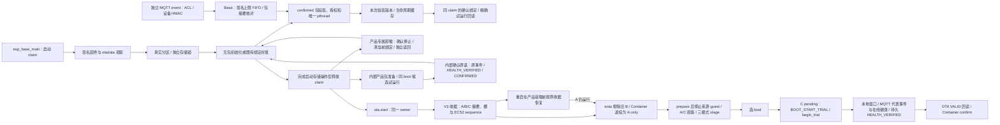

# Base 与 Container 产品装配

主应用编译本组件，并在启动时沿唯一 `ota_operation` claim 调用它。默认产品授权输入全部为空，Base 保持无包运行；任一输入出现但合同不全，启动明确阻断并保留 claim。C3 源码表已包含三份 `0x77000` 包槽、独立 FRP scratch 与 11 页 Base NVS；ESP32 源码表包含三份 `0x82000` 包槽、独立 FRP scratch 与六页 Base NVS。两目标布局迁移和实体负载尚未验收，不可据此写板。

活动状态在新 `econtainer_product_open` 成功后，从本次复验 manifest 的完整 slice 复制版本，并与实例一同发布。ID 与不可变编译授权逐字节核对；版本只持有实际长度加终止字节，不新增固定 4 KiB 常驻区。队列同一锁保护发布、查询副本和停止清理，查询再按同一个签名固件观察／ECS2 读回核对确认绑定或精确本 boot 候选。版本副本分配失败返回资源失败并清空快照，其他不确定保持阻断。绑定预检入口继续不分配版本，联合固件 pending trial 沿既有 claim／观察合同保持忙或未知。

`product.status` 现硬切为十个 required 字段，新增 required nullable 的 `active_product`。非 null 对象精确包含 `product_id`、完整 `product_version`、非零 `package_sha256`、正 uint32 `guest_abi_version`／`data_schema_version`、布尔 `is_trial` 和 required nullable `operation_id`。ID／版本沿用 Container 的小写连字符 ASCII 合同，两者合计不超过 v1 manifest 的 4096 字节边界，不截为 64 字节。确认实例的摘要／ABI／schema 与根确认绑定一致且 operation ID 为 null；候选来自本 boot 的实际验签装载，操作 ID 必须匹配未决账本，确认绑定仍保留旧包。活动 ABI 必须等于实际运行时 ABI。null 只表示未取得可确认的活动实例，不能证明 guest 健康或所有 native 资源已回收。
## 架构拓扑

`esp_base_container_with_firmware_set` 使用调用者**已持有**的 Base claim，不再二次 claim。它支持 `CONFIRMED`、`PENDING_TRIAL`，以及仅在 `eota_prepare` 成功后、`eota_select` 前使用精确收据的 `PREPARED_CANDIDATE`；每次逐字段映射实际可启动签名固件集合，执行一次 Container 操作后复读。不一致返回 `UNCERTAIN`。provider 的槽操作信号量与 Base 高层 claim 分开；其包分区、专用 NVS 初始化及 blob 操作通过启动时绑定的短时 owner 与 FRP scratch 串行。租约释放失败使操作返回 I/O 失败；映射解除时释放失败会关闭刚装载的 runtime，阻止 guest 入口。映射从 map 至 unmap 持有该租约，含验包与解释器装载的持有时间仍待测量。OTA app、otadata、Base 启动和配置 NVS 已接入共同短时 owner；SDK 整镜像验签、包映射和 NVS 提交仍可能长时占用，物理时延及同机 FRP 活性未实测。

产品策略通过 `Kconfig` 的显式构建输入提供：产品 ID、RSA-3072 PKCS#1 公钥 DER 十六进制与 key ID、包分区和 NVS 分区的真实 label/offset/size、三个绝对槽区域，以及独立的 Wasm 大小、栈、事件队列、指令、宿主调用、capability、timer/log 与入口期限上限。公钥必须来自仓外受控产品信任源；签名包中的请求不能扩大这些授权。固定 ABI 2 只接受一页 Wasm 线性内存，持久包记录使用指定 NVS 分区的 `base_pkg/slots`。受控测试输入只供仓外容量原型，不能冒充生产信任源。

在真实表中 `esp_container_slots_idf_bind` 校验包分区 `data/undefined`、NVS 分区、精确地址/大小、槽几何与可写属性。若指定 NVS key **确实不存在**，启动 claim 下的 `CONFIRMED` 双重观察先验证实际一个或两个签名 Base 固件，再通过公开 `econtainer_slots_initialize` 持久写入对应无包绑定；损坏、读失败或部分授权配置均不会被当成首装。既有绑定经 `reconcile` 对账。若启动结果为 `EMPTY`，Base 在释放 claim 前另行双重观察签名固件并独立读取 ECS2：只有序号 1、IDLE、无操作、无包且全部固件绑定精确匹配时，才允许缺失的产品账本首次创建；任一观察不确定则阻断启动。confirmed 包随后在唯一 `pthread` 中通过公开 `econtainer_product_open` 回读、映射、验签、验产品和授权，释放映射后执行 `init`；线程轮询已授权 timer 并排出 log。对账与装载结束后释放高层 claim，guest 存活不会长期占用 OTA owner；出错时保持阻断。

Container 成功 open 返回本次重新验签包的 SHA-256 与签名 `event_queue_limit`；Base 在 `init` 后据此分配有界 FIFO。只有已经完成设备端授权的入口才能调用 `esp_base_container_product_offer_event`，它复制事件并在同一包摘要、长度、队列空位和运行状态均满足时入队。唯一产品 pthread 依次取出并调用 `on_event`，退出时清除未交付事件；停止请求后与同 boot 换包后旧摘要都不能投递。`ACCEPTED` 不是 guest 成功结果；最近一次事件观察绑定包摘要、事件字节 SHA-256，并区分 runtime 结果与 guest 返回值，仍不构成业务试运行健康证明。独立 MQTT `event` Topic 的设备 HMAC、boot／包摘要／连续序号门和有界入队已有软件接线，Broker ACL 生成及隔离实测已完成；生产账户、真实设备消息、产品业务成功判定与公开试运行确认仍待闭合。

验包与 Wasm 校验的 5,504 B 工作区在 `open_selected` 的产品 pthread 栈中，仅供同步 `econtainer_product_open` 借用；Container 自己生成本次 `verified_info`。配置了产品策略时，owner pthread 栈至少为 16,384 B；无产品策略仍为 0。双目标签名 QEMU 的启动路径已量到约 5 KiB 最低未用栈，但 ESP32 内部堆最低仍未过 48 KiB 门，event／timer／stop 与完整网络并发的栈深尚未验收，见[工作区移栈检查点](../../../docs/operations/product-workspace-stack-checkpoint.md)。

同一 boot 内需要改动已确认产品绑定时，调用方先取得 Base storage claim，再调用 `esp_base_container_product_stop_confirmed`。仅在 guest 主动停止、Container `stop/close` 成功、唯一 pthread 已 join 且无实例引用后才允许再次调用 `product_boot`；失败保留 claim 并阻断重开。首次启动得到 `EMPTY` 时，已退出的线程 join 后也允许在有效 claim 下重试；重试仍由真实固件集合观察、ECS2 reconcile 和签名包 open 决定结果。`BLOCKED`、trial 和未完成停止都不开放重试；一旦卸载观察或提交进入 `UNCERTAIN`，即便后续单独停止 guest 也不开放本 boot 重试。此运行时收敛入口现由公开 `product.uninstall` 及安装／升级 worker 使用；包来源与持久操作收据由 Base 控制任务管理，试运行成功判据尚未闭合。

维护者已确认停止只对当前启动生效，重启后自动运行已确认产品。`stop_confirmed` 的成功仅清理本 boot 的执行器与活动视图，不修改 ECS2 或包 Flash；下一 boot 仍由普通启动恢复、签名固件观察、ECS2 对账和包复验决定自动装载。停止不增加持久配置或账本操作；公开 `product.stop`／`product.start` 已通过同一产品 worker 接入 `esp_base_container_product_set_running`，以本 boot、已确认包摘要与精确 ECS2 序号核对真实运行或已成功停止状态。停止后真实关闭／回收并 join；启动重新验签／装载／init，同一已确认实例已经运行时只读成功。trap、停止失败和未决 trial 不开放重启。原 ID 查询只复用现有请求守卫／outcome，EPRD 保持安装／升级／卸载三种持久操作，完整语义见[设备协议](../../../docs/design/device-protocol.md#产品停止与新启动)。

内部包准备成功后，旧确认 guest 必须先经上述停止与回收证明，才能用原 operation ID 和 `PREPARED` 序号启动产品专属 trial。启动前只读预检持久操作和签名固件，错误参数不消耗同 boot 重开机会；正式 Container 将状态推进 `TRIAL_STARTED` 后才重新验签、打开并执行候选 guest。只有候选包摘要匹配的已授权事件可入队；事件执行、离线和 Base ready 均不会自动确认产品。同 boot 精确试运行期间，绑定只读快照允许返回当前 ECS2 序号和仍已确认的旧包绑定；原 operation ID、boot ID、序号或签名固件不符则保持不确定，不把候选包报为已确认。放弃时先停止候选并回收 native 实例，再以原操作及 boot 身份持久提交 `ABORTED`、独立读回并核对全部固件绑定，成功后才允许同 boot 重新打开旧包；不确定结果仍阻断。公开安装／升级已经接入试运行，业务健康策略和成功终态尚未接线，详见[产品试运行检查点](../../../docs/operations/product-package-trial-checkpoint.md)。

内部 `esp_base_container_product_confirm_package_trial` 只在调用方已独立判定真实授权代表事件、业务结果与验证窗口通过后使用；它本身不定义产品健康。入口要求当前仍是同一 operation ID、trial 序号与 boot 的运行候选，最近完成事件的序号与已核对原始字节 SHA-256 匹配、runtime 成功且 guest 未报告负数业务失败，事件包摘要与候选包一致。确认前在事件锁下核对队列为空且没有正在执行的 guest 调用，并暂时关闭新事件入队及定时器回调；原 Base claim 下先持久写入 `HEALTH_VERIFIED`、独立读回并证明旧绑定未变，再持久写入 `CONFIRMED`、独立读回新包绑定与未变的另一固件绑定。全部成功后才把本 boot 实例改为已确认状态并恢复事件入口，允许按正常路径停止／重新打开。任一步不确定时输出序号为空、保持入口关闭并保留 claim，不能据内存状态宣称成功。公开安装 worker 已接入候选试运行；实际业务健康判据与同 boot 持久账本成功终态尚未接线。

普通已确认固件冷启动时，Base 先读取产品账本的未决安装／升级意图，再进入上述 `product_boot`。有原操作时，Container 根据同一签名固件集合、原 ECS2 sequence、operation ID 与包摘要检查持久候选；未预留候选可只读判失败，`WRITING`／`PREPARED`／`TRIAL_STARTED`／`HEALTH_VERIFIED` 仅在原绑定可证时持久放弃并独立读回。候选 Flash 即使损坏，也不会抢先阻断这个失败恢复决策；已经 `ABORTED` 可只读收尾。原操作在旧 boot 已到精确 `CONFIRMED` 序号时，Container 只读核对新绑定、包字节与两个签名固件身份，Base 才将原账本记为成功。归属或存储不确定仍阻断；账本终态提交并读回后才进入 `product_boot`，其中继续验签装载当前包。原[冷启动恢复检查点](../../../docs/operations/product-package-cold-recovery-checkpoint.md)记录了本次改动前的失败恢复边界。

内部 `esp_base_container_product_uninstall` 在有效 Base claim 下，以独立签名固件集合双次观察、精确 ECS2 sequence、当前包 SHA-256 和新的 operation UUID 预检当前绑定，避免把参数错误变成 guest 停机。运行中的已确认 guest 由该入口停止、关闭并 join；已 `STOPPED` 或因包损坏而 `BLOCKED` 的 guest 只有在同一 worker 已 join 且 native runtime 未创建或确已停止、关闭后才能进入卸载。它以该真实回收证明调用 `esp-container@3b5f16f` 的公开 `econtainer_slots_uninstall`，只清运行固件的包绑定。Base 在 Container 提交/读回之外再次读取 ECS2，核对新的 sequence、无包 operation、清空的当前绑定及逐字段未变的回退固件绑定。只有此读回和固件双观察全部成功才开放同次启动 `product_boot`，此时真实槽返回 `EMPTY`；失去 ECS2 key、停止、提交、独立读回或物理固件观察不确定均保留本 boot claim、禁止重开，需由新启动从持久事实重新对账。签名包原始 Flash 与回退包引用不会被擦除。

当前 Base 候选有只读 `product.status`／`product.result` 和独立的最近八条持久操作账本；`product.status` 以签名固件双次观察读取 ECS2 当前绑定序号与可选包摘要，供正式写入前获取精确参数；同 boot 产品包试运行返回试运行序号和仍已确认的旧绑定。公开 `product.uninstall` 已接入持久账本和本地串口客户端，`product.install`／`product.upgrade` 已接 HTTPS 来源与候选试运行。ECS2 只保留最近 operation ID 和卸载后的无包状态，不保留旧包 SHA/长度；跨 boot 的请求参数与历史结果不能由 ECS2 单独推断。新 boot 的只读卸载恢复按原 operation ID、原 ECS2 序号和当前签名固件绑定裁决，不能重放写入；未能证明持久结果时保留未决。此软件路径未授权物理设备刷写。

当前公开 `ota.start` 按原 V3 支持 `NO_PACKAGE`／`REUSE`／`WRITE` 三种模式。只读来源快照已能按 `REUSE`／`WRITE` 对账当前签名 A／原独立 B 与 ECS2：运行中的已确认 guest 必须保持事件入口开放，来源包的 SHA-256、长度、ABI 和 schema 从已验证绑定复制；`WRITE` 也允许从 `EMPTY` 无来源包开始，`REUSE` 必须有来源包。快照同时检查目标请求：`REUSE` 的包身份、长度、ABI、schema 必须逐项等于来源；`WRITE` 必须能放入非来源槽，若有来源包则保持同一 data schema；两种模式都要有非零代表事件摘要。此入口不登记收据、不写 Flash，也不能单独授权后续带包事务。`ota.start` 的现有无包路径在同一 owner 下取得 ECS2 sequence，并在写 app 槽前持久登记和读回 V3 收据。登记前的只读快照按实际路径检查 ECS2 序号余量：C 成功时需要 stage、begin_trial、mark_healthy、confirm 共 4 次提交；若 C 在 `HEALTH_VERIFIED` 后回滚到 A，恢复需要 stage、begin_trial、mark_healthy、abandon、drop 共 5 次。`WRITE` 再保留一次 `WRITING` 提交，`REUSE` 不增加。原 A/B 还需先退役旧 B，多 1 次；原 A-only 无需退役。因此无包／`REUSE` 的 A/B 至少保留 6 个序号，A-only 至少保留 5 个；`WRITE` 分别至少保留 7／6 个。余量不足直接拒绝，不登记收据或擦除旧 B。worker 重新核对该收据后先调用 `eota_retire_inactive`：擦除确切 inactive 槽首扇区、读回首字节 `0xff`，使旧 B 的 otadata 失效，并核对 A 仍为 VALID 且被选为 boot；然后调用 `econtainer_slots_retire_inactive_firmware` 将 A/B 持久绑定退役为 A-only。原本已是 A-only 时仍验证物理单槽事实和原 sequence。只有退役完成才运行 `eota_prepare` 下载 C，以 prepare 收据重新核对 A/C，调用 `econtainer_slots_stage_firmware(NO_PACKAGE)` 持久 stage，成功后才 `eota_select`。C 的 `PENDING_VERIFY` boot 必须由 Container 返回精确 `BOOT_START_TRIAL`，先 `begin_trial`，再经过 Base 本地控制进展与稳定窗口、`mark_healthy`、`eota_confirm_pending`、VALID 与签名集合回读，最后 `confirm`。C 已 VALID 而 Container 仍为 `HEALTH_VERIFIED` 的复位恢复，在本 boot 完成本地基本检查后，用持久旧 `trial_boot_id` 补交 confirm。

重启后的启动 claim 在产品装载前读取原 V3 收据。A 仍运行且为 VALID、boot selector 仍指向 A 时，按收据再调用物理退役，清除可能只写了一部分的 C；Container 恢复只接受原 ECS2 sequence 所限定的 A/B 或 A-only，或与原 operation ID、C 摘要和不同 boot ID 相符的 NO_PACKAGE `PREPARED`、`TRIAL_STARTED`、`HEALTH_VERIFIED`、`ABORTED` 状态，必要时执行 `abandon` 和 `drop_aborted_firmware`，最终复读 A-only。三层都对账成功后才把原收据记为 `FAILED` 并继续产品启动。C 已被选中并运行时复核 pending/VALID、完整签名 C 与旧 A 的签名及 IDF 回退资格；配置 Container 时还要核对原 operation、A/C 身份与 ECS2 sequence，绝不把 C 当作 inactive 槽擦除。若 C 已为 VALID、原 V3 收据仍为 `PREPARED` 且 ECS2 为精确 `HEALTH_VERIFIED`，就在本次收据对账中持久确认并读回 `CONFIRMED`；已 `CONFIRMED` 的同一 operation 只读通过。随后才进行已确认产品启动，成功后持久写入读回 `SUCCEEDED` 收据。普通产品启动不再自行确认、放弃或删除固件迁移。

`SUCCEEDED` 是此前 C 已为签名 `VALID` 且 ECS2 原操作确认完成的持久证明。后续产品操作可推进 ECS2 sequence 并替换原 operation；下次启动仍须用旧 V3 收据核对 C/A 签名固件集合，再让 Container `reconcile` 检查包引用和未决候选。原确认序号只接受原 operation 精确匹配；更高序号只接受目标仍为运行 C、无固件迁移且非 `IDLE` 的产品操作，决策须为 `CONFIRMED` 或 `RECOVER_CONFIRMED`。`PREPARED` 收据保留原 operation/sequence 约束，不能借后续产品路径放宽；包损坏、错误固件集合或未决固件迁移都阻断启动。

收据确实不存在、已标记 `FAILED` 或 OTA 不可用时，在产品启动前只读检查真实 ECS2：允许缺键首装与无固件迁移的绑定，任何残留 `firmware_transition`（包括 `CONFIRMED`）都阻断启动且不写 ECS2。旧 V1/V2、损坏或读失败收据、身份/sequence 不匹配和任何存储不确定也阻断产品启动，不能改写成新的空状态。

带包产品在 OTA 写 inactive app 之前按完整原收据和来源快照准入：产品专用操作已有独立 MQTT 授权业务事件入口与请求绑定的代表事件摘要；内部 V3 登记、包槽 stage 和 `WRITE` 续写入口已接线，联合 OTA 已独立接入 HTTPS 来源、带包启动试运行、连续在线健康与恢复，仍须逐项取得真实 Broker／设备验收。`REUSE` 内部 stage 重验现有签名包后提交 `PREPARED`；`WRITE` 内部 stage 预约并提交 `WRITING`，独立续写核对原收据与持久序号，写入非来源槽、验签授权并读回 `PREPARED`。内部 selected C 预检已能在双次签名固件观察后按原 V3 收据只读核对 ECS2 操作、精确序号、来源绑定和真实包槽字节；`WRITING` 或包损坏时阻断，不推进 trial。内部 A 侧恢复也已改为消费原 V3 收据，在物理 A-only 后对账来源包和原操作，允许清理未完成 `WRITING` 或旧 boot 的带包候选，同时保留旧确认包；普通启动现已调用该 A 侧带包分支，原收据的失败终态持久提交并读回后才重开旧确认包；物理退役、ECS2 对账或收据不确定均保留启动写门。目标 C 已为 VALID 时，启动先完成本地控制基本检查，再用原 V3 核对原 HEALTH_VERIFIED、旧 trial boot 和模式序号，补交并独立读回 CONFIRMED；同操作已确认只读通过，之后才装载 guest 并持久记成功收据。错误证据、包字节损坏或任一步不确定保留写门。公开 worker 准备新固件后先停止来源 guest；`REUSE` 重验复用包，`WRITE` 完成严格 HTTPS、验包与 PREPARED 独立读回，SDK 传输完整后才选择新 boot。已确认包的正常启动入口继续可用。退役、下载、签名、stage 或选 boot 中事实不确定时，worker 留住本 boot 的 claim 并报告 `unknown/storage_uncertain`，不会当作普通失败释放；claim 本身不跨重启，跨重启恢复仅由原 V3 收据授权。上述是软件恢复合同，host 假件不能模拟实板掉电时的 Flash/NVS 原子性、bootloader 后备扫描、双槽迁移或 guest 与 FRP/MQTT 并发。

退役入口已硬切为直接消费完整原 V3：除了 A/B 身份和精确序号，也核对来源包摘要、长度、ABI 和 schema，再调用 Container 退役并独立引用对账。来源只有 A 可启动且已确认时不伪造额外提交；保留原 CONFIRMED 相位和序号，stage 或 prepare 前失败恢复均按完整来源核对。双固件来源则先退役 B 为 IDLE。旧来源 guest 在 app prepare 后、包 stage 前停止并 join／回收。

联合固件包内部 trial 入口现消费原 V3 并先持久本 boot trial，再验签启动包，沿唯一 pthread 跟踪代表事件和失败。调用方仍须完成在线窗口；内部健康入口只复核事件依据、空队列与无在途调用，随后冻结 guest、提交并独立读回 HEALTH_VERIFIED。固件 VALID 后确认引用成功才取消 trial 和冻结；持久读回不确定继续阻断。真实 trap 已结束且 native 回收、线程 join 时才允许回滚。主应用已消费此链，原候选准入后控制任务才开放 MQTT 并采集连续 30 秒 Wi-Fi／时间／MQTT 与代表事件健康，主应用依次提交健康、固件 VALID、包绑定与原成功收据。离线保持未决；FRP 和破坏性写门保持关闭。双目标签名 app 已实际链接此链与 WRITE 续写；静态容量不代表真实五能力峰值。

当前清单精确锁定 `esp-container@2b93b979b8b0760dcb96b28ac5d13fc52ae547bf` 与 WAMR `74fd95ccbdc417c3816e04f3308eea8a5473ed34`。既有原子 `stop_requested` 由 guest owner 的取消谓词读取，init／event／timer 取消后必须真实 stop／close 并由调用方 join，失败阻断重开；宿主与实板边界见[取消检查点](../../../docs/operations/async-cancel-checkpoint.md)。此前旧 `esp-container@5c807400c49158c3283686f18617b28f0f962868` 的 943,056 字节未签名 ESP32 产品离线 ELF，以及 1,114,100 字节测试键签名 ESP32 镜像和 ECDSA v1 验签，只是历史证据，不代表当前锁的容量。当前软件恢复接线的构建和测试证据见[开发检查点](../../../docs/operations/development-checkpoint.md)。默认 C3 未配置产品授权，不运行 guest；两目标正式源码均有包分区，但现役设备尚未完成布局迁移。ESP32 签名 guest 与 FRP reader 的仓外 QEMU 检查点不包含正式 FRPS 会话或完整五能力资源峰值；没有持久实板包、掉电恢复或实板资源测量，不能宣称五能力运行验收。

历史 Base `3df1c33` 与当时的精确锁曾以仓外测试产品策略完成两目标深链接核验，两个 ELF 都确实包含 `econtainer_product_open` 与 WAMR load/instantiate/call。ESP32 测试键 ECDSA v1 签名镜像为 `0x10fff4`，官方验签通过，双 `0x120000` app 各余 `0x1000c`。C3 仅在隔离副本使用三 `0x82000` 包槽与双 `0x118000` app 的候选表，测试键 RSA v2 签名中间镜像为 `0x121000`，官方容量门判每槽溢出 `0x9000`，所以该布局没有可用构建。证据与隔离改动见[开发检查点](../../../docs/operations/development-checkpoint.md)；没有把测试策略、候选 C3 表或密钥写入本仓。

后续 Base `299851f` 仅在 C3 签名且显式启用产品策略时，对 WAMR、MQTT 两库执行选择性 LTO；同一仓外候选布局的签名镜像缩至 `0x111000`，官方 RSA 验签和双槽尺寸门通过，各余 `0x7000`。正式 C3 分区仍是无包布局；测试策略与候选表仍未进入仓库，QEMU 尚无 Base READY／guest 运行证据，实板与五能力并发也未验收。[开发检查点](../../../docs/operations/development-checkpoint.md)记录输入哈希、链接差额和仿真边界。

`tests/run_container_lifecycle_test.sh` 核对精确锁定的 Container/WAMR 源码并从该源码构建 host 库，再调用 Container 原有脚本生成真实签名 counter 包。测试覆盖 `EMPTY→reserve/write/trial/confirm→RUNNING→stop/reopen`、guest event、ECS2 不额外写入、停止等待超时后禁止重开，以及原 V3 `SUCCEEDED` 收据之后的新产品操作和新 boot 重放；Flash/NVS、调度与固件摘要观察由 host 替身提供，不能代替已签名固件或实板验收。脚本三个参数依次为 Container 源码、WAMR 源码、wasi-sdk 根目录；仓外依赖需提供 CMake、Python `cryptography` 和已锁定的 `esp_ota` 头文件。

同一宿主回归还从锁定 Container 的两份独立 counter 源码分别生成签名 P1/P2：Base 在同一 boot、同一固件集合及同一 storage claim 内先安装并执行 P1，事件 `{1,2,3}` 返回 3；停止、关闭并回收实例后安装 P2，持久绑定序号推进 5，重新启动后相同事件返回 6。此处安装由测试在 Base claim 内直接调用正式 Container 槽 API；设备尚无公开包来源、`product.*` 请求与持久原 ID 结果，因此这项宿主证据不等于 P6-11 或设备安装验收。
