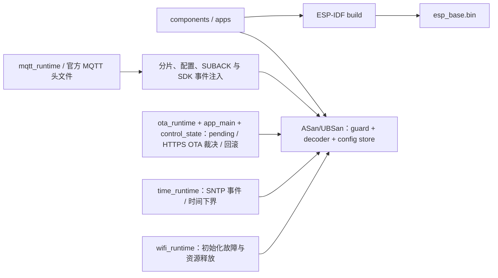

# 固件测试

`bash firmware/tests/run_host_tests.sh`（仓库根执行）验证命令身份、启动条件、期限、指纹冲突、重复请求与容量拒绝，并启用 ASan/UBSan。解析测试覆盖逐字节分片、重复/转义键、非法 UTF-8、整数边界、超限排空和 10000 次确定性畸形输入。先运行 `idf.py -C firmware reconfigure` 解析锁定的 cJSON 依赖；测试直接使用该组件。配置测试覆盖规范字节、revision 冲突/耗尽、损坏读取和写前/写后/commit/读回故障；注入的是 SDK 调用结果，不是 NVS 掉电仿真。OTA 测试覆盖槽状态读回、30 秒边界、第 29 秒后控制任务退出、跨窗口新一轮进展、启动失败、控制循环 5 秒活性边界、pending 配置写门、无回退镜像与确认失败后的持久状态；假件不模拟真实 bootloader、Flash 掉电或任务并发。完整 ESP-IDF 编译检查 USB VFS、Wi-Fi 与任务装配。

时间测试注入官方 SNTP 的初始化与同步返回值，验证本次 boot 未同步不就绪、无效时间、初始化失败后重试、调用者字符串生命周期和零等待轮询；pending OTA 启动测试同时核对时间初始化失败不触发回滚。Fake 不模拟 DNS、NTP 报文、系统时钟精度或 Wi-Fi 重连。

Wi-Fi 启动测试编译真实 `wifi_runtime`，逐项注入 netif、事件循环、队列、驱动、事件注册、配置和启动失败，验证明确 `failed` 状态及初始化中途资源释放；事件注入还验证不同 SSID 拒绝、同 SSID 但记录填充字节不同仍可取得关联/IP 证明。它不模拟真实 AP 关联、WPA3、DNS、无线恢复或 pending 槽的整机任务调度。

OTA 命令解析测试覆盖精确 manifest 字段、target、签名方案、长度和 HTTPS URL。`ota_update_test` 直接编译受控签名分支的下载源码，注入 SDK 结果，覆盖运行槽非 VALID、超槽、错误 project/芯片、缺 Content-Length、响应头及首块 EAGAIN 到期限、body 断流、5 分钟总期限、不完整、摘要不符、分区读取失败、验签拒绝、切槽后回退检查与旧槽恢复失败。Fake 只模拟每次 SDK 返回后的裁决，不替代真实 TLS、SDK 单次调用中的慢速滴流、签名密码学、bootloader 或断电测试。pending 确认故障测试还验证 SDK 报错但持久槽已 VALID 时清除配置写门。

`ota_receipt_test` 编译真实 NVS 收据实现，注入写前/写后/commit/读回错误，验证写槽前持久登记、同 ID 不重执行、活跃 worker 不误判 failed、pending/VALID 加整镜像摘要、显式下载失败与 ABORTED 回滚裁决、未决收据拒绝覆盖、目标 NEW/PENDING/读态异常拒绝、普通构建无 NVS 写入。它不模拟真实 NVS 掉电原子性、跨版本旧镜像或板上 SHA 时长。

## 架构拓扑

编译不证明设备运行与断电恢复；相关结果只在实际验收后登记。

MQTT host 测试额外验证 4 KiB 逐字节与空消息重组、畸形 UTF-8/偏移/长度、10000 次字段畸变、精确 SUBACK、动态单项订阅与重连完整订阅的不同回执、订阅/退订提交失败、UNSUBACK 错配及超时、配置复制、未同步时间拒绝、SDK 初始化失败、队列溢出、outbox 满/过期、停止失败保留资源与 100 次 create/start/stop/destroy。测试编译实际适配源码并包含 Component Manager 解析的官方 mqtt_client.h；fakes 只提供 SDK 调用结果和同步事件/队列，不实现协议、真实并发或网络。实际板卡和 Broker 验收单独执行 [MQTT 集成应用](../apps/mqtt_integration/README.md)。
