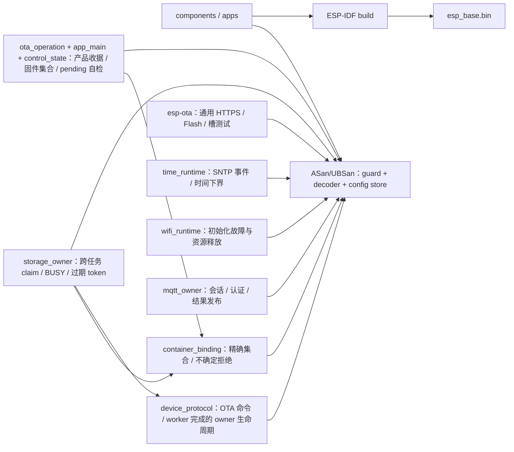

# 固件测试

`bash firmware/tests/run_host_tests.sh`（仓库根执行）验证命令身份、启动条件、期限、指纹冲突、重复请求与容量拒绝，并启用 ASan/UBSan。解析测试覆盖逐字节分片、重复/转义键、非法 UTF-8、整数边界、超限排空和 10000 次确定性畸形输入。先运行 `idf.py -C firmware reconfigure` 解析锁定的 cJSON 依赖；测试直接使用该组件。配置测试覆盖规范字节、revision 冲突/耗尽、损坏读取和写前/写后/commit/读回故障；注入的是 SDK 调用结果，不是 NVS 掉电仿真。OTA 测试覆盖槽状态读回、30 秒边界、第 29 秒后控制任务退出、跨窗口新一轮进展、启动失败、控制循环 5 秒活性边界、pending 配置写门、无回退镜像与确认失败后的持久状态；假件不模拟真实 bootloader、Flash 掉电或任务并发。完整 ESP-IDF 编译检查 USB VFS、Wi-Fi 与任务装配。

时间测试注入官方 SNTP 的初始化与同步返回值，验证本次 boot 未同步不就绪、无效时间、初始化失败后重试、调用者字符串生命周期和零等待轮询；pending OTA 启动测试同时核对时间初始化失败不触发回滚。Fake 不模拟 DNS、NTP 报文、系统时钟精度或 Wi-Fi 重连。

Wi-Fi 启动测试编译真实 `wifi_runtime`，逐项注入 netif、事件循环、队列、驱动、事件注册、配置和启动失败，验证明确 `failed` 状态及初始化中途资源释放；事件注入还验证不同 SSID 拒绝、同 SSID 但记录填充字节不同仍可取得关联/IP 证明。它不模拟真实 AP 关联、WPA3、DNS、无线恢复或 pending 槽的整机任务调度。

OTA 命令解析测试覆盖精确 manifest 字段、target、签名方案、长度和 HTTPS URL。通用 HTTPS/Flash/槽与 SDK 故障矩阵由精确锁定的 `esp-ota` 仓 `tests/update_test.c`、`tests/ota_test.c`、`tests/http_deadline_test.c`、`tests/http_transport_test.c` 和真实 TLS 回环测试维护；Base 不再编译第二份通用实现。Base 的 `ota_startup_test` 仍覆盖本地启动检查、30 秒与跨窗口控制进展、确认失败后的读回和无回退槽；`ota_receipt_test` 验证产品约束及持久收据。Fake 不替代实板 TLS/Flash/bootloader 或断电测试。

v2 配置测试覆盖 MQTT 六字段、最大 4885 字节规范 blob、v1 112 字节显式拒绝且无写入，以及 NVS 查询长度、写前/写后、commit 与读回故障；公开 USB 工具另验证相同 schema 的非法字段和整帧上限。

`mqtt_owner_test` 编译普通 Base 的真实 owner、Topic 与公开 emqtt 配置校验源码，注入客户端事件；覆盖无凭据不建客户端、UUID ClientID、严格 TLS、离线 LWT、SUBACK 前不受理命令、retained/错 Topic/HMAC 拒绝、结果和 reported 的 QoS/retain、断连重新订阅门、QoS 1 outbox 过期后的停止与重新取得 SUBACK、发布或订阅失败的停止重试，以及配置更换时 stop 失败不释放旧 handle、清除旧 key 且不再派发。Fake 不模拟实际 Broker、TLS 握手或设备任务调度。

`frp_status_listener_test` 在主机真实 loopback TCP 上执行受限 HTTP 协议，覆盖分片请求、header/body 上限、重复 Content-Length、错误 HMAC、旧 key 重配撤销和 2 秒总时限；`command_decoder_test` 验证 FRP status 六字段的严格解析，`protocol_ota_owner_test` 同时验证 status 的目标 boot、单调期限、同 ID 首次快照复用和不同内容冲突。HMAC 的 PSA 调用与失败清理仍由 `network_auth_test` 核对；主机回环不证明设备 FRP/TLS、内存、并行或实板运行。

`ota_receipt_test` 编译真实 NVS 收据实现，注入写前/写后/commit/读回错误，验证写槽前持久登记、同 ID 不重执行、活跃 worker 不误判 failed、pending/VALID 加整镜像摘要、显式下载失败与 ABORTED 回滚裁决、未决收据拒绝覆盖、目标 NEW/PENDING/读态异常拒绝、普通构建无 NVS 写入。它不模拟真实 NVS 掉电原子性、跨版本旧镜像或板上 SHA 时长。

`ota_firmware_test` 编译真实固件集合观察逻辑，注入 SDK 与 `esp-ota` 槽/镜像结果，覆盖双 `VALID`、只有当前签名镜像、双槽同摘要、pending/boot 不一致、不可回滚、旧槽虽标无效但仍有可验签镜像、读态改变及资源失败。它不模拟真实 bootloader、Flash 并发或物理镜像读取；固定 SDK 普通与测试键签名构建只验证装配。

`storage_owner_test` 验证跨任务 release、10 万次 BUSY 重试不消耗 token、下次成功只加 1、过期 token 拒绝和 `UINT_MAX` 耗尽后释放保留值。`protocol_ota_owner_test` 编译真实 `esp_base_protocol.c` 命令与异步完成分支，注入已解析请求、收据和 OTA worker 结果，验证 owner 忙时不登记收据、收据已知失败释放、收据不确定保留、worker 创建失败先记录再释放、下载失败完成后释放、选槽状态不明时保留，以及成功选槽到重启仍持有 owner；它不执行真实命令解析、NVS、Flash 或 FreeRTOS 并发。`container_binding_test` 以假 Container 类型与调用记录验证真实 Base 固件集合逐字段映射、同 owner 互斥、观察失败及前后镜像变化时拒绝启动。可选固定 SDK 探针再用公开 Container 真头文件和组件编译本适配，但并不调用包槽 provider 或证明实板写入串行。

## 架构拓扑

编译不证明设备运行与断电恢复；相关结果只在实际验收后登记。

MQTT 通用运行层的 host 回归由公开 `esp-mqtt` 仓执行；本仓不再编译第二份运行层或重复其 SDK fake。普通 Base 的 owner 故障测试与 C3 编译只证明软件接线；设备命令与 ACK 的 Broker/实板端到端验收仍需单独执行。隔离应用使用固定公开提交做 C3 组合编译；实验实板记录见 [MQTT 集成应用](../apps/mqtt_integration/README.md)。
