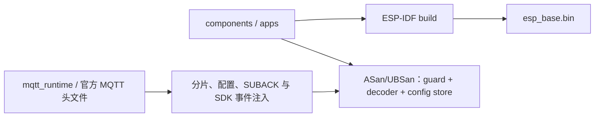

# 固件测试

`bash firmware/tests/run_host_tests.sh`（仓库根执行）验证命令身份、启动条件、期限、指纹冲突、重复请求与容量拒绝，并启用 ASan/UBSan。解析测试覆盖逐字节分片、重复/转义键、非法 UTF-8、整数边界、超限排空和 10000 次确定性畸形输入。先运行 `idf.py -C firmware reconfigure` 解析锁定的 cJSON 依赖；测试直接使用该组件。配置测试覆盖规范字节、revision 冲突/耗尽、损坏读取和写前/写后/commit/读回故障；注入的是 SDK 调用结果，不是 NVS 掉电仿真。完整 ESP-IDF 编译检查 USB VFS、Wi-Fi 与任务装配。

## 架构拓扑

编译不证明设备运行与断电恢复；相关结果只在实际验收后登记。

MQTT host 测试额外验证 4 KiB 逐字节与空消息重组、畸形 UTF-8/偏移/长度、10000 次字段畸变、精确 SUBACK、动态单项订阅与重连完整订阅的不同回执、订阅/退订提交失败、UNSUBACK 错配及超时、配置复制、未同步时间拒绝、SDK 初始化失败、队列溢出、outbox 满/过期、停止失败保留资源与 100 次 create/start/stop/destroy。测试编译实际适配源码并包含 Component Manager 解析的官方 mqtt_client.h；fakes 只提供 SDK 调用结果和同步事件/队列，不实现协议、真实并发或网络。实际板卡和 Broker 验收单独执行 [MQTT 集成应用](../apps/mqtt_integration/README.md)。
