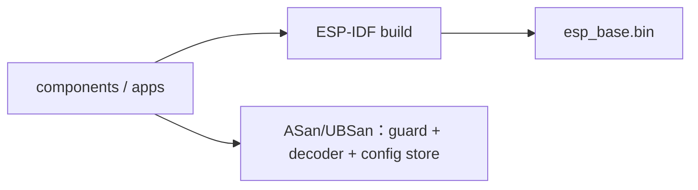

# 固件测试

`bash firmware/tests/run_host_tests.sh`（仓库根执行）验证命令身份、启动条件、期限、指纹冲突、重复请求与容量拒绝，并启用 ASan/UBSan。解析测试覆盖逐字节分片、重复/转义键、非法 UTF-8、整数边界、超限排空和 10000 次确定性畸形输入。先运行 `idf.py -C firmware reconfigure` 解析锁定的 cJSON 依赖；测试直接使用该组件。配置测试覆盖规范字节、revision 冲突/耗尽、损坏读取和写前/写后/commit/读回故障；注入的是 SDK 调用结果，不是 NVS 掉电仿真。完整 ESP-IDF 编译检查 USB VFS、Wi-Fi 与任务装配。

## 架构拓扑

编译不证明设备运行与断电恢复；相关结果只在实际验收后登记。
