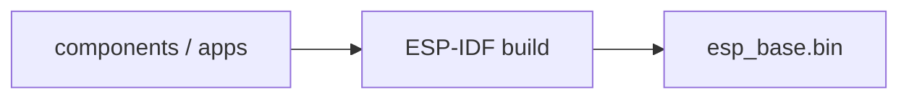

# 固件测试

`bash firmware/tests/run_host_tests.sh`（仓库根执行）验证命令身份、启动条件、期限、指纹冲突、重复请求与容量拒绝，并启用 ASan/UBSan。完整 ESP-IDF 编译检查设备代码；guard 尚未接入串口执行。

## 架构拓扑

```mermaid
flowchart LR
    sources["components / apps"] --> idf["ESP-IDF build"]
    idf --> image["esp_base.bin"]
```

编译不证明设备运行与断电恢复；相关结果只在实际验收后登记。
