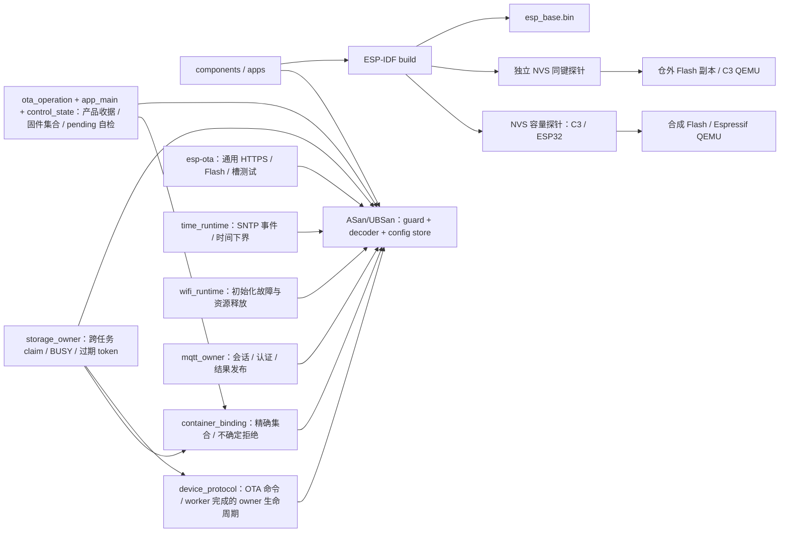

# 固件测试

`container_product_lifecycle_test.c` 的事件准入回归计数真实offer分配／释放，覆盖BUSY、错包、八槽全满且另一个事件处理中时零申请、准入后OOM释放锁、最大载荷、复制期间停止后的清零单次释放和同boot旧包隔离；`mqtt_owner_test.c` 验证拒绝不推进序号、原下一序号重复重试和后续成功推进。两目标完整host及真实Container／WAMR签名guest生命周期入口通过；首次Darwin测试宏冲突及修正后复跑分别保留。测试不证明MCU持锁时延或联合容量，见[分配检查点](../../docs/operations/ota_allocation_diagnostic_checkpoint.md)。

`config_store_test.c` 保持最大 7618 B、v3-only、损坏／冲突和写后不确定回归，新增 C3 load／commit／规范回调的三个 workspace OOM 点：输出保持、无 NVS 写入／commit、回调不执行、工作配置清零及随后恢复；每次释放检查整份 workspace 清零，完整 commit 只拥有一份缓冲，ESP32 无新增 heap 申请。两目标完整 host 和相关 ASan／UBSan 回归通过，见[RTC 检查点](../../docs/operations/rtc_config_ownership_checkpoint.md)。

`command_allocation_test.c` 验证实际缓冲分配、九个扩容失败点、行边界／排空、释放前清零、按类型载荷和复用恢复；`protocol_ota_owner_test.c` 验证配置移交后的独占存活期及两秒半包超时。两目标 ASan/UBSan 回归及实板范围见[检查点](../../docs/operations/c3-command-memory-checkpoint.md)。

宿主 Python 构包和 QEMU runner 位于固件根之外的 [tools/](../../tools/README.md)：生命周期入口调用 `container_product_deadline_test.py`，NVS 探针调用 `run_nvs_capacity_qemu.py`。固件测试目录只保存 C／Shell 等测试装配，不保留旧 Python 路径入口。

`container_product_lifecycle_test` 的 `event-failure` 分支新增两项真实签名已确认 guest 用例：候选准备前的事件预算异常拒绝升级且无写入；准备后的异常阻断停止／trial／同 boot 重开，内部显式放弃保持原绑定，随后卸载等待 native 回收且包槽逐字节不变。两目标使用精确 Container/WAMR 源码；Flash/NVS、固件观察与调度为宿主替身，已确认绑定为种子夹具。公开 worker 此处仍报告 unknown 并保留 claim，测试不经过设备命令／持久产品账本或生产 Broker。

`product_event_broker_probe.c` 是可供明确外部 TLS Broker 测试使用的宿主二进制入口。它编译实际 `mqtt_event.c`、`mqtt_command.c`、`command_guard.c` 与 `network_auth.c`，PSA 接口用 OpenSSL 实际 HMAC 替代 IDF 端口；只消费公开 `00..1f` 测试密钥，不使用设备凭据。输入为 device UUID、boot UUID、Topic、QoS、retain 和收到的原始帧文件，输出授权解析结果及原始事件摘要；不运行 MQTT owner、序号准入、队列、guest 或健康确认。16 项真实 Broker 软件验证与原测试竞态边界见[开发检查点](../../docs/operations/development-checkpoint.md)，不新增普通 host 测试的私有仓依赖。

2026-09-30 完整授权的正式 ESP32 签名 app 已在仓外 QEMU 运行 REUSE／WRITE 的离线 pending、同片回退恢复和再次冷启动；3,584 B 主任务栈复现溢出，统一 6,144 B 后通过。两模式回退主栈最低余 2,324／2,308 B，原收据持久失败，旧 P0 包恢复，二启完整 Flash 相同。前置 ECS2／原 V3 收据由合成 seed 构造，GDB 只在实际 app_main 返回后读取 TCB／栈填充值，没有注入业务调用或健康；未验证公开下载、真实 MQTT／Wi-Fi 或实体板。双目标签名构建、官方验签与欠栈配置拒绝通过，详见[开发检查点](../../docs/operations/development-checkpoint.md)。

同日 C3 从 `eb41a4a` 归档，仅在仓外适配 UART 控制台／驱动并跳过 QEMU ADC2 校准，完成同样的两模式三次启动。原 V3 字段、旧 P0／账本、官方 NVS CRC 与二启完整 Flash 一致；回退主栈最低余量均 2,260 B。模拟器 eFuse 前置修正及输入见同一开发检查点；该诊断不替代正式 USB 或实板。

`product_ledger_test.c` 使用内存持久层验证最近 8 条固定窗口、重启未决阻断、旧序号拒绝、同 ID 冲突、缺失键拒绝直接写入、写入/读回不确定与 CRC 损坏。`product_ledger_nvs_test.c` 验证实际 NVS 适配代码的短时 Flash I/O 租约、精确 blob 长度和提交失败释放。它们不代替 IDF NVS 的实板容量、掉电和磨损测试。

`product_package_source_test.c` 编译真实产品包 HTTPS 顺序读取器及公开 OTA 的同一期限源码，注入 HTTP／transport／单调时钟假件，检查可信时间和借用 transport 的装配、固定响应长度、无重定向、连续 offset、超时及正文未完整拒绝。分配、transport 创建、HTTP 初始化、打开和慢响应失败分别核对 HTTP cleanup、transport destroy、期限 owner release 的顺序；最后一段成功读取也先释放 TLS 再进入离线 Flash 校验。C3／ESP32 入口均运行；它不建立真实 TLS 会话，也不测试公开安装命令，真实 mbedTLS 机制由公开 OTA 回环测试单独核对，见[共享期限消费检查点](../../docs/operations/shared_http_deadline_consumer_checkpoint.md)。

`command_decoder_test` 另检查只读 `product.status`／`product.result` 精确 JSON 字段与非法输入；`protocol_ota_owner_test` 在 C3／ESP32 两目标假件下走真实查询处理，覆盖空账本的 `unknown`、持久序号与绑定快照、成功记录的结果序列化，以及绑定观察不确定后保留存储 claim。公开 Python 串口工具的伪设备测试核对原 ID 查询、窗口外 `unknown`、序号与可选包摘要；真实签名 guest 生命周期测试覆盖空绑定、已安装和卸载后的 ECS2 快照。正式受管 cJSON、IDF 和板上查询仍待精确依赖回归。

公开 `product.uninstall` 的解码测试验证精确字段、序号边界和小写非零 SHA-256；协议假件验证先提交 PREPARED、后调用内部卸载，成功后结果持久化、跨 request ID 同 operation ID 不再执行、参数冲突拒绝，以及复位后根据 ECS2 结果只读裁决。`product.install`／`product.upgrade` 测试覆盖严格参数解码、代表事件摘要进入完整指纹、同 ID 冲突、候选试运行、错事件和离线或执行失败重置连续 30 秒窗口、提交前短暂忙重试，以及确认后原操作的持久成功结果。真实 Container/WAMR 签名 guest 测试验证 ECS2 中原 operation ID／序号、无包绑定与未提交绑定的恢复判定，以及代表事件后另一个成功事件不会覆盖确认依据；串口伪设备测试验证精确前置参数和按原 ID 查询。组合软件测试不替代实体 Flash 掉电、真实 Broker 授权或两板迁移。

`bash firmware/tests/run_host_tests.sh`（仓库根执行）验证命令身份、启动条件、期限、指纹冲突、重复请求与容量拒绝，并启用 ASan/UBSan。解析测试覆盖逐字节分片、重复/转义键、非法 UTF-8、整数边界、超限排空和 10000 次确定性畸形输入。先运行 `idf.py -C firmware reconfigure` 解析锁定的 cJSON 依赖；测试直接使用该组件。配置测试覆盖最大 7,618 字节规范编码的同步复用、消费失败、工作配置擦除、revision 冲突/耗尽、损坏读取和写前/写后/commit/读回故障；注入的是 SDK 调用结果，不是 NVS 掉电仿真。OTA 测试覆盖槽状态读回、30 秒边界、第 29 秒后控制任务退出、跨窗口新一轮进展、启动失败、控制循环 5 秒活性边界、pending 配置写门、无回退镜像与确认失败后的持久状态；假件不模拟真实 bootloader、Flash 掉电或任务并发。完整 ESP-IDF 编译检查 USB VFS、Wi-Fi 与任务装配。

时间测试注入官方 SNTP 的初始化与同步返回值，验证本次 boot 未同步不就绪、无效时间、初始化失败后重试、调用者字符串生命周期和零等待轮询；pending OTA 启动测试同时核对时间初始化失败不触发回滚。Fake 不模拟 DNS、NTP 报文、系统时钟精度或 Wi-Fi 重连。

Wi-Fi 启动测试编译真实 `wifi_runtime`，逐项注入 netif、事件循环、队列、驱动、事件注册、配置和启动失败，验证明确 `failed` 状态及初始化中途资源释放；事件注入还验证不同 SSID 拒绝、同 SSID 但记录填充字节不同仍可取得关联/IP 证明。它不模拟真实 AP 关联、WPA3、DNS、无线恢复或 pending 槽的整机任务调度。

OTA 命令解析测试覆盖精确 manifest 字段、target、签名方案、长度、HTTPS URL、必需包模式及带包元数据。`protocol_ota_owner_test` 覆盖 REUSE／WRITE 的原收据复核、来源变化时不擦写、停止与 stage／下载／读回不确定、pending 原 ID 查询及配置写门；非法 WRITE URL 在持久登记前拒绝。`ota_startup_test` 检查原槽 A 恢复、新 pending trial 的本地／连续在线检查、native 回收与失败阻断，以及 VALID C 原健康证据确认后的启动；`ota_receipt_test` 核对合法带包字段、成功／失败终态与各次写入读回故障。公开客户端测试核对包摘要、代表事件摘要、目标包槽上限与 `ota.result` 模式字段。通用 HTTPS/Flash/槽与 SDK 故障矩阵由精确锁定的 `esp-ota` 仓 `tests/update_test.c`、`tests/ota_test.c`、`tests/http_deadline_test.c`、`tests/http_transport_test.c` 和真实 TLS 回环测试维护；Base 不再编译第二份通用实现。Base 的 `ota_startup_test` 仍覆盖本地启动检查、30 秒与跨窗口控制进展、确认失败后的读回和无回退槽，断言直接槽检查持有短 Flash claim、pending 确认期间 FRP scratch 等待到 500 毫秒后失败、释放后可再次获取；`ota_receipt_test` 验证产品约束、持久收据及各次 NVS 调用持有短 Flash claim。Fake 不替代实板 TLS/Flash/bootloader 或断电测试。

v2 配置测试覆盖 MQTT 六字段、最大 4885 字节规范 blob、v1 112 字节显式拒绝且无写入，以及 NVS 查询长度、写前/写后、commit 与读回故障；公开 USB 工具另验证相同 schema 的非法字段和整帧上限。

`mqtt_owner_test` 编译普通 Base 的真实 owner、Topic 与公开 emqtt 配置校验源码，注入客户端事件；覆盖无凭据不建客户端、UUID ClientID、严格 TLS、离线 LWT、双订阅 SUBACK 前不受理消息、命令 retained/错 Topic/HMAC 拒绝、业务事件签名/boot/连续序号与入队后推进、队列拒绝后原序号重试、同 boot 重配保留高水位、结果和 reported 的 QoS/retain、断连重新订阅门、QoS 1 outbox 过期后的停止与重新取得 SUBACK、发布或订阅失败的停止重试，以及配置更换时 stop 失败不释放旧 handle、清除旧 key 且不再派发。`network_auth_test` 的固定 HMAC 向量与 `tools/test_product_event.py` 的主机生成结果一致。Fake 不模拟实际 Broker、TLS 握手或设备任务调度。

`protocol_ota_owner_test` 使用真实 reported 格式器验证已入队序号与最近完成事件的包摘要及事件字节 SHA-256、非负 guest 结果、负数业务失败、runtime 失败时 null 结果及超限状态不发布；它的 Container 观察是假件。签名 guest 的真实结果与同 boot 换包清空由 `run_container_lifecycle_test.sh` 验证，仍没有真实 Broker 投递。

`frp_management_listener_test` 在主机真实 loopback TCP 上执行 status／restart 固定端点的受限 HTTP 协议，覆盖分片请求、header/body 上限、重复 Content-Length、错误 HMAC、旧 key 重配撤销、2 秒总时限，以及所有非空认证响应的 tag 和签发失败关闭。`command_decoder_test` 验证 FRP status 四字段、restart 七字段与普通写解析器的逐字节身份／指纹一致、各 10000 次变异、规范 UUID 和旧六字段拒绝；`protocol_ota_owner_test` 用真实 serializer 的 768 字节容量核对设备目标、服务端 30 秒首次快照缓存、新 ID 新状态、表满、TTL 释放及无写入。`network_auth_test` 核对 PSA 签发／验证用途、import/compute/长度/destroy 失败时的清理和输出清零。

显式运行 `bash firmware/tests/run_frp_management_crypto_tests.sh`（ESP32 加 `ESP_BASE_TEST_TARGET=esp32`）执行实际 listener、decoder 与 auth wrapper 的回环 HTTP 测试；需 OpenSSL 开发文件及 `pkg-config`，不自动跳过。PSA 测试端口共享 `fakes/network_auth_openssl.inc`，使用公开 `00..1f` key；Python 独立冻结的 status／restart 请求和成功／running 响应 HMAC 向量、签名 202／400／409、错误 key、tag／body 篡改与旧请求拒绝均检查。该测试与外部产品事件 probe 不验证 IDF 密码端口、FRPS、外侧 HTTPS、同板并行、内存或实板运行。

该入口还运行 `frp_management_owner_crypto_test`：将实际 Base handler／serializer／重启调度接到真实 loopback listener 与 HMAC，复用明确的 SDK／存储／网络假件；核对先回执后一次重启、跨请求 busy、重复不执行。不能代替新 boot 的实板确认。

`ota_receipt_test` 编译真实 NVS 收据实现，注入写前/写后/commit/读回错误，验证写槽前持久登记、同 ID 不重执行、活跃 worker 不误判 failed、pending/VALID 加整镜像摘要、显式下载失败与 ABORTED 回滚裁决、未决收据拒绝覆盖、目标 NEW/PENDING/读态异常拒绝、与运行 A 相同的 C 在写收据前拒绝且原收据和查询结果不变、普通构建无 NVS 写入。新增内部带包 REUSE／WRITE 登记、来源和目标身份、data schema、代表事件摘要、V3 读回及同 ID 包参数冲突用例；带包 A 侧与已有健康证据的 VALID C 启动恢复已接通，新 pending C 已接原 V3 trial、MQTT 准入与健康快照；两种模式的成功／失败终态与写前／写后／commit／独立读回故障已覆盖。它不模拟真实 NVS 掉电原子性、跨版本旧镜像或板上 SHA 时长。

联合固件包内部 trial 的真实签名 guest 回归覆盖空来源 WRITE、REUSE／WRITE 的原 V3 启动、错误事件和健康依据拒绝、事件／定时器提交冻结、健康读回不确定后 A 回滚、最终确认读回不确定后的 VALID C 恢复与真实 guest trap 回收。无包确认测试核对同 boot trial 状态清理和空绑定重开。非阻塞事件快照繁忙时测试有界重试，仍核对原序号和失败数；不将一次暂时忙视为最终错误。这些测试不验证真实 Broker 授权、在线窗口、实体 Flash 或 otadata。

`ota_firmware_test` 编译真实固件集合观察逻辑，注入 SDK 与 `esp-ota` 槽/镜像结果，覆盖双 `VALID`、只有当前签名镜像、双槽同摘要、显式 pending trial 与已确认模式隔离、pending 缺失可回滚旧槽、boot 不一致、不可回滚、旧槽虽标无效但仍有可验签镜像、读态改变、错误产品名/芯片/镜像头/分区几何和读回失败。它不模拟真实 bootloader、Flash 并发或物理镜像读取；固定 SDK 普通与测试键签名构建只验证装配。

`storage_owner_test` 验证跨任务 release、10 万次 BUSY 重试不消耗 token、下次成功只加 1、过期 token 拒绝和 `UINT_MAX` 耗尽后释放保留值。`protocol_ota_owner_test` 编译真实 `esp_base_protocol.c` 命令与异步完成分支，注入已解析请求、收据和 OTA worker 结果，验证 owner 忙时不登记收据、同镜像拒绝映射及重复请求回放不创建 worker/退役旧槽、收据已知失败释放、收据不确定保留、worker 创建失败先记录再释放、下载失败完成后释放、选槽状态不明时保留，以及成功选槽到重启仍持有 owner；其中 FRP restart 及跨通道 JSON 请求执行真实解析；其余多数请求由显式已解析假件注入，不执行真实 NVS、Flash 或 FreeRTOS 并发。`container_binding_test` 以假 Container 类型与调用记录验证真实 Base 固件集合逐字段映射、同 owner 互斥、观察失败及前后镜像变化时拒绝启动。可选固定 SDK 探针再用公开 Container 真头文件和组件编译本适配，但并不调用包槽 provider 或证明实板写入串行。

`ota_startup_scratch_test` 在 C3 候选几何下编译真实 Base 启动与 storage owner 胶水、假 FRP provider，验证分区绑定/恢复失败均早于 NVS、pending 确认和网络启动；短 I/O claim 在回调期间独占、返回后释放，pending 确认持有升级事务 claim 时仍可取得短 claim。NVS 初始化与设备身份读取在同一 claim 下执行；配置读取和提交的 owner 忙路径由 `protocol_ota_owner_test` 覆盖，候选保留原期限且不提前分配工作区。ESP32 的同源定向编译还核对该目标的 scratch offset，启动假件核对 Container 绑定取得独立于升级事务的同一个短时 owner。Container 源仓的 IDF provider 假件验证每次包分区和专用 NVS 操作的短租约及 map/unmap 释放。FRP 源仓的假 `esp_partition` 测试负责真实 provider 的分区精确绑定、短读/短写、lease、并发 guard 下 clear 重试和 boot 擦除。OTA 已接入应用、otadata 与收据仲裁，但长镜像验签和回退资格检查可能长期持有 claim；这些测试不证明最大 FRP 记录与 OTA 下载并存活性、真实 Flash 掉电、实板网络或 P6-03。`frp_owner_test` 另以显式清理错误注入验证旧 client handle 保留和重试。

`protocol_ota_owner_test` 的同一真实命令入口还验证无已恢复 scratch store 时，物理 USB `config.set` 返回 `frp_storage_unavailable`，MQTT `config.set` 仍先返回 `physical_usb_required`；两种拒绝均不启动 Wi-Fi 候选、不写新 revision 或覆盖旧配置。测试使用假规范字节与假哈希，只验证这两个路由的门禁顺序与无副作用。
`container_product_retire_test` 编译真实产品入口和 Base 双观察适配，使用假 ECS2/SDK 注入精确 A/B 退役、A/C 中断恢复、selected C 身份与 sequence；还覆盖 A/B 需 6 次、A-only 需 5 次 ECS2 提交的 `ota.start` 序号边界，首个不足值必须拒绝且不改变绑定、不退役旧 B，并验证最后可用值在 `HEALTH_VERIFIED` 回滚时可完成 abandon/drop。带包来源快照假件另覆盖 `REUSE`／`WRITE` 的确认包身份、无包起点、请求包摘要／长度／ABI／schema、代表事件摘要、非来源槽容量、事件入口与序号余量；真实签名 guest 生命周期核对快照不写 NVS 或 Flash；同一测试还核对无包原路径、空来源 `WRITE` 预约，并以真实签名包核对 `REUSE` 的重验签与 `PREPARED`、带包来源 `WRITE` 的仅预约 `WRITING`，以及来源包损坏、过期序号、guest 未停止和重复 stage 拒绝。公开带包 worker 已接原 V3、来源复核、停止与包准备。`protocol_ota_owner_test` 验证快照拒绝时不登记 V3 收据、不启动退役。其余覆盖 V3 `PREPARED` + VALID C + `HEALTH_VERIFIED` 的一次确认、`CONFIRMED` 幂等、错误 operation/sequence/摘要与确认失败不写、无收据时 `PREPARED`/`CONFIRMED` 迁移只读拒绝，以及确实缺键首装。`ota_startup_test` 用产品假件验证 `NOT_FOUND`/`FAILED`/OTA 不可用时的阻断接线、原收据 selected C 成功/失败和本地 pending 窗口。这些假件不模拟 NVS 掉电原子性、真实包映射、bootloader 回退或 guest 执行。

联合 OTA 内部 `WRITE` 续写用例在锁定 Container/WAMR 的签名 guest 生命周期中覆盖空来源和已确认包来源、错误 operation 在擦写前拒绝、真实签名包写入及 `PREPARED` 独立读回、来源槽字节不变、重复续写拒绝，以及篡改下载字节后保留 `WRITING` 与旧包。C3／ESP32 host ASan/UBSan 与固定 SDK 签名构建通过；本用例直接调用内部入口，公开 worker 已消费来源和续写入口；该测试仍直接调用原语，网络与 SDK 以假件验证，真实下载／新 boot 联网未验。

2026-09-27 序号预算修复使用固定 ESP-IDF `578cf89c343e388db43ba1f4ddcd602fedcb763c` 与锁定组件，在独立副本运行上述完整 ASan/UBSan 入口：默认 C3 20 项、`ESP_BASE_TEST_TARGET=esp32` 19 项均通过。边界用例只验证软件调用和假持久状态，不能证明实板掉电后的 Flash/NVS 行为。

`protocol_ota_owner_test` 另直接运行真实网络 owner 调度与 RAM 健康快照：pending 准入前无 MQTT／FRP，准入后仅启动 MQTT；逐项覆盖缺代表事件、错包、Wi-Fi／时间／MQTT 失联、guest 停止、失败数改变／溢出、时钟逆行、采样过期／忙和完整 30 秒重算，退出时 MQTT 撤销重试，成功转换保留会话。`ota_startup_test` 的两种带包模式覆盖晚于本地窗口的健康就绪、未尝试提交重试、离线等待后 guest 失败、健康不确定、native 停止失败、包确认／账本／成功收据故障及顺序门；SDK、guest 与网络仍是假件，不能替代真实 Broker 或实体板。

## 架构拓扑

```mermaid
flowchart LR
    sources["components / apps"] --> idf["ESP-IDF build"]
    sources --> host["ASan/UBSan：guard + decoder + config store"]
    ota["ota_operation + app_main + control_state：产品收据 / 固件集合 / pending 自检"] --> host
    owner["storage_owner：跨任务 claim / BUSY / 过期 token"] --> host
    protocol["device_protocol：OTA 命令 / worker 完成的 owner 生命周期"] --> host
    owner --> protocol
    binding["container_binding：精确集合 / 不确定拒绝"] --> host
    owner --> binding
    ota --> binding
    library["esp-ota：通用 HTTPS / Flash / 槽测试"] --> host
    time["time_runtime：SNTP 事件 / 时间下界"] --> host
    wifi["wifi_runtime：初始化故障与资源释放"] --> host
    mqtt["mqtt_owner：会话 / 认证 / 结果发布"] --> host
    idf --> image["esp_base.bin"]
    idf --> probe["独立 NVS 同键探针"]
    probe --> qemu["仓外 Flash 副本 / C3 QEMU"]
    idf --> capacity["NVS 容量探针：C3 / ESP32"]
    capacity --> synthetic_qemu["合成 Flash / Espressif QEMU"]
```

编译不证明设备运行与断电恢复；相关结果只在实际验收后登记。

MQTT 通用运行层的 host 回归由公开 `esp-mqtt` 仓执行；本仓不再编译第二份运行层或重复其 SDK fake。普通 Base 的 owner 故障测试与 C3 编译只证明软件接线；设备命令与 ACK 的 Broker/实板端到端验收仍需单独执行。隔离应用使用固定公开提交做 C3 组合编译；实验实板记录见 [MQTT 集成应用](../apps/mqtt_integration/README.md)。

`run_container_lifecycle_test.sh` 以精确锁定的公开 Container/WAMR 源和 wasi-sdk 编译真实签名 counter 包，Base 测试二进制启用 ASan/UBSan。卸载测试覆盖运行中 `stop/close/join`、已停止及损坏包启动失败但 native 资源确已回收的实例，调用公开 `econtainer_slots_uninstall` 后核对当前绑定清除、回退固件包引用与整份包 Flash 不变、同 boot 正式 `product_boot` 返回 `EMPTY`。错误 sequence/摘要在 guest 停止前拒绝；运行中失去 ECS2 key、Container 提交读回与 Base 独立读回各自失败、停止超时均返回不确定并禁止同 boot 重开；旧 OTA `SUCCEEDED` 收据在新产品 operation 推进 sequence 后仍核对原 A/C。Flash/NVS 与固件集合是宿主替身，不代表真实签名 Base 镜像或设备断电。

公开停止／启动回归分两层：`command_decoder_test` 与 `protocol_ota_owner_test` 走正式 JSON 解码／控制 handler，覆盖精确两参数、uint32 边界、原 request ID 查询、同 ID 指纹／期限冲突、错误 boot／device、过期／32 槽无驱逐、OTA／配置／产品试运行互斥、短 Flash claim 忙、worker 失败／unknown 保留占用，以及两方向的持久 ID 冲突和原六字段查询不被遮蔽；运行源码静态断言新增四字段观察不会扩大 32 槽 outcome 数组。

真实 Container/WAMR 的 `run_public_product_lifecycle` 使用临时 RSA 签名已确认包，核对错误 boot／包／序号、真实 stop／close／join／native 回收、三次停止／启动和 guest 事件返回。包 bytes／摘要不变而临时改变 RSA 公钥 modulus 后，start 必须重新验签并失败；恢复原公钥仍不能在同 boot 重开，重置 RAM 的新 boot 可从原 confirmed 自动恢复，整个过程核对 ECS2 blob／包 Flash／写计数不变。真实 event trap 与失败 stop 的场景还必须拒绝 start。宿主替身不证明实体停止／启动、串口租约或实板峰值，Tool 完整消费者仍需后续批次。

同一入口补充停止只对当前启动生效的回归：实际签名已确认 guest 停止后活动视图为空、native 实例已回收，保留原 ECS2 blob、整个包 Flash 和全部写入计数；只重置 RAM owner 并更换 boot ID 后，普通 `product_boot` 自动运行同一个已确认包、恢复完整活动元数据和授权事件入口，整个过程不修改持久绑定或包字节。Flash/NVS、固件观察与新启动由宿主夹具提供；此用例不经过公开停止命令，也不证明实体板重启。

同一真实签名 guest 生命周期还用构造的 V3 固件收据验证带包 selected C 的只读预检：空来源 `WRITE` 在 `WRITING` 时拒绝、完成包写入并读回 `PREPARED` 后通过；有来源包的 `REUSE`／`WRITE` 核对原 operation、来源与目标包身份，目标包字节篡改后拒绝，恢复字节后通过。整个只读预检不增加 blob、包槽擦除或写入计数；普通启动已消费该预检，但此分层用例不证明公开网络下载。

同一用例还在模拟物理 A-only 后，以原 V3 收据测试带包回退：旧 B 未退役、部分 `WRITING`、`PREPARED`、人为推进的 `HEALTH_VERIFIED` 及已提交 `ABORTED` 后的续进均只清理原候选绑定，保留 A 的签名包与包 Flash；完成后的原收据重复调用不新增提交。错误来源摘要、来源包字节损坏或同 boot 放弃不能写 ECS2。`HEALTH_VERIFIED` 在测试中由 Container 原语人为推进，不代表真实业务事件或 30 秒在线健康通过；普通启动已消费原收据恢复，真实 SDK／签名 app 的离线回退另见本页顶部检查点。

同一入口另用临时 RSA 测试键签发真实 ABI 2 guest：`init` 成功写入一条日志、登记一次性定时器后进入纯 Wasm 无限循环。签名包沿真实槽的安装、验签、授权、WAMR 装载和 `econtainer_product_init` 执行；在测试策略的 100,000,000 条指令额度与 20 ms 期限下必须先返回 `ENTRY_EXPIRED`，本次日志不可取、计时器不可投递、失败实例不可 `stop`，`close` 释放原生实例。正式 Base `product_boot` 对同一包须返回 `BLOCKED`，worker 已 join、native 已回收，同 boot 重试仍阻断且槽/包不被失败入口改写。随后在同一测试进程的新启动替身中，普通签名 counter 包仍可 `product_boot → stop_confirmed`。这两个数值不代表当前默认关闭的产品授权。测试使用宿主假 Flash/NVS 与固件摘要；新启动替身会重置其假存储，不证明同一物理 boot 解阻、NVS 持久恢复、设备调度上界或同步原生导入可抢占。

同一测试进程还重复 100 次真实签名包安装、正式 Base `product_boot`、产品卸载、同 boot `EMPTY`，每轮保持唯一 storage claim，读取正式 ECS2 状态并核对每次安装 5 次、卸载 1 次提交。guest 实际执行 `init` 与 `stop`；循环不调用 `on_event`。另在同 boot 的 P1/P2 换包用例中，测试通过 Base 有界 FIFO 投递事件、等待唯一 guest 线程完成，核对完成序号、当前包摘要与真实 guest 返回值，并验证换包后观察清空、错误摘要、空事件、停止后旧事件均被拒绝。该测试没有真实 MQTT 授权入口。运行中卸载必须证明 `stop/close/join`、native 已回收，并确认卸载不擦写包 Flash。macOS 另编译非 sanitizer 二进制，先校准 64 KiB 堆与 VM 映射能被采样，再比较第 10／50／100 次后的默认 malloc zone 已用字节、`TASK_VM_INFO` 虚拟字节与 region 数；ASan/UBSan 二进制也执行同一循环。这是宿主分配和线程回收检查，不代表 ESP 堆、Flash 耐久、公开安装或实板 100 次运行。

产品包准备入口的同源签名 guest 用例在旧确认实例运行时，先用完整目标摘要和被篡改的下载字节触发校验失败，核对 WRITING 已持久转为 ABORTED、当前绑定和旧槽包字节不变；再以合法源完成独立读回的 PREPARED，核对候选使用未引用槽、旧 guest 仍接收事件。NVS 保留写入但读回失败时返回不确定、没有擦写包 Flash，调用者持有原存储 claim 并需从持久 ECS2 恢复。准备入口只是内部事务阶段，不含 HTTPS 来源、公开安装／升级命令、业务试运行或最终确认；宿主假 Flash／NVS 不证明实体掉电结果。

同一真实签名 guest 用例还验证内部产品试运行：旧实例未停止时拒绝，停止后错误 PREPARED 序号或 operation ID 不写存储，正确参数持久进入 `TRIAL_STARTED` 并运行候选；旧包事件被拒绝，候选事件返回 3 后仍未自动确认。固件 OTA 的确认入口不能确认产品 trial；放弃后独立读回 `ABORTED` 和未变的旧绑定，允许同 boot 重开旧 guest。此测试没有公开安装／升级、真实 Broker、产品健康谓词或实体掉电，见[检查点](../../docs/operations/product-package-trial-checkpoint.md)。

产品包内部确认用例从初始空绑定准备真实签名包、同 boot 试运行并完成事件；未发生事件、错误 operation ID／trial 序号／事件序号均不写存储。正确参数先后提交并独立读回 `HEALTH_VERIFIED`／`CONFIRMED`，当前固件改绑新包后可按已确认实例停止并重开。两次提交的读回故障分别保留 `HEALTH_VERIFIED` 或 `CONFIRMED` 的持久事实，入口返回不确定且保留原 claim。此用例直接调用内部原语，未验证公开请求、MQTT 真消息、业务健康策略、账本收尾或实体掉电。

产品包冷启动恢复用例保留宿主假 Flash/NVS，签名 guest 的候选 trial 后模拟新 boot 并损坏候选字节。普通 Container reconcile 先证明会拒绝损坏候选；新入口在 guest 装载前按原 operation ID、摘要、旧序号及新 boot 身份放弃，独立读回后旧确认 guest 可重新打开。错误 ID、旧 boot 与已放弃的重复恢复不改写 ECS2；另验证账本意图已提交但 Container 从未预留候选的只读裁决。协议假件验证账本 `PREPARED→FAILED` 终态与结果序号，启动假件验证失败保留 claim 且不打开 guest；仓外 C3 签名 QEMU 另验证无未决操作的正常冷启动，见[恢复检查点](../../docs/operations/product-package-cold-recovery-checkpoint.md)。

仓外双目标签名镜像另以[宿主脚本](../../tools/prepare_qemu_product_uninstall_probe.py)准备调度测试任务，经 QEMU 执行正式 Base 卸载和同片冷启动；真实输入、C3 GDB／ESP32 UART 与 Flash 读回见[产品卸载检查点](../../docs/operations/product-uninstall-qemu-checkpoint.md)。该任务不在普通产品中编译。

## NVS 仓外仿真

[nvs-same-key-probe](nvs-same-key-probe/README.md) 是独立 ESP-IDF/QEMU 测试项目；三种模式分别观察初始化、同键提交和新进程持久读回，并逐页比较仓外 Flash 副本。它不接入正常固件构建，不读取仓内私有数据。实板异常页与正式预检的判断见[离线迁移记录](../../docs/operations/base-v3-offline-migration.md#固定-sdk-qemu-同键保页探针)。

[nvs-capacity-probe](nvs-capacity-probe/README.md) 只用合成数据验证最大 v3 配置、OTA 收据形态、精确 Container ECS2 产品键和最近八条产品操作账本的反复提交、页回收与重启读回；它不修改产品分区表或实板。当前 V3 长度已在正式 C3 十一页与 ESP32 六页布局复测，见[C3 产品布局容量记录](../../docs/operations/c3-eleven-page-nvs-capacity.md)和[ESP32 容量记录](../../docs/operations/esp32-six-page-nvs-capacity.md)。历史 C3 六／八页结果使用当时的 V2 长度，见[C3 容量记录](../../docs/operations/c3-eight-page-nvs-capacity.md)。

带包 A 侧启动恢复的 `ota_startup_test` 同时覆盖 `REUSE`／`WRITE`：原 V3 全字段进入 Container 对账，物理退役、包引用恢复和失败收据精确读回必须先于旧 guest 启动；失败收据再次启动不擦槽，终态下若 ECS2 仍未决则拒启。SDK 退役、Container 对账与收据提交或读回失败均保留 startup claim，目标 C 带包 trial 继续拒绝。两目标同源 ASan/UBSan 与测试键签名构建是软件证据，未模拟实板断电。

2026-10-02 的取消回归使用 `tools/container_product_cancel_test.py` 在宿主生成四种临时 RSA 签名 ABI 2 包，并运行正式产品 owner 的五个 init／event／timer／停止失败场景。直接运行的独立 Container 测试实例不会继承此前已停止 Base owner 的标志；正式 Base owner 用例仍绑定真实原子标志。两目标完整生命周期与 host 通过；资源数值、已通过的固定 SDK 构建及尚待实板项见[检查点](../../docs/operations/async-cancel-checkpoint.md)。`TEST_PYTHON` 同时指定 CMake 构包与直接 Python 调用。
