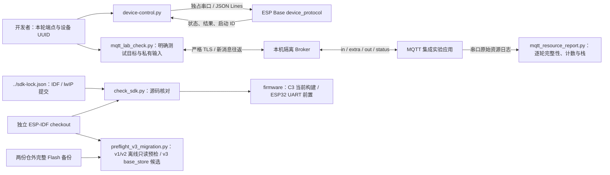

# ESP Base 宿主工具

此目录运行在 macOS/Linux 宿主；不属于 MCU 固件，也不依赖私有 ESP Tool。

## 架构拓扑



## SDK 源码准备

本仓 `sdk-lock.json` 锁定公开 ESP-IDF fork 的 OTA 擦除失败和 HTTP 初始化低内存清理修正，以及公开 esp-lwip 的零窗口修正。首次准备独立 SDK 时，将 `ESP_BASE_IDF` 指向仓外的新路径：

```bash
ESP_BASE_IDF=/private/path/esp-base-idf
git clone --recurse-submodules --branch codex/fix-http-init-transport-oom \
  https://github.com/esp-space/esp-idf.git "$ESP_BASE_IDF"
git -C "$ESP_BASE_IDF" checkout --detach 578cf89c343e388db43ba1f4ddcd602fedcb763c
git -C "$ESP_BASE_IDF" submodule update --init --recursive
git -C "$ESP_BASE_IDF/components/lwip/lwip" fetch \
  https://github.com/esp-space/esp-lwip.git 2758df4cd3666b3b2a5b53830148379326425c0d
git -C "$ESP_BASE_IDF/components/lwip/lwip" checkout --detach FETCH_HEAD
bash "$ESP_BASE_IDF/install.sh" esp32c3 esp32
source "$ESP_BASE_IDF/export.sh"
python3 tools/check_sdk.py --path "$IDF_PATH"
```

构建同时核对两个精确提交、SDK 索引与工作树、所有其他子模块及最终解析的 lwIP 组件路径；SDK 工作树只允许这一个锁定 lwIP gitlink 差异。Git remote 使用 HTTPS 或 SSH 不改变提交身份。普通构建与 MQTT 实验构建共用一份 `firmware/dependencies.lock`，其中 `mqtt` 精确来自公开 `esp-mqtt@5bff093646d8db810d64c50c39edc004e78bf40c`。以上准备和检查不访问串口或写设备；实验应用仍须提供仓外输入，并按固件 README 使用独立 build 与 sdkconfig。

先退出占用该端点的监控或烧录程序；工具仅使用 Python 3 标准库。从本轮系统枚举结果选择端点，不把历史端点当设备身份。

```bash
python3 tools/device-control.py --port /dev/cu.usbmodemEXAMPLE status
python3 tools/device-control.py --port /dev/cu.usbmodemEXAMPLE --device-id <刚核对的UUID> restart
# ESP32-D0WD-V3 完成新布局、固件迁移和实板启动后，选择本轮 CH340 端点：
python3 tools/device-control.py --port /dev/cu.usbserial-EXAMPLE status
```

默认输出块状摘要，`--json` 输出设备 JSON。重启先读取状态、精确绑定 UUID/boot/deadline，收到 `running` 后再次查询同设备的新启动，才报告成功；超时为 unknown，写命令不自动重试。直接打开 POSIX 串口，使用 `flock` 和 `TIOCEXCL` 独占当前端点，不切换 DTR/RTS，并关闭 HUPCL；串口写入限一秒，以设备回执确认执行。C3 原生 USB 与 ESP32 CH340 UART 均须验证打开端点不改变 boot_id；后者还须实测无 USB 背压时的整帧与超载行为。完整 probe/flash/恢复编排由设备工具负责。

配置使用当前用户拥有、权限 0600 的本机 JSON 文件，不把密码放在命令行或输出中：

```bash
python3 tools/device-control.py --port /dev/cu.usbmodemEXAMPLE --device-id <刚核对的UUID> --config-file <本机私有配置文件> config.set
```

文件包含完整 `schema_version`、`wifi`、`mqtt`、`frp`、`business` 字段。当前 `schema_version` 为 3；`wifi` 为 `{ssid,password}` 或 null；`mqtt` 为 `{hostname,port,username,password,ca_pem,management_key_hex}` 或 null；`frp` 可为 `{server_hostname,server_port,token,ca_pem,proxy_name,remote_port,local_port,management_key_hex}` 或 null，`business` 必须为 null。MQTT 主机为 1–253 字节 ASCII DNS 名，端口 1–65535；用户名最多 128 UTF-8 字节、密码最多 256 UTF-8 字节，均非空；CA PEM 最多 4096 ASCII 字节并含证书标记；独立管理密钥为非全零 64 个小写十六进制字符。工具不会生成凭据，整个配置仅经本轮独占物理串口端点发送，整行请求上限 9216 字节。工具读取新鲜 revision 后构造 CAS 请求，最多等待 30 秒；仅确认新 revision 后报告成功。文件不存在、权限不合格、重复字段或内容无效会拒绝，不回显配置。固件 MQTT/FRP 状态由实际 owner 报告；设备级 Broker ACL 与网络控制端仍需联调。

`python3 tools/test-device-control.py` 使用本机伪终端验证字节不变、禁用关闭挂断和写入背压期限；伪终端不证明物理 USB 复位行为，后者以同板重复打开后的 boot_id 与断电验收为准。

## v1/v2→v3 离线配置预检

`preflight_v3_migration.py` 只读取两份仓外的完整 4 MiB Flash 备份和固定 SDK 源码；可选输出权限 0600 的 `base_store` v3 候选分区镜像。它不打开串口，也不刷写设备。v1 输入保持 Wi-Fi 原值与 revision，MQTT/FRP absent；v2 输入还逐字节保留既有 MQTT 字段及管理 key，FRP absent。凭据不生成或替换。完整步骤、阻断条件和两槽首启边界见[离线迁移合同](../docs/operations/base-v3-offline-migration.md)。

## MQTT 实验检查

`mqtt_lab_check.py` 仅用于固件的 [MQTT 集成实验应用](../firmware/apps/mqtt_integration/README.md)。在独立宿主 Python 环境安装 `tools/mqtt-lab-requirements.txt`，传入本轮隔离 TLS Broker、CA、UUID 和权限 0600 的账号 JSON（username/password）。不把账号放在命令行。

```bash
python3 tools/mqtt_lab_check.py --host <隔离Broker> --port <TLS端口> \
  --ca <实验CA文件> --credentials-file <本机私有账号文件> \
  --device-id <本轮已核对UUID> --cycles 100 --json
```

检查 QoS 0/1 下 0、1、127、1024、4096 字节的完整往返，并可执行最多 100 次完整客户端重建。retained online 还必须配合新随机载荷往返才能视为当前在线；控制字超时不自动重发。`--json` 的 stdout 只有结果 JSON，进度在 stderr。该脚本不刷写设备，也不能单独证明释放后 heap、栈或 socket 稳定；这些指标需要与本轮串口遥测共同核对。追加 `--subscriptions` 验证 `extra` 的订阅、重连保持、退订和退订后重连；Broker ACL 需要设备 read 与控制端 write 的该精确主题。`--wifi-cycles 3` 只暂停本板 station 五秒再恢复，不等同于 AP 断电。`--resource-samples` 在初始在线和每次重建后请求串口的任务栈、socket 与 esp_timer 快照，检查器的 JSON 只记录请求次数，资源判定必须读取串口原始证据。

Broker/TLS 负例与其他故障矩阵需单独执行；本轮已完成的子项和未关闭范围见 [实板验收记录](../docs/operations/mqtt-hardware-acceptance.md)。


`mqtt_resource_report.py --serial-log <私有串口日志> --cycles 100 --json` 逐轮核对资源快照集合、任务集合、socket 数、具名 esp_timer 的后续增长和至少 1 KiB 的各任务栈余量；截断、交错或缺失记录不能通过。计时器以初次在线样本比较后续轮次，首次初始化差异单独列出并需要核对 SDK/应用来源。结果同时输出堆范围及首尾十项中位数，堆趋势仍须结合真实运行阶段评估，不把计数通过扩大为无内存泄漏或 72 小时长稳。

TCP 仅用于隔离实验：固件独立 sdkconfig 显式启用 `CONFIG_EMQTT_PLAINTEXT_LAB=y`，私有输入 `.tls=false` 且 `.ca_pem=""`，主机以 `--plaintext-lab` 代替 `--ca`。两者互斥；TLS 错误不会触发明文连接，普通基座仍拒绝该构建选项。
