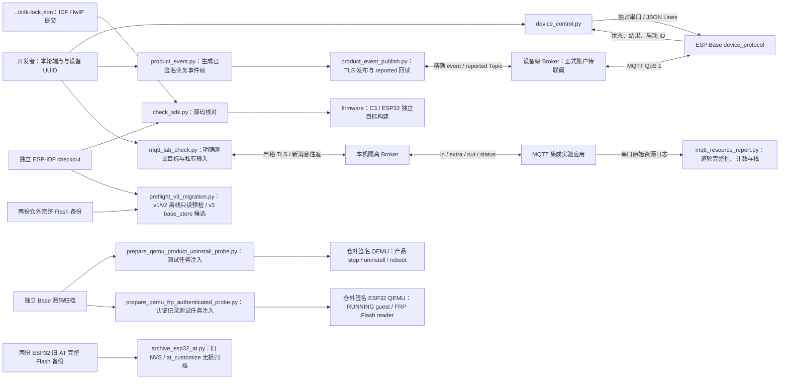

# ESP Base 宿主工具

此目录运行在 macOS/Linux 宿主；不属于 MCU 固件，也不依赖私有 ESP Tool。

## 架构拓扑


```mermaid
flowchart LR
    user["开发者：本轮端点与设备 UUID"] --> cli["device_control.py"]
    cli -->|"独占串口 / JSON Lines"| firmware["ESP Base device_protocol"]
    firmware -->|"状态、结果、启动 ID"| cli
    user --> event_frame["product_event.py：生成已签名业务事件帧"]
    event_frame --> event_publish["product_event_publish.py：TLS 发布与 reported 回读"]
    event_publish <-->|"精确 event / reported Topic"| device_broker["设备级 Broker：正式账户待联调"]
    device_broker <-->|"MQTT QoS 1"| firmware
    user --> checker["mqtt_lab_check.py：明确测试目标与私有输入"]
    checker <-->|"严格 TLS / 新消息往返"| broker["本机隔离 Broker"]
    broker <-->|"in / extra / out / status"| lab["MQTT 集成实验应用"]
    lab -->|"串口原始资源日志"| report["mqtt_resource_report.py：逐轮完整性、计数与栈"]
    sdk_lock["../sdk-lock.json：IDF / lwIP 提交"] --> sdk_check["check_sdk.py：源码核对"]
    idf["独立 ESP-IDF checkout"] --> sdk_check
    sdk_check --> build["firmware：C3 / ESP32 独立目标构建"]
    backup["两份仓外完整 Flash 备份"] --> preflight["preflight_v3_migration.py：v1/v2 离线只读预检 / v3 base_store 候选"]
    idf --> preflight
    archive["独立 Base 源码归档"] --> uninstall_probe["prepare_qemu_product_uninstall_probe.py：测试任务注入"]
    uninstall_probe --> qemu["仓外签名 QEMU：产品 stop / uninstall / reboot"]
    archive --> frp_probe["prepare_qemu_frp_authenticated_probe.py：认证记录测试任务注入"]
    frp_probe --> frp_qemu["仓外签名 ESP32 QEMU：RUNNING guest / FRP Flash reader"]
    at_backup["两份 ESP32 旧 AT 完整 Flash 备份"] --> at_archive["archive_esp32_at.py：旧 NVS / at_customize 无损归档"]
```

## 真实签名 guest 与 NVS 宿主测试

`container_product_deadline_test.py` 由 `bash firmware/tests/run_container_lifecycle_test.sh` 调用，在 macOS/Linux 宿主使用明确传入的精确 Container、WAMR 和 wasi-sdk 构建真实签名期限 guest，再执行 Base 生命周期测试。它不进入 MCU 固件构建，也不读取设备凭据。

`container_product_cancel_test.py` 由同一生命周期入口调用，使用临时 RSA 测试键构造 init／event／timer 长循环及 stop 失败包，验证正式 Base owner 的原子停止、真实 guest stop／close／join 与失败阻断；不用生产凭据或设备。结果见[取消检查点](../docs/operations/async-cancel-checkpoint.md)。

`container_product_timer_business_test.py` 由同一入口使用固定 wasi-sdk 编译真实定时 guest，以临时 RSA 测试键签署 `-7`、`0`、`3` 三种业务返回。正式 Base owner 与生产健康策略核对试运行失败记账、旧确认拒绝、原完整窗口重开及非负返回；不用设备或生产凭据，详见[定时业务健康检查点](../docs/operations/timer-business-health-checkpoint.md)。

`run_nvs_capacity_qemu.py` 在宿主调用所选 Espressif QEMU，使用显式构建目录和仓外合成 Flash；仍拒绝仓内 Flash 路径。完整三阶段命令见 [NVS 容量探针](../firmware/tests/nvs-capacity-probe/README.md)。

## 产品卸载 QEMU 测试源码准备

`prepare_qemu_product_uninstall_probe.py` 只对**不含 `.git` 的独立 Base 源码归档**插入 FreeRTOS 测试任务，接收本轮已签名包的 SHA-256 和预置 ECS2 sequence，并在 READY 后用正式 Base API 执行确认停止、产品卸载、同 boot 空绑定读回及 storage claim 释放。不注入签名键或包内容，不修改纳管源码、真实设备、Flash、SDK 或组件。构建仍须提供仓外候选分区、签名输入，并按[双目标 QEMU 检查点](../docs/operations/product-uninstall-qemu-checkpoint.md)区分合成状态与真实产品入口。

## ESP32 FRP 认证记录 QEMU 测试源码准备

`prepare_qemu_frp_authenticated_probe.py --source-root <独立 Git 归档目录>` 仅修改无 `.git` 的仓外源码副本。它用公开固定公式生成真实 AES-256-GCM 的 64 KiB 合法记录，向 Base `READY container=running` 后的测试任务注入 16 字节整头分段、1 KiB 密文分段、完整认证、16 个 4 KiB 明文窗口复验、坏 tag 零交付与 storage owner／heap／栈读数。测试任务直接调用受管 FRP 的正式 IDF Flash provider 和正式 AEAD reader；明文不构成 FRPS 控制消息，所以结果只证明该读写切片，不证明正式 session。脚本需要宿主 Python `cryptography`，不包含生产凭据、不生成 Flash 镜像，也不调用烧录工具。仓外分区、ECDSA 测试签名、包状态预置、QEMU MTD 运行与独立读回见[ESP32 认证记录检查点](../docs/operations/esp32-frp-authenticated-record-qemu-checkpoint.md)。每次 QEMU 运行须使用全新的串口日志，不能把旧 marker 当作本次结果。

## SDK 源码准备

本仓 `sdk-lock.json` 锁定公开 ESP-IDF fork 的 OTA 擦除失败和 HTTP 初始化低内存清理修正，以及公开 esp-lwip 的零窗口修正。首次准备独立 SDK 时，将 `ESP_BASE_IDF` 指向仓外的新路径：

```bash
ESP_BASE_IDF=/private/path/esp-base-idf
git clone --recurse-submodules --branch codex/fix-http-init-transport-oom \
  https://github.com/esp-space/esp-idf.git "$ESP_BASE_IDF"
git -C "$ESP_BASE_IDF" checkout --detach 578cf89c343e388db43ba1f4ddcd602fedcb763c
git -C "$ESP_BASE_IDF" submodule update --init --recursive
git -C "$ESP_BASE_IDF/components/lwip/lwip" fetch \
  https://github.com/esp-space/esp-lwip.git 2758df4cd3666b3b2a5b53830148379326425c0d
git -C "$ESP_BASE_IDF/components/lwip/lwip" checkout --detach FETCH_HEAD
bash "$ESP_BASE_IDF/install.sh" esp32c3 esp32
source "$ESP_BASE_IDF/export.sh"
python3 tools/check_sdk.py --path "$IDF_PATH"
```

构建同时核对两个精确提交、SDK 索引与工作树、所有其他子模块及最终解析的 lwIP 组件路径；SDK 工作树只允许这一个锁定 lwIP gitlink 差异。Git remote 使用 HTTPS 或 SSH 不改变提交身份。C3 使用 `firmware/dependencies.lock`，ESP32 使用 `firmware/dependencies.lock.esp32`；二者分别固定 target，引用同一组精确组件提交，不能共用生成的 sdkconfig/build 目录。以上准备和检查不访问串口或写设备；实验应用仍须提供仓外输入，并按固件 README 使用独立 build 与 sdkconfig。

先退出占用该端点的监控或烧录程序；工具仅使用 Python 3 标准库。从本轮系统枚举结果选择端点，不把历史端点当设备身份。

```bash
python3 tools/device_control.py --port /dev/cu.usbmodemEXAMPLE status
python3 tools/device_control.py --port /dev/cu.usbmodemEXAMPLE --device-id <刚核对的UUID> --operation-id <本次固定操作UUID> --image-file <本地已签名.bin> --image-url <设备可达的HTTPS地址> --ota-target esp32c3/esp_base ota.start
# 新启动后仍使用同一 operation UUID，只读查询；ESP32 构建的 target 为 esp32/esp_base：
python3 tools/device_control.py --port /dev/cu.usbmodemEXAMPLE --operation-id <同一操作UUID> ota.result
python3 tools/device_control.py --port /dev/cu.usbmodemEXAMPLE product.status
python3 tools/device_control.py --port /dev/cu.usbmodemEXAMPLE --operation-id <原操作UUID> product.result
# 首次安装要求 product.status 的当前包摘要为 null；本地已签名 .pkg 与 HTTPS URL 必须指向同一组字节：
python3 tools/device_control.py --port /dev/cu.usbmodemEXAMPLE --device-id <刚核对的UUID> --operation-id <本次固定操作UUID> --operation-sequence <下一操作序号> --expected-container-sequence <当前Container序号> --package-file <本地已签名.pkg> --package-url <设备可达的HTTPS地址> --guest-abi-version <已签名清单ABI> --data-schema-version <已签名清单schema> --trial-event-file <随后要发布的原始业务事件文件> product.install
# 同 boot 升级另需提供当前已确认包的 SHA-256：
python3 tools/device_control.py --port /dev/cu.usbmodemEXAMPLE --device-id <刚核对的UUID> --operation-id <本次固定操作UUID> --operation-sequence <下一操作序号> --expected-container-sequence <当前Container序号> --expected-package-sha256 <当前包SHA-256> --package-file <本地已签名.pkg> --package-url <设备可达的HTTPS地址> --guest-abi-version <已签名清单ABI> --data-schema-version <已签名清单schema> --trial-event-file <随后要发布的原始业务事件文件> product.upgrade
# 从刚查询的 product.status 精确抄录下一操作序号、Container 序号和当前包摘要；先固定原操作 UUID：
python3 tools/device_control.py --port /dev/cu.usbmodemEXAMPLE --device-id <刚核对的UUID> --operation-id <本次固定操作UUID> --operation-sequence <下一操作序号> --expected-container-sequence <当前Container序号> --expected-package-sha256 <当前包SHA-256> product.uninstall
# 仅改变本 boot 的确认包运行状态；不提供持久 operation sequence：
python3 tools/device_control.py --port /dev/cu.usbmodemEXAMPLE --device-id <刚核对的UUID> --operation-id <本次固定操作UUID> --expected-container-sequence <当前Container序号> --expected-package-sha256 <当前确认包SHA-256> product.stop
python3 tools/device_control.py --port /dev/cu.usbmodemEXAMPLE --device-id <刚核对的UUID> --operation-id <本次另一固定操作UUID> --expected-container-sequence <当前Container序号> --expected-package-sha256 <当前确认包SHA-256> product.start
python3 tools/device_control.py --port /dev/cu.usbmodemEXAMPLE --device-id <刚核对的UUID> restart
# ESP32-D0WD-V3 完成新布局、固件迁移和实板启动后，选择本轮 CH340 端点：
python3 tools/device_control.py --port /dev/cu.usbserial-EXAMPLE status
```

默认输出块状摘要，`--json` 输出设备 JSON。重启先读取状态、精确绑定 UUID/boot/deadline，收到 `running` 后再次查询同设备的新启动，才报告成功；超时为 unknown，写命令不自动重试。直接打开 POSIX 串口，使用 `flock` 和 `TIOCEXCL` 独占当前端点，不切换 DTR/RTS，并关闭 HUPCL；串口写入限一秒，以设备回执确认执行。C3 原生 USB 与 ESP32 CH340 UART 均须验证打开端点不改变 boot_id；后者还须实测无 USB 背压时的整帧与超载行为。完整 probe/flash/恢复编排由设备工具负责。

`ota.start` 默认调用正式无包固件 OTA，发送必需的 `package_mode=no_package`：用户显式指定本轮精确 target，工具从本地已签名固件读取完整长度和 SHA-256，核对目标槽上限、新鲜 boot 与 OTA ready，再发送设备使用同一字节的 HTTPS URL；设备独立验证镜像签名和摘要。`--ota-package-mode reuse` 要求本地签名包、guest ABI、data schema 与代表事件文件，并先核对设备当前确认包摘要；`write` 另要求包 HTTPS URL，两种模式均按精确 target 检查包槽上限。当前公开软件 worker 已接三种模式；来源、容量或产品授权不满足仍返回 `product_ota_unavailable`。带包命令必须在新 boot 向精确 event Topic 发布请求绑定的代表事件，设备在线窗口及持久联合确认完成后才成功。收到 `running` 仅表示已受理，固件随后可能重启；串口回执超时也不重发写命令。新启动后用原 operation UUID 调用 `ota.result`，只接受同一设备的持久结果，并检查固件摘要、长度、target、目标槽及包模式／摘要字段。`unknown`、`running` 或尚未观察到新 boot 都不是成功。真实 HTTPS／MQTT、两板连续更新、掉电与资源验收仍须在 P6-10 完成。

`product.result` 仅按原 operation ID 只读查询，不触发产品写入或重放。安装／升级／卸载仍从最近固定条数的设备持久账本读取，结果精确包含 `operation_id`、正 uint32 `operation_sequence`、`kind`、`package_sha256`、`container_sequence` 与 `result_code` 六字段。停止／启动仅查询本 boot 的命令缓存，结果精确包含 `operation_id`、值为 null 的 `operation_sequence`、`kind=stop|start` 和 `container_sequence` 四字段；没有持久结果码或包摘要。停止／启动缓存与其他写请求共享本 boot 的固定 32 槽，不驱逐既有记录；满后拒绝新写请求，既有 ID 仍可只读查询。本 boot 未记录该 ID、跨 boot 或旧持久记录不在窗口内时返回 `unknown/product_operation_not_found`；客户端不据此生成新 ID 重试。`product.install`／`product.upgrade` 在发送前从本地普通文件计算整包 SHA-256 和长度，并从 `--trial-event-file` 的原始 guest 业务字节计算代表事件 SHA-256；后续帧生成器的 `--event-file` 必须使用同一原始字节。工具复核 `product.status` 的持久序号与旧绑定；设备从指定 HTTPS URL 下载并自行验签，本工具不上传包或生成签名。写回执之后只按原 ID 读取持久账本，超时也绝不重发写命令。候选试运行期间返回 `unknown/product_operation_unresolved`；代表事件完成后须连续在线 30 秒，才可能得到持久成功结果。真实 Broker 和两块实体板仍待端到端验收。

`product.status` 在同一个 Base 存储占用期读取持久高水位、下一操作序号、未决操作 ID 和当前签名固件对应的 ECS2 `container_sequence`／`package_sha256`。无包时摘要为 `null`；它是持久绑定元数据，不证明包字节或 guest 健康。缺失账本返回 `unknown/product_ledger_uninitialized`，不会自动初始化；绑定或签名固件观察不确定时返回 `unknown/storage_uncertain` 并阻断本次启动的后续写入。查询到的序号只是快照，正式写入仍须由设备持久账本与 Container 原子裁决。

只读产品状态现硬切为十个 required 字段：原五字段加 `firmware_sha256`、`runtime_guest_abi_version`、`package_guest_abi_version` 、`package_data_schema_version` 与 `active_product`。运行固件摘要来自同一 Base claim 下双次核对的实际签名镜像，按 SDK 验签后确定的完整镜像长度计算，包含该签名方案的尾部；不是 ELF 或包摘要。运行时 ABI 来自实际 Container 编译常量；包 ABI／schema 来自同一当前固件对应的 ECS2 确认绑定，无包时二者必须同时为 `null`，有包时必须同时为正 uint32。公开 CLI 与 Tool 同批拒绝缺字段、全零摘要及摘要／包元数据不一致。活动版本复制本次验签装载结果；状态查询没有新增包 Flash 读取或验签，不证明 guest 健康。

`product.status` 现硬切为十个 required 字段，新增 required nullable 的 `active_product`。非 null 对象精确包含 `product_id`、完整 `product_version`、非零 `package_sha256`、正 uint32 `guest_abi_version`／`data_schema_version`、布尔 `is_trial` 和 required nullable `operation_id`。ID／版本沿用 Container 的小写连字符 ASCII 合同，两者合计不超过 v1 manifest 的 4096 字节边界，不截为 64 字节。确认实例的摘要／ABI／schema 与根确认绑定一致且 operation ID 为 null；候选来自本 boot 的实际验签装载，操作 ID 必须匹配未决账本，确认绑定仍保留旧包。活动 ABI 必须等于实际运行时 ABI。null 只表示未取得可确认的活动实例，不能证明 guest 健康或所有 native 资源已回收。

`product.uninstall` 仅接受已经确认的当前包绑定：操作者显式给出原 operation UUID、下一持久序号和从本轮 `product.status` 读到的 ECS2 序号／包摘要；工具在发送前重新读状态并逐项比较。设备验证目标 UUID、boot 和期限，先把意图持久提交并读回，再停止、卸载、读回空绑定与写入结果。命令超时或返回 unknown 时只用原 ID 查询 `product.result`，不自动重发或生成新 ID。包 Flash、产品数据和回退固件仍引用的包保持原位；此入口不能安装或升级包。

`product.stop`／`product.start` 只改变当前 boot 中已确认包的运行状态，不提交 ECS2，不占用持久操作序号，也不更换包、清除产品数据或修改启动绑定。操作者给出当前确认包摘要、Container 序号及固定原操作 UUID；`--operation-sequence` 会被拒绝。工具先重新读取 `product.status`，逐项核对确认绑定、无未决操作及非试运行实例，再从新鲜 `status` 核对同设备／同 boot 并构造期限。写请求的顶层 `request_id` 直接使用该原操作 UUID，`parameters` 精确只有 `expected_container_sequence` 与 `package_sha256`；Container 序号允许 1 至 UINT32_MAX。

工具只发送一次停止／启动命令。明确的 failed／expired 写拒绝直接返回；running、unknown、缺失或部分写回执随后只轮询原 ID 的 `product.result`，每次查询使用新的只读请求 ID，所有等待共用发送前固定的 30 秒期限，超时仍为 unknown。成功必须有同设备、同 boot、同原操作 ID、同操作类型及未变化 Container 序号的四字段结果。活动实例为 null 不能证明已安全停止；已经运行的 start、已经安全停止的 stop，仍须由设备 owner 证明目标状态才报告成功。trap、阻塞或 native 回收不确定时不会自动重新开启。后续 boot 按原确认绑定执行正常启动，上一 boot 的停止／启动结果不持久保留。

配置使用当前用户拥有、权限 0600 的本机 JSON 文件，不把密码放在命令行或输出中：

```bash
python3 tools/device_control.py --port /dev/cu.usbmodemEXAMPLE --device-id <刚核对的UUID> --config-file <本机私有配置文件> config.set
```

文件包含完整 `schema_version`、`wifi`、`mqtt`、`frp`、`business` 字段。当前 `schema_version` 为 3；`wifi` 为 `{ssid,password}` 或 null；`mqtt` 为 `{hostname,port,username,password,ca_pem,management_key_hex}` 或 null；`frp` 可为 `{server_hostname,server_port,token,ca_pem,proxy_name,remote_port,local_port,management_key_hex}` 或 null，`business` 必须为 null。MQTT 主机为 1–253 字节 ASCII DNS 名，端口 1–65535；用户名最多 128 UTF-8 字节、密码最多 256 UTF-8 字节，均非空；CA PEM 最多 4096 ASCII 字节并含证书标记；独立管理密钥为非全零 64 个小写十六进制字符。工具不会生成凭据，整个配置仅经本轮独占物理串口端点发送，整行请求上限 9216 字节。工具读取新鲜 revision 后构造 CAS 请求，最多等待 30 秒；仅确认新 revision 后报告成功。文件不存在、权限不合格、重复字段或内容无效会拒绝，不回显配置。固件 MQTT/FRP 状态由实际 owner 报告；设备级 Broker ACL 与网络控制端仍需联调。

`python3 tools/test_device_control.py` 使用本机伪终端验证字节不变、禁用关闭挂断和写入背压期限，并以宿主假设备验证停止／启动的完整参数、原 ID 只读轮询、共享期限、异形结果／跨 boot 拒绝、丢失回执不重发和原持久三类结果；这些测试不证明 native 实例已安全回收或物理 USB 复位行为，后者以同板重复打开后的 boot_id 与断电验收为准。

## 产品 MQTT 业务事件帧

`product_event.py` 读取权限精确为 0600、内容为 64 个小写十六进制字符的**现有设备管理密钥文件**，使用当前设备 UUID、当前 boot UUID、已核对的签名包 SHA-256、下一个连续事件序号和原始 guest 事件文件，生成新的 0600 二进制帧文件；不在命令行或终端输出密钥。它只生成 wire 帧，不替代 Broker 账户、TLS、正式发布、guest 执行结果或试运行健康裁决。调用方须向脚本显示的精确 `esp-base/<device_id>/event` Topic 以 QoS 1、非 retained 方式发布该帧，并从新鲜非 retained `reported.last_accepted_event_sequence` 判断入队。Broker PUBACK 不能证明入队；`reported.last_completed_event_sequence`、`last_completed_package_sha256`、`last_completed_event_sha256`、`last_event_outcome` 与 `last_guest_result` 是最近启动的产品实例中的最近一次 guest 调用的只读观察，仍不能单独确认产品健康。旧 boot、错包、满队列或离线时序号不推进。重试须重新核对高水位及当前 boot，原序号使用原帧，不改内容。

`product_event_publish.py` 消费上面的原始签名帧和本轮明确指定的 Broker/CA/控制账户。账户 JSON 只有 `username` 与 `password`，文件须由当前用户独占、权限精确为 0600。先等待精确 `reported` 订阅的 SUBACK 和本次 boot 的非 retained 消息，确认入队序号恰为本帧序号减一；只有此前置条件成立才发布一次 QoS 1、非 retained 事件。发布后继续等待同 boot、同序号、同包摘要和事件字节 SHA-256 的入队及 guest 完成结果，输出 `event_outcome`；超时、断线或读回不符均标记 unknown，不自动重发。返回码 0 仅表示本次 guest 报告非负结果，2 表示已发布但执行失败或结果不确定，1 表示发布前拒绝；这些都不是产品安装、升级或试运行健康的最终结果。依赖与现有 MQTT 宿主检查器相同，安装 `tools/mqtt-lab-requirements.txt` 中固定的 Paho 版本即可。

客户端关闭 Paho 的自动重连；QoS 1 发布后若失去连接，客户端不在新连接中重发该帧，本次结果记为 unknown。后续人工核对须沿用原 boot、序号及摘要，Broker 曾接收但 PUBACK 丢失也不能据此宣称未执行。

```bash
python3 tools/product_event.py --management-key-file <私有0600密钥文件> \
  --device-id <本轮设备UUID> --boot-id <本轮启动UUID> \
  --package-sha256 <当前包摘要> --event-sequence <下一连续序号> \
  --event-file <原始业务字节文件> --output <新0600帧文件>
python3 tools/product_event_publish.py --host <本轮Broker域名> --port <TLS端口> \
  --ca-file <本轮CA证书> --credentials-file <私有0600控制账户JSON> \
  --management-key-file <私有0600密钥文件> --frame-file <上述帧文件> \
  --device-id <本轮设备UUID> --boot-id <本轮启动UUID> \
  --package-sha256 <当前包摘要> --event-sequence <下一连续序号>
python3 tools/test_product_event.py
python3 tools/test_product_event_publish.py
```

Broker 的精确设备 Topic ACL 已有源码与隔离验收，但当前生产 Profile 还没有 Base 账户；真实控制账户发布与两板 guest 业务结果均未验收。上述发布器的宿主假客户端测试验证前置拒绝、一次发布和本次启动回读；它不代替真实 Broker/TLS 或设备验证。

## v1/v2→v3 离线配置预检

`preflight_v3_migration.py` 只读取两份仓外的完整 4 MiB Flash 备份和固定 SDK 源码，以保留的旧 C3 分区表核对备份；可选输出权限 0600、符合新 C3 产品表 `0xb000` 长度的 `base_store` v3 候选分区镜像。它不打开串口，也不刷写设备。v1 输入保持 Wi-Fi 原值与 revision，MQTT/FRP absent；v2 输入还逐字节保留既有 MQTT 字段及管理 key，FRP absent。凭据不生成或替换。完整步骤、阻断条件和两槽首启边界见[离线迁移合同](../docs/operations/base-v3-offline-migration.md)。

## ESP32 旧 AT 离线原始归档

ESP32 旧 ESP-AT 的一次性归档使用 `archive_esp32_at.py`。它只接受两份各 4 MiB、独立、当前用户所有且权限至多 0600 的完整备份；先比较全片字节和 SHA-256，核对旧 `nvs@0x12000/0xe000`、`at_customize@0x20000/0xe0000` 分区表，验证各区只有前两页非空，再将两区前两页顺序写为 16 KiB `at_old_raw` 原始字节。工具对**整个**旧分区补 `0xff` 后逐字节及 SHA-256 重建核对；输出父目录先解析到真实路径，只允许在 Git 仓库外、当前用户所有且不向组/其他用户开放的目录中新建 0600 文件，不覆盖已有文件，不打印敏感内容；落盘读回不符会删除新建文件。旧分区尾页若非空则直接阻断。原完整 Flash 备份仍须独立保留；此归档不包含旧启动镜像或 otadata，也不执行刷写。合成反例测试：`python3 -m unittest tools/test_archive_esp32_at.py`。后续新分区的首次写入、双签名固件、恢复与实板验收另行完成。

## MQTT 实验检查

`mqtt_lab_check.py` 仅用于固件的 [MQTT 集成实验应用](../firmware/apps/mqtt_integration/README.md)。在独立宿主 Python 环境安装 `tools/mqtt-lab-requirements.txt`，传入本轮隔离 TLS Broker、CA、UUID 和权限 0600 的账号 JSON（username/password）。不把账号放在命令行。

```bash
python3 tools/mqtt_lab_check.py --host <隔离Broker> --port <TLS端口> \
  --ca <实验CA文件> --credentials-file <本机私有账号文件> \
  --device-id <本轮已核对UUID> --cycles 100 --json
```

检查 QoS 0/1 下 0、1、127、1024、4096 字节的完整往返，并可执行最多 100 次完整客户端重建。retained online 还必须配合新随机载荷往返才能视为当前在线；控制字超时不自动重发。`--json` 的 stdout 只有结果 JSON，进度在 stderr。该脚本不刷写设备，也不能单独证明释放后 heap、栈或 socket 稳定；这些指标需要与本轮串口遥测共同核对。追加 `--subscriptions` 验证 `extra` 的订阅、重连保持、退订和退订后重连；Broker ACL 需要设备 read 与控制端 write 的该精确主题。`--wifi-cycles 3` 只暂停本板 station 五秒再恢复，不等同于 AP 断电。`--resource-samples` 在初始在线和每次重建后请求串口的任务栈、socket 与 esp_timer 快照，检查器的 JSON 只记录请求次数，资源判定必须读取串口原始证据。

Broker/TLS 负例与其他故障矩阵需单独执行；本轮已完成的子项和未关闭范围见 [实板验收记录](../docs/operations/mqtt-hardware-acceptance.md)。


`mqtt_resource_report.py --serial-log <私有串口日志> --cycles 100 --json` 逐轮核对资源快照集合、任务集合、socket 数、具名 esp_timer 的后续增长和至少 1 KiB 的各任务栈余量；截断、交错或缺失记录不能通过。计时器以初次在线样本比较后续轮次，首次初始化差异单独列出并需要核对 SDK/应用来源。结果同时输出堆范围及首尾十项中位数，堆趋势仍须结合真实运行阶段评估，不把计数通过扩大为无内存泄漏或 72 小时长稳。

TCP 仅用于隔离实验：固件独立 sdkconfig 显式启用 `CONFIG_EMQTT_PLAINTEXT_LAB=y`，私有输入 `.tls=false` 且 `.ca_pem=""`，主机以 `--plaintext-lab` 代替 `--ca`。两者互斥；TLS 错误不会触发明文连接，普通基座仍拒绝该构建选项。
